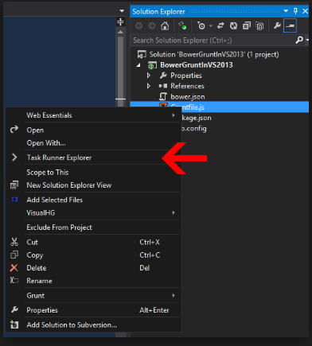
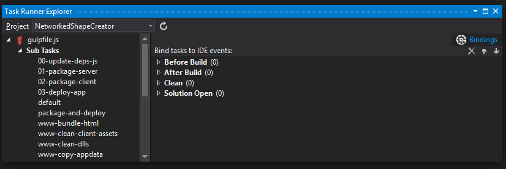
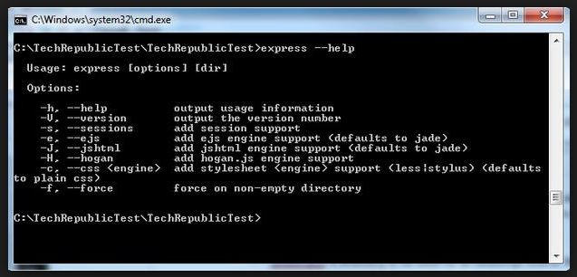
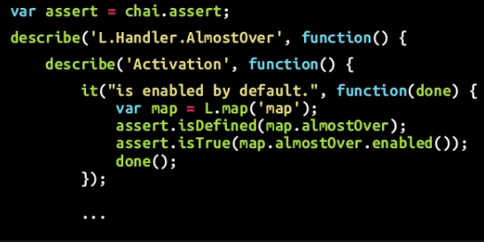
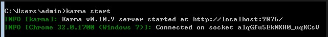

A host of tools are available to help programmers in their journey of node.js programming. Irrespective of whether you are an expert programmer or a newcomer, these tools will help you create robust, scalable, re-usable code that leads to great applications. Today let us look at some of the areas in which these tools can help you optimize your code.

## IDE

Integrated Development Environment is the birth place of great code. A great IDE should act as a one stop shop for all the programmer's needs to produce optimized code. The IDE should also be simple and easy to navigate so that it does not distract the programmer's attention from the code.

There are a number of IDEs that are doing a great job in providing the right environment to build great applications.  One of the most powerful IDEs that is available today is the [Webstorm](https://www.jetbrains.com/webstorm/). It supports most modern frameworks, build tools and a load of plugins to make coding a lot more enjoyable. It is one of those rare products that does not allow you to leave its windows for any reason except to take a look at your browser.

## Build Tools

Getting your project ready for release is another task that requires the help of tools. The node.js eco-system provides a good number of tools for this task. Some of the most famous tools for this purpose are Gulp, Grunt, Brunch, or WebPack.

[Grunt](http://gruntjs.com/)

Grunt is a task runner that allows you to specify the task to be completed, run it once and then it will take care of the job for you. It is basically a powerhouse that allows you to perform a range of functionalities with minimal code. The grunt js manages to achieve this through the host of plugins.

[Gulp](http://gulpjs.com/)

Gulp is an easy-to-use streaming build system that is very flexible. Though fundamentally both gulp and grunt perform the task of satisfying programmer needs, the difference lies in the fact that Gulp focuses on writing code while grunt is more focused on writing configuration.

## Transpilation

It is the process of converting source code from one language to another language or another form of the same language. If you have worked with any superset of the javascript or the other languages such as CoffeeScript, ECMAScript 6, JSX etc. you would have faced the need for transpiler. The transpiler basically converts the source code into code that can run smoothly in the latest Node.js environment and in the modern browsers.

Node.js does not run code of languages such as CoffeeScript directly out of the box. Though there are many transpilers available in the market today, the most powerful tool among them is [BABEL](https://babeljs.io/). It has support for all the latest versions of javascript that you can utilize right now without waiting for browser support.

## Rest API Frameworks and Services

The use of frameworks makes the programming a pleasurable process. Though a lot of frameworks are available today, some of the most famous frameworks are time-tested to ensure the best programming experience. The [best frameworks for node.js developers](/9-best-node-js-frameworks-developers) gives you an idea of all the great frameworks that works wonders for developers across the globe. Let us take a look at some of them

[Express.js](http://expressjs.com/)

Express.js was built by TJ Holowaychuk, one of the members of core Node project team. A large community backs this framework, therefore it has the advantage of continuous updates and reforms of all the core features. This is a minimalist framework that is used to build a number of mobile applications and APIs.

[hapi.js](http://hapijs.com/)

Hapi is a powerful and robust framework that is used for developing APIs. The well-developed plugin system and various key features such as  input validation, configuration-based functionality, implement caching, error handling, logging makes the Hapi one of the most preferred frameworks.

[Sails.js](http://sailsjs.org/)

This is yet another MVC framework that has become very popular with Node.js developers. The framework has gained traction through the development of chat applications, dashboards and multi player games. It is most famous for building data-driven APIs. It uses waterline for object related mapping and db solutions. This framework uses Express.js for handling HTTP requests and is built upon Node.js. Its compatibility with Grunt modules, including LESS, SASS, Stylus, CoffeeScript, Jade, Dust makes Sails.js an ideal candidate for browser based applications.

## Test Frameworks and Tools

Testing is an integral part of software development life cycle that is essential to ensure the quality of developed product. Code developed on Node.js which is powered by a language such as Javascript has an additional need for thorough automation testing. The most commonly used tools for this purpose are Mocha and Chai. Mocha is a javascript testing framework and chai is a BDD/TDD assertion library. This duo comes into play in the backend testing and has the capacity to perform all types of testing such as unit, integration, functional and smoke.

The frontend testing is generally taken care by karma.js and jasmine. Karma is a JavaScript command line tool that can be used to spawn a web server which loads your application's source code and executes your tests. Jasmine is an open source testing framework for JavaScript. It aims to run on any JavaScript-enabled platform, to not intrude on the application nor the IDE, and to have easy-to-read syntax.

_Conclusion_:

These are 5 areas where tooling will really help you a great deal in creating great code.

If you are already using these tools or if you are going to try them now, Share your thoughts in the comments and we will discuss.