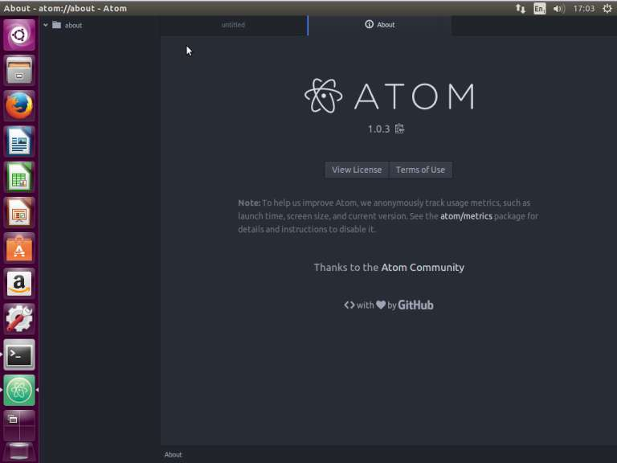

Whether you are a coder who specializes in ReactJS development services, AngularJS development services, or React native Development services this atom editor setup is sure to drastically improve your productivity.

  

_This list is divided into two sections Utlities and ReactJS Development specific packages:_

 
# Utilities:

  
 
## (1) Atom-transposee3

Atom’s alt+t (transpose) is like a string flip. Sublime’s would switch two selected strings one with another, which is a much more useful behavior.

## (2) Case-keep-replace

With this package you can replace given string with another while preserving its original case.

## (3) Change-case

A quick way to change the case of your current selection. From camelCase to snake_case etc.

## (4) Copy-path

Copy a file path flexibly.

## (5) Duplicate-line-or-selection

It duplicates the selection if there is one, otherwise, duplicates the line.

## (6) Editorconfig

It helps developers maintain consistent coding styles between different editors

## (7) Git-plus

It makes commits and other git things without the terminal

## (8) Highlight-selected

Just double click on a word to highlight it throughout the open file.

## (9) Local-history

It is a package for maintaining local history of files .

## (10) Project-manager

It helps you get easy access to all your projects and manage them with project specific settings and options.

## (11) Related

Related provides a quick way to access files that are “related” to the file currently opened. For example, switching between .js and .spec.js files.

## (12) Set-syntax

It will creates easy Command Palette entries for setting the syntax of the current file.

## (13) Sort-lines

It will sort and remove duplicated lines.

## (14) Tab-foldername-index

The plugin replaces tab’s title if the index is opene.* file for more readability

## (15) Sync-settings

It will synchronize settings,user styles,keymaps, snippets, init script and installed packages across Atom instances. I back up all my settings to Gist and sync between work/personal computers.

## (16) Toggle-quotes

Toggle a single-quoted string to a double-quoted string (and ticks ` in JS!)

# _HTML/CSS/JS/React Specific Packages:_
These packages are specific for ReactJS development , HTML, and CSS.

## (1) Atom-ternjs

JavaScript code intelligence for atom with Tern. Adds support for ES5, ES6, ES7, Node.js, jQuery, Angular and more. Extendable via plugins. Uses suggestion provider by autocomplete-plus.

## (2) Atom-wrap-in-tag

It wraps tags around a selection

## (3) Autoclose-html

It will automatically add closing tags when opening tag is completed.

## (4) Autocomplete-modules

With this package autocomplete for require and import statements.

## (6) Docblockr

Helps write documentation faster.

## (7) Emmet

A plugin which will greatly improves your HTML & CSS workflow and help your  ReactJS development projects.

## (8) es6-javascript

A collection of commands and ES6 focused snippets for optimizing modern Javascript development productivity.

## (9) Pigments

A package to display colors in project and files.

## (10) Linter-eslint

This linter plugin for Linter provides an interface to eslint. It can be used with files that have the “JavaScript” syntax.

## (11) Tree-view-copy-relative-path

It allows you to copy relative path to file from tree view.

## (12) Lodash-snippets

Some snippets to quickly use Lo-Dash Library in Atom.

## (13) Language-babel

JavaScript ES201x, React JSX, Flow and GraphQL Grammar. Babel Transpiler

## (14) React-es7-snippets

React ES7 snippets for atom

## (15) Atom-jest-snippets

Snippets for Jest testing framework

_Looking to hire a [ReactJS services company ?](/)_

