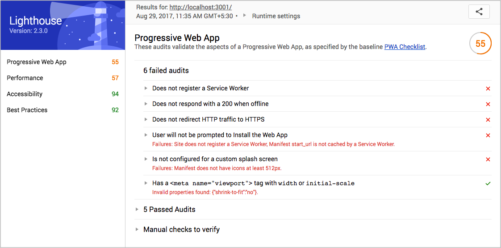

[Progressive web apps](https://developers.google.com/web/progressive-web-apps/) (PWAs) came in the lime light recently. It uses the best of web and the best of apps to give a smooth experience to users and feels like native app. PWAs are responsive and fast, consume less data, need less storage space, support push notifications and offline use in browser. Twitter recently launched [mobile.twitter.com](https://mobile.twitter.com/) which delivers mobile app like experience to users in browser without actually installing on user device. This article focuses upon building progressive web app with React JS


We’re going to build a simple PWA in this article. You can use this code as boilerplate for further PWA developments.


## Getting Started with PWA
First let’s generate a React application with create-react-app. You can run the following commands to generate the React app.
```sh
npm install -g create-react-app

create-react-app pwa-app
```
Next we will install React Router:

```sh
cd pwa-app

npm install --save react-router@3.0.5
 ```

Now replace your `src/App.js` content with below gist. It will give us a basic template with navigation.
```jsx
import React, { Component } from 'react';
import { Router, browserHistory, Route, Link } from 'react-router';
import './App.css';

const NavBar = () => (
  <div className="navbar">
    <Link to="/">Feed</Link>
    <Link to="/profile">Profile</Link>
  </div>
);

const Template = ({ title }) => (
  <div>
    <NavBar />
    <p className="page-info">
      This is the {title} page.
    </p>
  </div>
);

const Feed = (props) => (
  <Template title="Feed"/>
);

const Profile = (props) => (
  <Template title="Profile"/>
);

class App extends Component {
  render() {
    return (
      <Router history={browserHistory}>
        <Route path="/" component={Feed}/>
        <Route path="/profile" component={Profile}/>
      </Router>
    );
  }
}

export default App;
 ```
Next we need to update the default styles a bit to make our app look clean. Replace your __src/App.css__ `with below styles.
```css
.navbar {
  background-color: #01C8E5;
  text-align: center;
}

.navbar a {
  display: inline-block;
  padding: 10px;
  color: #fff;
  text-decoration: none;
}

.page-info {
  text-align: center;
  font-weight: bold;
}
 ```
Finally run __`npm start`__ to check the app in the browser. Now this is a basic app with 2 routes. We will now convert it to PWA.


## Install Lighthouse and Audit
Lighthouse is an open-source, automated tool which helps us to test our app against PWA checklist. It also provides audits for performance, accessibility, and more. You can download and install in your chrome browser by following this [link](https://chrome.google.com/webstore/detail/lighthouse/blipmdconlkpinefehnmjammfjpmpbjk/).


Next let’s test our app using Lighthouse. Click on Lighthouse icon in the top right corner of Chrome and then click on Generate Report button. This is how the generated report looks like –

We will fix all 6 failed audit next.

## Register a Service Worker
Services worker act as proxy servers that sit between app and network. Using this we will intercept network requests and serve cached files. It will allow our web app to work even if network is offline.

First create a blank __worker.js__ file in public folder of the app and add this block of code in that file.
```jsx
// Flag for enabling cache in production
var doCache = false;

var CACHE_NAME = 'pwa-app-cache';

// Delete old caches
self.addEventListener('activate', event => {
  const currentCachelist = [CACHE_NAME];
  event.waitUntil(
    caches.keys()
      .then(keyList =>
        Promise.all(keyList.map(key => {
          if (!currentCachelist.includes(key)) {
            return caches.delete(key);
          }
        }))
      )
  );
});

// This triggers when user starts the app
self.addEventListener('install', function(event) {
  if (doCache) {
    event.waitUntil(
      caches.open(CACHE_NAME)
        .then(function(cache) {
          fetch('asset-manifest.json')
            .then(response => {
              response.json();
            })
            .then(assets => {
              // We will cache initial page and the main.js
              // We could also cache assets like CSS and images
              const urlsToCache = [
                '/',
                assets['main.js']
              ];
              cache.addAll(urlsToCache);
            })
        })
    );
  }
});

// Here we intercept request and serve up the matching files
self.addEventListener('fetch', function(event) {
  if (doCache) {
    event.respondWith(
      caches.match(event.request).then(function(response) {
        return response || fetch(event.request);
      })
    );
  }
});
 ```
We will check whether the browser supports service workers, and then register our __worker.js__. To do so add the below script to __public/index.html__. (Notice that we have removed “shrink-to-fit=no” from viewport meta tag.)
```html
<!doctype html>
<html lang="en">
  <head>
    <meta charset="utf-8">
    <meta name="viewport" content="width=device-width, initial-scale=1">
    <meta name="theme-color" content="#000000">
    <link rel="manifest" href="%PUBLIC_URL%/manifest.json">
    <link rel="shortcut icon" href="%PUBLIC_URL%/favicon.ico">
    <title>React App</title>
  </head>
  <body>
    <noscript>
      You need to enable JavaScript to run this app.
    </noscript>
    <div id="root"></div>
    <script>
      if ('serviceWorker' in navigator) {
        window.addEventListener('load', function() {
          navigator.serviceWorker.register('worker.js').then(function(registration) {
            console.log('Worker registration successful', registration.scope);
          }, function(err) {
            console.log('Worker registration failed', err);
          }).catch(function(err) {
            console.log(err);
          });
        });
      } else {
        console.log('Service Worker is not supported by browser.');
      }
    </script>
  </body>
</html>
 ```
Restart you app and reload the browser. You will see “Worker registration successful” message in developer console. Now let’s re-generate the Lighthouse report.


## Improve Progressive Nature of the app
Currently, our app renders empty __root__ div till the JavaScript loads and React hooks up the initial route. We need make sure our app works without any JavaScript loading and displays some HTMl and CSS before React comes into the play. Here’s how our updated __index.html__ looks like.
```html
<!doctype html>
<html lang="en">
  <head>
    <meta charset="utf-8">
    <meta name="viewport" content="width=device-width, initial-scale=1">
    <meta name="theme-color" content="#000000">
    <link rel="manifest" href="%PUBLIC_URL%/manifest.json">
    <link rel="shortcut icon" href="%PUBLIC_URL%/favicon.ico">
    <title>React App</title>
    <style type="text/css">
      body {
        margin: 0;
        padding: 0;
        font-family: sans-serif;
      }
      .navbar {
        background-color: #01C8E5;
        text-align: center;
      }
      .navbar a {
        display: inline-block;
        padding: 10px;
        color: #fff;
        text-decoration: none;
      }
      .page-info {
        text-align: center;
        font-weight: bold;
      }
    </style>
  </head>
  <body>
    <noscript>
      You need to enable JavaScript to run this app.
    </noscript>
    <div id="root">
      <div class="navbar">
        <a href="/">Feed</a>
      </div>
      <p class="page-info">
        Loading an awesome app...
      </p>
    </div>
    <script>
      if ('serviceWorker' in navigator) {
        window.addEventListener('load', function() {
          navigator.serviceWorker.register('worker.js').then(function(registration) {
            console.log('Worker registration successful', registration.scope);
          }, function(err) {
            console.log('Worker registration failed', err);
          }).catch(function(err) {
            console.log(err);
          });
        });
      } else {
        console.log('Service Worker is not supported by browser.');
      }
    </script>
  </body>
</html>
 ```
Re-audit the app using Lighthouse and you will see the performance is improved;

## Add Splash Icons
We need to add a 512×512 icon to show up on splash screen. For doing so we need to update the manifest.json and put the icon in public folder.
```json
{
  "short_name": "React App",
  "name": "Create React App Sample",
  "icons": [
    {
      "src": "icon-192x192.png",
      "sizes": "192x192",
      "type": "image/png"
    },
    {
      "src": "icon-512x512.png",
      "sizes": "512x512",
      "type": "image/png"
    }
  ],
  "start_url": "/",
  "display": "standalone",
  "theme_color": "#000000",
  "background_color": "#ffffff"
}
 ```

We also need to add these meta tags to inform the browser that our app is a PWA.

```html
<!-- Tell the browser it's a PWA -->
<meta name="mobile-web-app-capable" content="yes">
<!-- Tell iOS it's a PWA -->
<meta name="apple-mobile-web-app-capable" content="yes">
 ```

## Let’s Deploy
We’re now only missing HTTPS and caching which will be fixed after deploy. Update the __doCache__ flag to __true__ in worker.js file. Next, create a new project in firebase-console with name __Pwa App__. Run the following commands in project directory.

```sh
npm install -g firebase-tools
firebase login
firebase init
 ```
Make sure your __firebase.json__ looks like this-

```js
{
  "hosting": {
    "public": "build",
    "rewrites": [
      {
        "source": "**",
        "destination": "/index.html"
      }
    ]
  }
}
 ```
After initialisation build the app and deploy.
```sh
npm run build
firebase deploy
 ```

Now when we do audit using Lighthouse on deployed URL. We should see this result.


and We’re done! Now we have a working base for building progressive web app with React JS. We’re ready for the future of web applications. 😀

Demo URL: [Pwa Demo App](https://pwa-app-cb.firebaseapp.com/)

Code: [Github](https://github.com/balramkhichar/progressive-webapp-base)