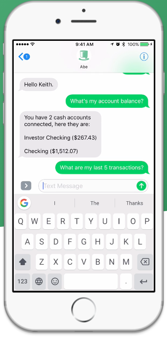
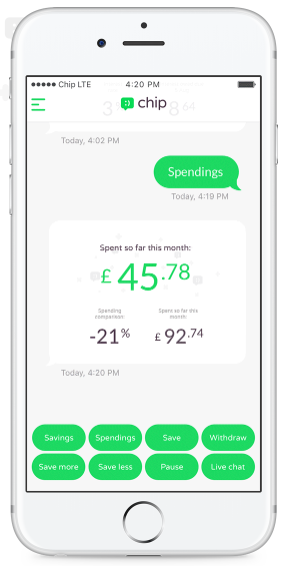
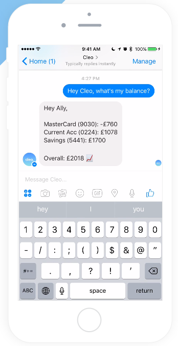

Lots of financial institutions are getting on the chatbot bandwagon to increase sales, and help with customer service. We ourselves have seen a lot of clients coming in, asking for chatbots. While certain skeptics believe it’s too early and warn entrepreneurs to not jump in blindly, we believe financial institutions can only benefit from chatbots.

Fintech bots, as they are referred to in the digital world are aplenty. Countries like UK and US are already seeing personal finance bots that promise friction free, conversational banking to its users gaining traction. One thing that gives third party applications an edge over banking institutions is that they let you connect multiple accounts with multiple banks. A banking institution’s chatbot can only properly serve its customers if the customer has her complete financial portfolio with that bank.

Here we look at 3 personal finance bots that are already making a splash in the international market:

### Abe

[(https://www.abe.ai)](https://www.abe.ai)

An AI software company based out of Orlando, Abe is a conversational bot available on SMS and Slack. Once a user connects their bank accounts with Abe, the software runs a series of statistical and machine learning algorithms to identify a series of recurring and non-recurring expenses. These are then classified into categories to mark expenses. This helps Abe predict how much cash the user can work with over a given period of time. Because the system is based on machine learning, the algorithms ‘learn’ the spending habits of the user and are able to give better predictions over time.

Unlike other financial apps where the user is required to set goals on their own, Abe automates this, greatly reducing the friction. Users can ask questions like, “How much can I spend this weekend” or “How much did I spend on Uber last month” and get answers as a message response.

The service is completely free to the end user and they’re only serving in the US currently. Users can chat with Abe via SMS or on Slack (as a direct message) and the team is working on getting this service on Facebook Messenger and Amazon Alexa very soon.

### Chip

[(https://getchip.uk/)](https://getchip.uk/)

Chip is a UK based personal finance bot that helps users save money. “The Automatic Savings App” as proclaimed on their website, Chip is desinged to help people save money no matter how much they earn. Users can connect their bank accounts with Chip via a 256 bit bank grade encryption. The app employs artificial intelligence and machine learning algorithms to identify how much a user can afford to save every month. The app then automatically puts away the amount into a savings account every month. What is impressive is that the amount is flexible and calculated on the basis on actual expenditure, so if you spend more than usual in a specific month, Chip saves slightly less – if you spend less, more money is saved.

Chip has developed its own Android and iOS app, while keeping the flow of information conversational. It’s like talking to your personal banking assistant via the app. Talking to Techcrunch, the founders shared their big plans for Chip, which they envision turning into a complete financial services app providing users a host of financial products at transparent pricing.

### Cleo

[(https://www.meetcleo.com)](https://www.meetcleo.com)

Cleo terms itself as a smart assistant for your money. Not very unlike the other two bots mentioned above, Cleo lets users connect their bank accounts and credit card data with it. Running analysis on user’s expenditure history, Cleo then provides intelligent insights and answers the user’s query in a conversational form. Currently, Cleo is available on Facebook Messenger and SMS with plans to launch on Amazon Alexa and Google Assistant very soon.

The motivation behind Cleo is that the current financial services and products are not very good, and could be improved. Finances could be made easy to understand and managing money could be become a lot easier by leveraging technology. The products focus is to make managing money really simple as a whole. Their ideal user being people who hate spending time on spreadsheets managing their finances.

Currently in a private alpha mode, Cleo plans to offer a whole range of financial products in suited to individual needs and prices eventually.

Fintech chatbots are just beginning to create a serious market for themselves. The possibilities with conversational banking are endless. There’s no wonder that Fintech chatbots are one of the hottest market to look for in this year.

