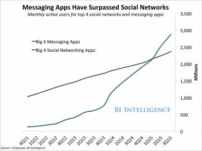
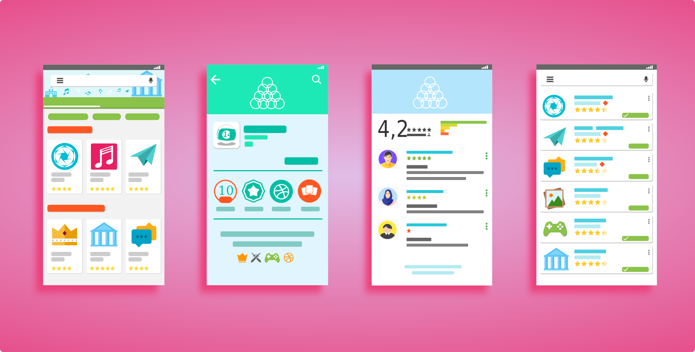

Chatbot is the latest buzzword in the tech world. Everybody is gushing over how amazing it is to have a chatbot for your business. In this article we quickly take you through the ins and outs of having a chatbot and whether or not your business would benefit from it.

## What are chatbots?

Chatbots are computer programs designed to simulate human conversations – and they can be broadly classified into two types:

AI powered chatbots – chatbots use artificial intelligence to ‘learn’ from multiple conversations, draw context, and respond within that context. They are designed to ‘talk’ to humans as a ‘human’.

Script based chatbots – chatbots have a specific flow. They have a predefined script that they follow and are generally implemented for a specific use case, could be customer service, shopping assistants or weather update bots.

## Why Chatbots?

Messaging apps have taken the world by storm. The top four messaging app have a combined user base of upwards of 3 billion and they recently surpassed the combined active user base of the top four social media platforms.

Source: Business Insider

Consumers prefer to connect with businesses over chat, reveals a recent study done by Facebook. Whether buying a new pair or boots or trying to get their query resolved, over 53% of users prefer to do it over a chat. Incidentally, around the same percentage of users surveyed believe that chatting with the business directly would help them resolve their queries faster. A staggering 45% of users surveyed feel that ‘talking’ to a business over their preferred chat application would be more convenient as they would not need to use a separate service or an app on their device.

The most important numbers that would convince any business owner to get a chatbot for their business are:

63% of the participants in the survey said that they message more with businesses than they did two years ago.

67% of the participants expect to message more with businesses in the next two year.

Now that we’ve established that chatting with your customers over one of the popular messaging applications will be beneficial for your business, how do you make sure that every query on the chat is answered within a few seconds, at any time of the day?

This is where chatbots fit in. They are the perfect solution to 1:1 marketing at scale. Pre-programmed chatbots can simultaneously hold conversations with each and every user, no matter where they are, no matter what time it is. And if the customer needs something your chatbot cannot answer – you easily channel the request to your ‘human’ support team. Can’t get any better that this!

Sources: Business Insider

## How can chatbots be used for your business?

Luckily, each and every business that can benefit from an online presence can also use a chatbot to boost their business. Breaking down the business flow into pre-purchase and post-purchase, here are some use cases you can draw inspiration from:

## Pre purchase chatbots

### 1. Query Bots

Let’s say you run a pizza delivery shop. Some of the general queries your potential customers might have are:

What is your closing time.

Do you deliver at a particular location.

Are you running any discounts or offers.

Instead of the customer having to call you on your phone and engaging your employee, you can easily configure a chatbot to answer these questions. The way to go about implementing this would be to compile a list of 10 (or more) most frequently asked questions and program the bot to answer them.

__2. Shopping Assistant Bots__

These bots can help you sell more if you’re running an e-commerce store. Let’s say you sell custom footwear. An example conversation that could happen between your chatbot and a potential customer:

> **ShoeBot**: Hi there, what are you looking to buy today?
>
> <ol>
>   <li>Men’s Footwear</li>
>   <li>Women’s Footwear</li>
> </ol>
>
> **Customer**: Men’s Footwear 
> **ShoeBot**: Great, what kind of Men’s Footwear
>
> <ol>
>   <li>Casual Shoes</li>
>   <li>Formal Shoes</li>
> </ol>
>
> **Customer**: Casual Shoes 
> **ShoeBot**: What’s your price range?
>
> <ol>
>   <li>$25 – $75</li>
>   <li>$75 – $150</li>
>   <li>$150 – $300</li>
>   <li>Above \$300</li>
> </ol>
>
> **Customer**: $75 – $150 
> **ShoeBot**: Great, what do you think of these:

And the bot lists down the options you have that fit the filters – the customer can see the products, choose to buy or see more options. The possibilities are endless!

 __3. Explainer Bots__
If you’re running a [SaaS application company](/saas-development-services/), you could use a bot to help people get a feel for your product. These bots would usually live on your website via a chat tool (something like smooch) and help answer queries your potential customers might have.

Using a combination of interactive media like images, videos and using links to drive people to the right pages, a chatbot could be a big boost to your customer success team. Ofcourse, human help should always be at hand, incase your bot has trouble understanding your customers.

### Post Purchase Bots

A good after sales connect with your users can make a big difference in how your brand is perceived, and incidentally, this is where most bigger brands struggle. Implementing chatbots to help your customers post their purchase is something every brand should look at.

These bots would exists with only one aim – to help your customers with their post purchase issues. Scheduling returns, registering complaints, taking feedback – these bots can be configured to do anything that has a process to it.

If you’re selling high end watches, you could implement a bot that would help your customers find service centers and schedule a servicing.

Advancement in chatbots have opened up a whole new platform for businesses. And this is just the beginning. The next year will see a majority of businesses adapting chatbots in some form.

