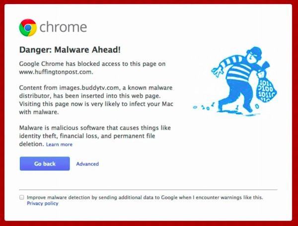
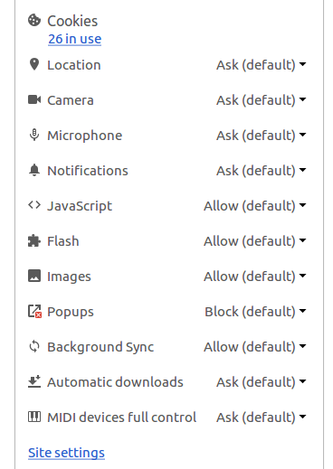
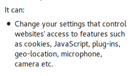
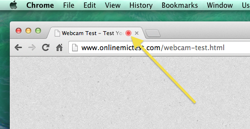

Chrome is one of the most powerful web browsers (if not the most powerful web browser). With its huge marketplace of extensions and apps, it’s more like a platform and has fuelled the creation of ChromiumOS. The Chrome APIs have played a major role in fueling this massive growth. From extensions like AdBlockPlus, that block pestering ads to Grammerly, that help fix grammatical issues in the text we type, numerous utilities have become an integral part of our life.

### TL;DR

A Chrome extension can manage permissions for itself and other extensions. This allows for extensions to grant itself audio/video access, monitor keyboard inputs, access you browser history and even access your camera and mic.

All this without showing the red dot in tabs, quite unlike websites access your webcam.

Here’s a video showing the Permission Flaw:

  

    <iframe
      src="https://player.vimeo.com/video/220151318"
      frameBorder="0"
      allow="autoplay; fullscreen"
      style="max-width: 100%;"
      allowFullScreen
    />
  

## Evolution of Malwares
According to chrome “Malware is any software or mobile application specifically designed to harm a computer, a mobile device, the software it’s running, or its users. Malware exhibits malicious behavior that can include installing software without user consent and installing harmful software such as viruses.”

Have you ever seen this?

Malwares were initially OS-specific (like Windows only or Mac only). Then they started becoming application-specific, like Macro viruses for Word, Excel and other business applications. Both these type of malwares are easily detectable by Anti-virus softwares.

<iframe width="560" height="315" src="https://www.youtube.com/embed/pbG0JGY2U00" frameborder="0" allow="accelerometer; autoplay; encrypted-media; gyroscope; picture-in-picture" allowfullscreen></iframe>

Recently, new kind of malwares are being developed which are embedded in basic data files. One such example is specially crafted [Subtitle files for VLC Media Player](http://blog.checkpoint.com/2017/05/23/hacked-in-translation/), Kodi and Popcorn Time, which go undetected and upon being used in the mentioned media player softwares, can initiate remote tunnels to a malicious server giving full access of the system.

The next and even more advanced kind of malwares come in the form of Chrome and Firefox extensions. Initially, these extensions could be developed in C/C++ along with JavaScript using NPAPI. This allowed the extensions to interact with the OS and they could potentially create and modify files on the system.

Ever wondered why the extension for Internet Download Manager was never installed from Chrome Webstore or Mozilla Add-ons repository? It wouldn’t have passed the validation checks put in place by these repositories. Towards the end of 2014, Chrome phased out the support for the NPAPI (it had been there since 1995) and later by the end of 2016, Firefox made a similar decision after adding some corresponding features in their core API platform.

Now the extensions can only be written in JavaScript and for the extension to be able to access some critical APIs, they need to be installed from the webstore. This check was made mandatory so that the Chromium Team is aware of what extensions use those critical APIs.

Enter HTML5 and the PeerConnection API. HTML5 is not just the next version of HTML, but it opened the doors for a whole new user experience. It brought in native support for playing audio and video files, which meant that there was no longer the need to install QuickTime, VLC or Flash Player plugins to play such content. We have used these functionalities to access camera, microphone access to interact with the browser, in many of [our projects](/works). Last year even YouTube made HTML5 as the default video player instead of the Flash player used earlier.

With all the good happening, one would obviously wonder, “So what went wrong?”.

## Chrome contentSettings pattern-matching Bug
The answer to this lies in the ever-growing power of Chrome APIs. As of now, a chrome extension can inject scripts in tabs, read the cookies, create desktop notifications, and convert text to speech and read it out for you. Obviously, when installing any extension using these APIs, certain permissions are asked for and only upon being granted by the user are they installed. But there is one API, ‘contentSettings’ which can potentially grant full access to a chrome extension to modify permissions for any website.

According to Chrome [documentation](https://developer.chrome.com/extensions/contentSettings):

> Use the chrome.contentSettings API to change settings that control whether websites can use features such as cookies, JavaScript, and plugins. More generally speaking, content settings allow you to customise Chrome’s behaviour on a per-site basis instead of globally.

The following permissions are controlled by contentSettings API – Cookies, Location, Camera, Microphone, Notifications, JavaScript, Flash, Images, Popups and triggering Automatic Downloads.

Upon installing an extension with ‘contentSettings’ permission, the following popup is raised:

These popups are taken as seriously as is the ‘license agreement’ before installing VLC Media Player or the list of ‘permissions’ before installing Facebook Messenger. This notice can (and will) easily be overlooked. Due to a bug in the chrome URL patterns for extensions, a chrome extension can manage permissions __for itself as well as other extensions__ also. A simple extension can be written to grant itself audio/video access permissions, listen to your conversations, monitor the keyboard inputs, access your browser history and even look at you through the webcam. Unlike websites, it does not show the red dot that appears for tabs, since extension runs as a background process in Chrome.

PS: I had reported the issue to Chromium Team on 1st Jan, 2017. It was accepted as Security Bug and first PR was created 3 months later in March. Since then, there are only talks and no clear solution has been arrived at yet. At the time of writing, its 5 months now and the issue has been jumped from v56 to v57 and then to v58. The purpose of making it public is for the Chromium team to take it seriously and prioritize it in the upcoming version.

