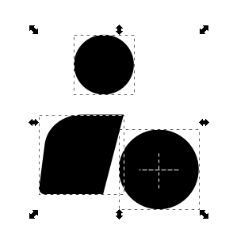
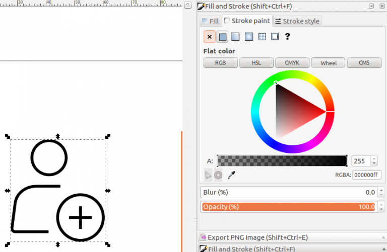
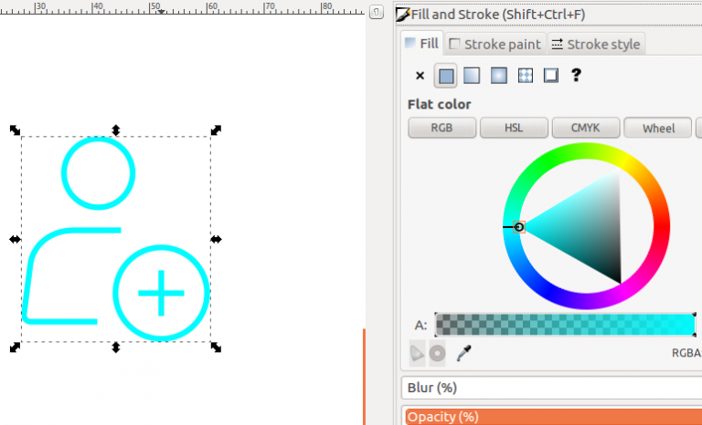
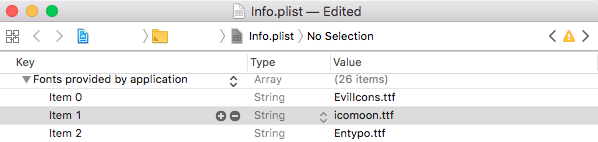
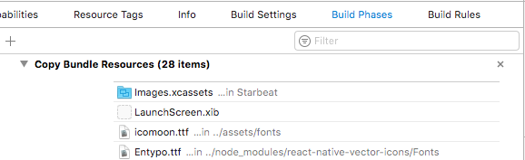

Developing iOS and Android applications by React Native is growing day by day. Stunning UI can be easily achieved by the right combination of images and styled content like icons / texts. SVG is the best available option for rendering an icon in a React Native application development process. Unfortunately React Native does not natively support SVG rendering. Although there are a couple of libraries out there that do it, turning icons into fonts makes it much simpler to display clean-cut icons with consistent dimensions with dynamic styling (including colors / size etc…)

Let’s start off with getting an SVG image to iconize. I shall be using the following:

- [Inkscape](https://inkscape.org/)
- [IcoMoon](https://icomoon.io/app)
- [React Native Vector Icons](https://github.com/oblador/react-native-vector-icons)
- [React Native Linear Gradient](https://github.com/react-native-community/react-native-linear-gradient)

If you had tried any of the tools out there that make fonts out of SVGs such as Fontello or IcoMoon, you might have had problems with some SVG images. For fonts, we need SVGs that do not have strokes in them. They only take _fills_.


The end result would be this icon picture-perfect in whatever size / color we might need which is easily controllable by our React Native Code.

## Getting the Icon

In this case we are using InkScape since it’s available across Mac, Windows and Linux for free.

1. First get your SVG image. If you have designs in sketch it can easily be exported. Also, there are options in Sketch to export only outlines, that might make short work of the Strokes that we do not want in our images. There are a bunch of services that convert JPEG, PNG and other formats into SVG.
2. One thing to note is multi-colored icons aren’t really a thing. So, if I was exporting the above icon from Sketch, we would simply export the inner most lines and circles and leave the circular lavender background. If that proves difficult, extract our icon using InkScape.
3. Open up the SVG in InkScape and select the second option in the left pane Edit Paths by Node (F2). Select all the paths you need by holding down shift and left clicking them. If the lines happen to be invisible for some reason simply hovering over the area where they are would show outlines. Now cut out your selection. Let’s remove what was left out. Select everything else on screen, choose the Selection tool (first on the left pane / F1) and delete. Paste the selection that you cut out earlier.



Right click and Group them.

You can play around with this a little bit to see what’s happening. Basically, if you set Stroke color and see your image filling up like so, then it isn’t ready for conversion into a font. `Shift + Ctrl + F` brings it up.



Select your image and click on the Path menu and choose Stroke to Path. After that you can try to remove colors for Stroke and choose a color for Fill and see if the icons color up with just the Fill color set.


In this case it was not working. So to make it work, get into the XML editor which is brought up with `Shift + Ctrl + X`. Select each of the paths that have Stroke on them and convert them to Paths by pressing `Ctrl + Alt + C` or going into the menu.



The colors that you got from Strokes, you get them from Fills now. The SVG is ready to go into our font!

Next up, we have to export / save this image. Select the image go to Document Properties in the File menu or press `Ctrl + Shift + D`. The option we’re looking for here is Resize Page to Content. Click on it and select Resize page to drawing or selection. Then simply save as a Plain SVG.

---

## Generating the Font

Generating the fonts itself is pretty straightforward at this point. You simply go to [IcoMoon’s site](https://icomoon.io/app/) and Import your icons and Generate Font. Download it with the Download option at the bottom right. You get a couple of files. The files of significance to us are the selection.json and the iconmoon.ttf files. There’s a bit of work left to bring the icons into your project.

Put the .json and the .ttf files into your assets folder. For Android, you simply want to move it to android/app/src/main/assets/fonts and you are done. For iOS, you have to import the files into your project from XCode.

&nbsp; &nbsp; &nbsp; &nbsp;Add the font file to info.plist.


&nbsp; &nbsp; &nbsp; &nbsp;Make sure it shows up in Build Phases under Copy Bundle Resources. Create an entry and point it to your font location.


If you think you didn’t get it right check out [react-native-vector-icons](https://github.com/oblador/react-native-vector-icons#installation)’ git for a more detailed explanation.

Don’t forget to re-build after it’s all done.

---

## The Icon component

Time to build our icon component!

```jsx
import React from "react"
import { StyleSheet, View } from "react-native"
import { createIconSetFromIcoMoon } from "react-native-vector-icons"

import icoMoonConfig from "#/assets/selection.json"

const Icon = createIconSetFromIcoMoon(icoMoonConfig)

const styles = StyleSheet.create({
  backdrop: {
    alignItems: "center",
    justifyContent: "center",
  },
})

const RadIcon = ({ backdrop, color, name, size, style }) => {
  if (!name) return null

  const IconComponent = (
    <Icon
      name={name}
      size={size}
      color={color}
      style={!backdrop && style}
    />
  )

  return backdrop ? (
    <View
      backgroundColor={backdrop}
      style={[
        {
          borderRadius: size,
          height: size * 2,
          width: size * 2,
        },
        styles.backdrop,
        style,
      ]}
    >
      {IconComponent}
    </View>
  ) : (
    IconComponent
  )
}
```

The code above does simple as well as icons with a backdrop. Doing gradients is just as simple. All you have to do is replace the View component with the imported LinearGradient component and pass on some colors. It can also easily be customized to add shadows other fancy adornments.


This technique can also be employed in React. Instead of importing images and hassling with the dimensions and editing for colors, this is so much easier.
