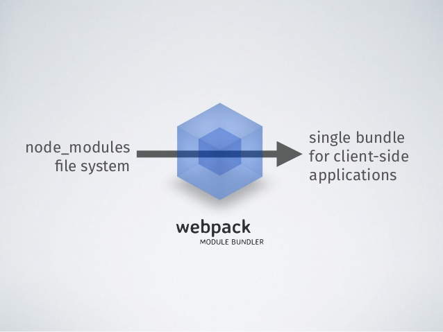
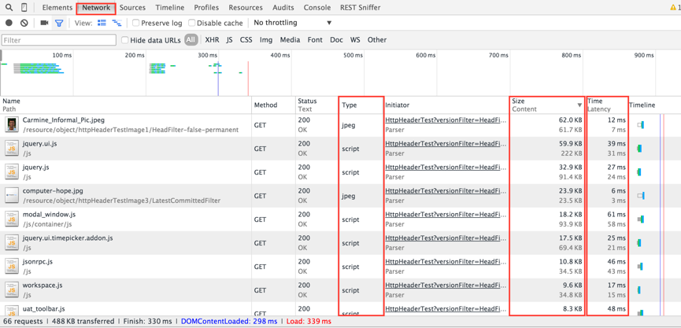
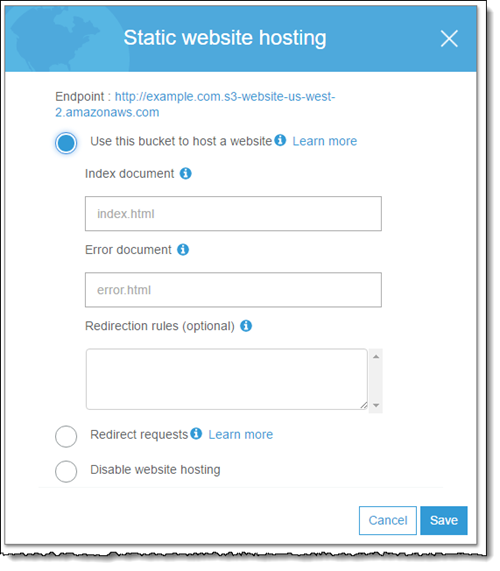
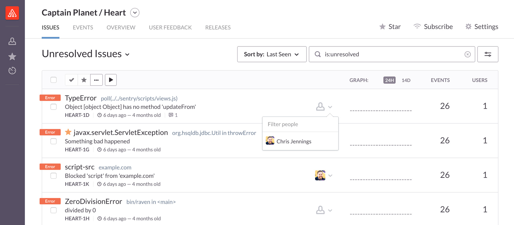

A lot of front end application development companies are using React for developing applications. Deploying an application refers to making the application accessible to the world through internet. We will discuss about the various ways to deploy a React application, the platforms to deploy and test the applications. There are a lot of articles describing how to deploy a React application. We will mention about each steps involved in detail as per our experience and various options to how to do it. This article is written assuming webpack as the module bundler to generate the bundled assets for a client side deployment.

## What does deployment refers to ? (For Beginners)

Once you create your React application you want to share it to the whole world. You wouldn’t want to tell every single user of the application to download the repository and ask them to run locally. So to share it and make it open to the entire world we deploy the application in the internet. Also there would be frequent version updates to the application (like bugfixes, feature addition…) that has to happen without informing the end users.



## What should be the major focus of a deployed application ?

The major focus of a deployed front end application (in our case it is the React application) is to make the application load faster by minimizing the overhead. This can be achieved by reducing the bundled Javascript files and optimizing the static assets. Imagine downloading 15 MB files for every single network request in our application. The user will feel that the application will be too difficult to use. There are many ways to improve the speed of the application and we have described in upcoming sections.

## How deployment is different from development ?

We typically define “production environment” and “development environment” to actually distinguish between the deployment and development phase.

The main focus in development phase is to make the development process easier by integrating many tools. For example a better stack trace can help in identifying the error easily. Also we can use loggers to identify the problem. We don’t use this in production environment since this might consume more memory and make the app slower. The whole idea is there are can be a lot of optimisations present in a deployed app.

## How does deployment works ?

In a typical client side deployment we generate files which are actually served over the network.



In the example you could see that all the necessary files (Javascript / static assets ) are fetched over the network.
Typically during development using webpack dev server, the server actually stores these files in memory and serves during development. So during deployment we get the following files generated

1. A root html file
2. Single or multiple Javascript files [Including styling]
3. Static assets like images / svgs

The html file links the javascript file(s) based on which the application loads. This is a way Single Page applications work. So the first step of deployment is actually creating these files.

## Optimizations in creating a bundle

We cannot do much changes to html file since it will have a single JS file linked to it. Even the size of it will be < 1Kb. Mostly we target the Javascript files to optimize. So if you ask me what is the proper size of Javascript bundles which will make the application faster. The answer is there is no such magical number. As you increase the size of bundled JS file, you app will be getting slower. But optimizations like splitting bundles and caching can still be performed to make it served faster. For exact numbers, lets look at how much the popular React web applications fetch initially. Open your devtools and hit the below websites.

Airbnb : 3.1 MB

Bitbucket: 1 MB

Clashofclans: 3.3MB

Most of these applications use better optimisation techniques to reduce the overhead during initial fetch. For example Facebook / Netflix fetches minimal data (Around 1 MB) when it loads for the first time. Based on the further user interactions, the application will be fetching additional files. So if you feel that your application is slow and have a large bundle size even after performing optimisation, the best technique is to lazy load the modules and provide only when required.

Lets look at the various optimisation techniques one by one. **Remember that you don’t need all of these**. These are just the best available options. You could choose the right ones suitable for your project. We, at [Codebrahma](/) typically handpick the appropriate optimisations for the appropriate use case.

**Setting the right node environment**

Even though React has good system implemented for warnings and errors, you don’t need it for a deployed application. (It is really helpful in development though). So by setting Node Environment to production, we explicitly tell React to ignore displaying warnings. Also the libraries which you use (not all) will avoid the development related code.

If you have seen React’s source code you would have found lot of conditional checks(process.env.NODE_ENV != ‘production’). Most of these are for development purposes. So to avoid it, we can use definePlugin in webpack like this.

```js
plugins: [
  new webpack.DefinePlugin({
    "process.env": {
      NODE_ENV: JSON.stringify("production"),
    },
  }),
]
```

This will avoid all the code which is actually meant for development.

**Minification**

Minification strips a code file of all data that isn’t required in order for the file to be executed. Generally readability is not a concern for the deployed code running on the browser. By Minifying, we compresses the file size by removing the spaces, new lines thereby making the code ugly. Uglify also joins sentences using comma, removes dead code and removes console logs. it also simplifies conditional statements (if), Boolean operations, constants, function declarations etc.

We can use Uglify JS plugin to minify your code. Even though there are a lot of configurations, you can easily identify which one works the best for you.

```js
plugins: [
  new webpack.optimize.UglifyJsPlugin({
    output: {
      comments: false,
    },
    mangle: true,
    sourcemap: false,
    debug: true,
    minimize: true,
    compress: {
      // set what to include and what to exclude
      warnings: false,
      screw_ie8: true,
      conditionals: true,
      unused: true,
      comparisons: true,
      sequences: true,
      dead_code: true,
      evaluate: true,
      if_return: true,
      join_vars: true,
    },
  }),
]
```

__Removing dead code using Tree Shaking:__

Tree shaking is a technique by which you can remove the non imported code. This works only with ES2015 module import/export. By using this method we can remove code from libraries which are not imported. So how it works ? During bundle creation, Webpack grabs all of your modules and puts them into a single file but removes the exportfrom code that’s not being imported anywhere.

Even though this is a good technique majority of the libraries don’t publish their code in ES2015. Due to this reason this might not yield results as you expect.

__Dedupe-plugin__

Deduplication as the name suggests, prevents duplicate files being included in the compiled code by creating copies of the duplciate functions instead of redefining them. So in the runtime it includes only one copy of each function thereby removing the duplicates.

```js
new webpack.optimize.DedupePlugin()
```
__Ignore - plugin__

Using this plugin we can ignore modules for import matching the following regular expressions.

```js
new webpack.IgnorePlugin(requestRegExp, [contextRegExp])
```

For example, in moment library all locales are bundled together with the core library . You can use the IgnorePlugin to stop any locale being bundled with moment:

```js
new webpack.IgnorePlugin(/^\.\/locale$/, /moment$/)
```

__OccurrenceOrderPlugin__

Assign the module and chunk ids by occurrence count. Ids that are used often get lower (shorter) ids. This make ids predictable, reduces total file size and is recommended.

```js
new webpack.optimize.OccurrenceOrderPlugin(preferEntry)
```

__Lazy loading and Dynamic imports__

Webpack provides a great platform to achieve dynamic imports seamlessly. Try opening facebook.com and netflix.com and try using some of their features. You could see that there will be multiple network requests to fetch the JS files. These files will be fetched only when needed. A simple example would be


Webpack allows you to import a library only when you actually use it. For example, moment is a heavy library which might not be used everywhere. If there is a Component where you used moment and that component is rendered only in one route, you can dynamically import it like this

```js
import(‘moment’).then() // This will return a promise
```

We can use moment only in the case when it is actually required.

So if you can identify modules based on the usage, we can reduce bundle size significantly for most of the cases using this plugin.

### CommonChunk plugin

Most probably you won’t be having multiple entry points in your configuration for webpack, I want to discuss this to show the power of commonChunksPlugin. If you are having a multipage app you can easily bundle with multiple entry points, generate multiple chunks and load them on demand.

```jsx
module.exports = {
  entry: {
    index: "./index.js",
    dashboard: "./dashboard.js",
  },
  output: {
    filename: "[name].entry.chunk.js",
  },
}
```

This will generate multiple entry chunks: index.entry.chunk.js and dashboard.entry.chunk.js.

If your entry chunks have some modules in common then CommonsChunkPlugin identifies common modules and put them into a commons chunk. You need to add two script tags to your page, one for the commons chunk and one for the entry chunk.

```jsx
var CommonsChunkPlugin = require("webpack/lib/optimize/CommonsChunkPlugin")
module.exports = {
  entry: {
    index: "./index.js",
    dashboard: "./dashboard.js",
  },
  output: {
    filename: "[name].entry.chunk.js",
  },
  plugins: [new CommonsChunkPlugin("commons.chunk.js")],
}
```

This will generate all the above JS files plus one commons.chunk.js. First load commons.chunk.js and then load all the other files in the html to make it work.

Now comes the question, how to use it with react since it will be a single page application. We can actually create multiple entries with one for the vendor JS file (All your libraries) and the other for the app JS file. Browser generally caches JS files and return the same file from previous request if the name is not changed. Mostly it happens to be the same libraries we will be using once deployed for our application updates. So we can actually use hash IDs of the build to change the name for app.bundle.js dynamically, thereby caching the vendor files by which you can avoid re fetch during new version releases.

__ModuleConcatenation Plugin__

In the past, one of webpack’s trade-offs was that each module in your bundle would be wrapped in individual function closures. These wrapper functions made it slower for your JavaScript to execute in the browser. In comparison, tools like Closure Compiler and RollupJS ‘hoist’ or concatenate the scope of all your modules into one closure and allow for your code to have a faster execution time in the browser.

This plugin will enable the same concatenation behavior in webpack.

__Compression-webpack-plugin:__

This is by far the most important plugin. Once you compress with GZIP your bundle size reduces drastically. I will let you down to google to understand what exactly this plugin does

```jsx
module.exports = {
  plugins: [new CompressionPlugin()],
}
```

Once you build your files using these plugins you have really a lot of options to deploy your application. To deploy your application to internet and make it available to the entire world all you need is a server to handle response and a facility to host the server. There are various options to do this.

Read their documentation to understand the pricing and limits before using their deployment facility. All I wanted to discuss is the procedure to deploy.

### AWS S3

Pricing: Free for one year using free tier.

Amazon S3 is object storage built to store and retrieve any amount of data from anywhere. With S3 we can actually store HTML, JS and CSS files thereby serving it as a static website. All you get is a public folder with a bucket (each bucket can be used as a different static webpage). For this you need to create a bucket. With AWS you can get 11 months of free tier with which you can create one.

### How to host



<ol>
  <li>
    For Index Document, type the name of the index html file, which is typically named index.html. When you configure a bucket for website hosting, you must specify an index document. Amazon S3 returns this index document when requests are made to the root domain or any of the subfolders.
  </li>
  <li>
    (Optional) For 4XX class errors, you can optionally provide your own custom error document that provides additional guidance for your users. For Error Document, type the name of the file that contains the custom error document. If an error occurs, Amazon S3 returns an HTML error document. For more information, see Custom Error Document Support in the Amazon Simple Storage.
  </li>
  <li>
    (Optional) If you want to specify advanced redirection rules, in the Edit redirection rules text area, use XML to describe the rules. For example, you can conditionally route requests according to specific object key names or prefixes in the request. You can have an advanced redirect rules from here.
  </li>
  <li>
    You can also configure cloudfront for region based delivery and caching.
  </li>
</ol>

If you face any react router issue with S3 we can use advanced Redirection rule to solve it. For example, if you hit the nested route as declared in the React router you won’t be getting the results. Since in static deployments it first looks for the folder based on the route. To avoid this you can write advanced redirection rule for 404 and use Hash URL based on this [stackoverflow](https://stackoverflow.com/questions/16267339/s3-static-website-hosting-route-all-paths-to-index-html) thread.

### AWS EC2 or digital ocean:

AWS : Free tier for 1 year. Beyond that chargable (Approx > 6 USD / month)

EC2: > 5 USD per month depending upon config.

This offers instance of your preferred operating system (from ubuntu to Windows) and let you deploy your application. You get a IP address by which you can ssh and access the instance. The steps involved to deploy are

1. SSH into the machine
2. clone your github repository and pull the latest code
3. npm install
4. Create a simple Node server to serve your files
5. Use process manager like PM2 to handle server errors and restarts.
6. We can use services like nginx for load balancer and proxying. To make react router working with nested routes we can set up nginx config to redirect to root if we get any error.

Since this is a static deployment, you can use any server of your wish. We are using Node since we are comfortable with Javascript. This is exactly similar to serving from your local machine. Instead we do this on a remote machine. This is one of the best and commonly used method to deploy. The advantages are the freedom to choose our tools, advanced network security and better options to deploy.

### Heroku.

Pricing: Has a free account for which you can create 5 applications. We can get dynos as low as 7 USD per month.

Heroku is a popular Platform as a service that enable developers to run build and automate applications over the web. The major advantage with heroku is that if you follow their set of instructions it will automatically identify which type of app and deploy on its own. If we use a Node server similar to the one we used at AWS EC2, then we can follow this tutorial to deploy our application. The typical process includes

1. Create Heroku account
2. Create an express app to handle routes
3. Create a heroku app.
4. Add remote url for heroku
5. Push to heroku master
6. App will be auto deployed

__Bonus__

__Production Logging tools.__

There are certain tools which helps us to monitor deployed applications. For example if there is a bug in a deployed verion and if we log it we can use their stack trace to easily solve it.

__Sentry:__

Using Sentry we can log all errors and maintain its stack trace. All we need to include their CDN / source code with our account credentials on our JS file. We need to push to sentry at all possible error locations (We can use try catch pattern at async fetches or any other potential locations).



__Log Rocket__

Log Rocket is a latest tool by which we can even replay redux states when a bug occurs. It is gaining its popularity of late.
