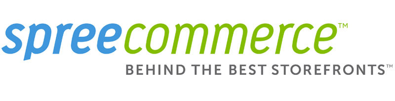
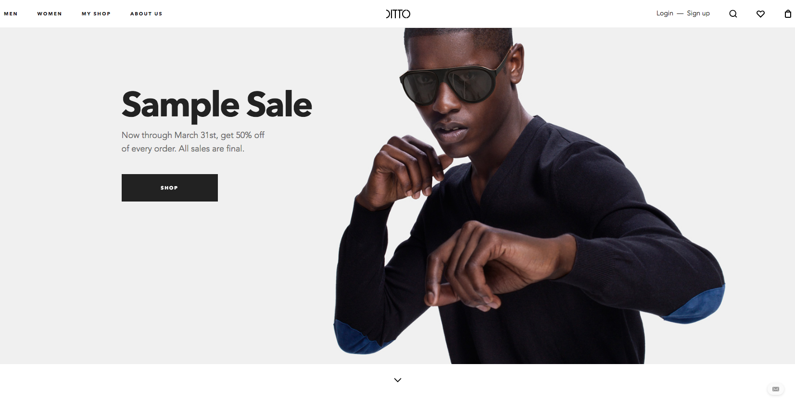

E commerce refers to a business or commercial transaction, that involves the transfer of information over the internet. For business that are already selling through a physical brick and mortar store, setting up an online store is becoming a natural extension. Most business now have websites wherein the users can browse through their product catalog, add items to their cart, pay and get the items delivered to their doorsteps. The advantages of having an e-commerce store are aplenty!

Keeping with the e-commerce trend, a lot of out of box solutions to help businesses get online have emerged. Shopify, Magento, WordPress (with Woocommerce) are some of the bigger names in ecommerce. A relatively newer name on the block – Spree Commerce is fast gaining popularity as the go-to platform for bigger businesses looking to set up their e-commerce store. Here, we take a close look at what is Spree and how can it be used to get your online store up and running.

## What is Spree Commerce

Spree commerce is a full featured e-commerce platform built on top of Ruby on Rails framework. It’s completely open source, with a ‘use-as-you-deem-fit’ license. With over 700 active contributors to the project on GitHub, Spree is amongst the top 50 open source projects in the world. It’s growing popularity can also be gauged by the number of stores being powered by Spree – a staggering 45,000.

## Why Use Spree

Spree is fast gaining popularity. According to [Wikipedia](https://en.wikipedia.org/wiki/Spree_Commerce), it has been downloaded over 429k times as of January 2016. Some of the reasons behind Spree’s success are:

**Flexibility**

Compared to other open source e commerce solutions, Spree is way more flexible – giving developers the power to configure it as they want. This is particularly important for businesses that need to implement variety custom business logic to their ecommerce store. Complex taxations, specific shipping rules etc can be implemented rather easily with Spree. This is why a growing number of big businesses are looking towards Spree commerce.

**Rapid Development**

All the core functionalities of an e-commerce store come in-built with Spree. Inventory management, orders, product catalogs, promotions, shipment etc – are all available as modules and can be implemented on your e-commerce store with just a couple of lines of code. Third party extensions make almost every feature that an e commerce store could have, available without needing to be developed from scratch.

**Scalability and Reliability**

A community of over 700 contributors ensures that Spree is stable and reliable. In fact, Spree’s first stable release was in 2011, about 4 years after the first release. Choosing an open source software system can be a bit tricky as there’s no full-time, dedicated employees working on it. But if the open source project has a developer community as big as Spree’s, you can rest assured about the reliability.

Built on Ruby on Rails, which itself has a one of the largest developer communities working on it, ensures that Spree has a robust framework. Full page caching and faster page indexing keep the page load times in check. Multiple industry standard scalability tests have attributed Spree as on of the easiest to scale e-commerce platforms. Spree is built to handle huge volumes of traffic, and does a wonderful job at it – quite unlike some of the other ecommerce solutions.

**Design Ready**
The admin panel as well as the storefront are responsive right out of the box. Spree is built around simplicity – and this reflects in the design. The admin panel looks way less overwhelming compared to some other ecommerce platforms. This is not because of lack of features but better, more streamlined organization of data.

One rather small drawback is that Spree doesn’t offer a lot of themes for the storefront. The ones that are there are not much to look at. The good news is that since version 3.0, both the admin panel and the storefront implement the popular CSS framework – Bootstrap. This means that you can hire a front end engineer to customize your storefront as you want! Looking at some of the live Spree commerce projects will tell you that your Spree store’s designs are only limited by your imagination (or your developer/designer’s skills :))

## Who Is Using Spree Commerce

A lot of big brand have joined the Spree bandwagon. To name a few popular ones:

1. [Bonobos](https://bonobos.com/) – The men’s apparel company uses Spree commerce for their ecommerce store.
   

2) [Urban Ladder](https://www.urbanladder.com/) – A popular furniture store based in India uses Spree.
   

3. [The Collective](https://codebrahma.com/thecollective) – India’s largest, luxury, multi-brand retail concept. Their web store is built on Spree commerce.
   

4) [Ditto](https://www.ditto.com/) – The eye wear company’s web store is powered by Spree commerce.
   

In conclusion, Spree commerce is a highly viable solution if you’re looking to set up your online store. Being an open source software, the only major financial implication is that of hiring a [spree commerce development company](https://codebrahma.com/spree-commerce-development/), apart from the usual hosting fee etc. We have worked extensively with Spree commerce and would highly recommend using it for your next ecommerce project!
