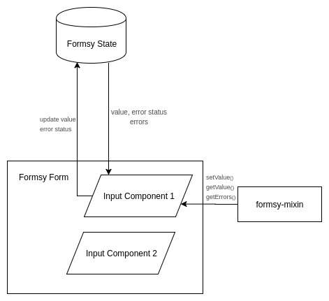
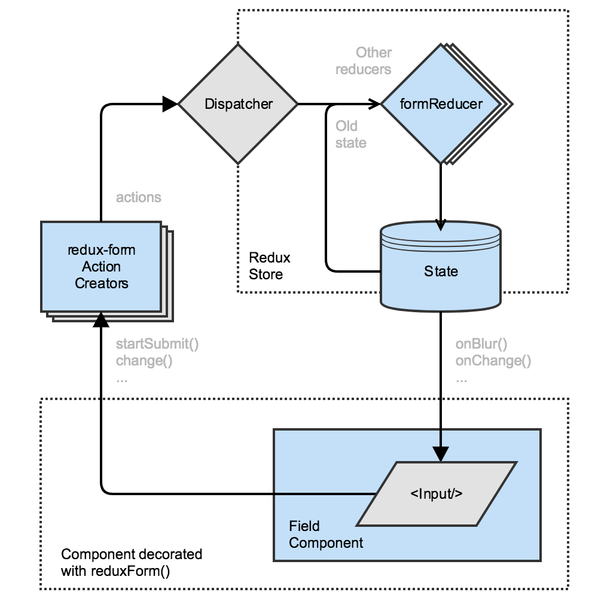

## Introduction
With [React JS](https://facebook.github.io/react/) community on a journey to conquer the best front-end development Javascript framework, the easiness in handling HTML forms in React is one of the most important aspect. Talking about [forms in react](https://facebook.github.io/react/docs/forms.html), as default they have provided us with an option to create controlled and uncontrolled input components. But that does not provide us with a full fledged solution to have a complete and comprehensive module for handling everything related to forms such as
Form Validation and error Handling, Handling form submissions, Easiness in creating custom components. We being one of the best [React JS development](/react-js-development) service company have a good experience with how to handle forms.

Look at [how we create React Applications](/codebrahma-react-application) in a better way by abstracting these Form libraries.

## How to choose the best form library?
Various form libraries in React have evolved to greater extent which solves most of our common problems. Some open source enthusiast and react geeks came up with their own ideas of having a library which will not only handle above mentioned features but also will help us write our own custom input components letting us control their design, behaviour and presentation of the entire form. Choosing the right form library for our application depends on

- How much code complexity gets reduced ?
- How easy is it to create custom input elements
- How easy is it to extract and change the form values
- How easy is to write custom validation logics

## Popular form libraries in React
[Formsy React](https://github.com/christianalfoni/formsy-react) – “The main concept is that forms, inputs and validation is done very differently across developers and projects. This extension to React JS aims to be that “sweet spot” between flexibility and reusability.”

[Redux Forms](http://redux-form.com/7.0.3/)– “Redux Form works with React Redux to enable an html form in React to use Redux to store all of its state.”

[Formik](https://github.com/jaredpalmer/formik) – “Formik will keep things organized–making testing, refactoring, and reasoning about your forms a breeze.”

[React Forms](https://github.com/tannerlinsley/react-form) – “React Forms library provides a set of tools for React to handle form rendering and validation.”

Although there are many such libraries we restrict ourselves to comparing two of the most commonly used libraries __Formsy React__ and __Redux Forms__. Most of the other libraries works on a common principle. So choosing the right one will be an easier task if we understand the work flow of each library.

__Formsy React__ was once most popular and most promising solution for most of the problems related to forms. __Redux Forms__ was extending the support of redux in our applications to forms and maintaining the data of all the forms in the app. Apart from being most popular, __Redux Form__ and __Formsy React__ have more things in common. The only thing which isn’t common is the approach with which developer integrates with their React Project and also the way they manage the data from forms.

## Architecture

### Formsy


__Formsy__ architecture is pretty simple and direct, Input components inside formsy form are provided with ```get__()``` and ```set__()``` methods from __formsy mixin__ (or HOC in case of ES6). Using get and set methods we can communicate the data of the form with the library.

### Redux Form


__Redux form__ architecture is very much similar to Redux architecture, except there are input components as an addition. Input components wrapped with the library dispatch actions and payload which in turn updates the form Reducer of the Redux store, which in turns updates the UI.

## Setting Up in a project
### Formsy
Well one of the few benefits of __Formsy__ is that there is no need of setting it up anywhere in the application. We can directly import ```Formsy.Form``` and use it with their custom input components.

### Redux Form
```jsx
// in your root reducer
import { combineReducers } from 'redux';
import { reducer } from 'redux-form';
export default combineReducers({
  form: reducer, // form Reducer which has all details about form.
  // ...other reducers
});
```

In case of Redux form we need to have a form reducer to handle all data related to any form in the app.

## Building a simple form
Building a simple form with one input and one submit itself brings out a lot of differences between libraries.

### Formsy
```jsx
import React, { Component } from 'react';
import { Form } from 'formsy-react';

class ExampleForm extends Component {
  constructor() {
    this.state = {
      canSubmit: false,
    };

    this.enableSubmit = this.enableSubmit.bind(this);
    this.disableSubmit = this.disableSubmit.bind(this);
    this.submitValues = this.submitValues.bind(this);
    this.handleReset = this.handleReset.bind(this);
  }

  setSubmit(canSubmit) {
    return () => {
      this.setState({
        canSubmit: true,
      });
    }
  }

  submitValues(values) {
    console.log(values);
    // ...code to submit values
  }

  handleReset() {
    this.refs.form.reset();
  }

  render() {
    return (
      <Form onValidSubmit={this.submit} onValid={this.setSubmit(true)} onInvalid= {this.setSubmit(true)} ref="form">
       {/* Some Input fields */}
       <button onClick={this.handleReset}> Reset </button>
       <button> type="submit" disabled={!this.state.canSubmit}> Submit </button>
      </Form>
    );
  }
}
export default ExampleForm;
```
__Redux Form__
```jsx
import React from 'react';
import { reduxForm, ... } from 'redux-form';

const ExampleForm = ({ invalid, submitting, reset }) => {
  const handleSubmit = (values) => {
    console.log(values);
    // ...code to submit values
  };

  return (
    <form onSubmit={handleSubmit}>
      {/* Some Input Fields */}
        <button onClick={reset}>Reset</button>
        <button> type="submit" disabled={invalid || submitting}>Submit</button>
    </form>
  );
};
export default reduxForm({ form: 'example' })(ExampleForm);
```
#### Key Difference :
__Formsy__ provides callbacks for all the form related events such as when form becomes ```valid```, ```invalid``` or ```pristine``` and over those callbacks we can define the behaviour of our components.

__Redux forms__ is similar to __Formsy__ in terms of providing callbacks through HOC. The only difference is these callbacks dispatches an action to the store unlike __Formsy__ .

We can switch to stateless component while working with __Redux Form__, with __Formsy__ this isn’t possible as every event we have to modify the local state of the form to get changes reflected over the children components.

Also it took around 40 lines for use to write one simple form with __formsy__ whereas with Redux form it just took 15 lines of code.

## Creating Custom Input
Most of the modern web applications have variety of inputs like Date Range Picker, Range Selector etc. Easiness in Creating custom inputs with these libraries is one of the most important features for any such libraries.

__Formsy__
/* render part of building component */
```jsx
render() {
  return (
    <div>
      <label htmlForm={this.props.name}>{label}</label>
      {/* general props */}
      <input>
       onChange={(event) => {this.props.setValue(event.currentTarget.value)}}
       value={this.props.getValue()}
        className={`form-group ${(this.props.showRequired() ? 'required' : '')} ${(this.props.showError() ? 'error' : '')}`}
      />
      <span>{this.props.getErrorMessage()}</span>
    </div>
  );
}
```
## Redux Form
```jsx
/* return part  */
const CustomInput = ({ label, input, meta, ...props }) => (
  <div className={`${(meta.error ? 'error' : '')} ${(meta.warning ? 'warning' : '')}`}>
    {label && {<span>{label}</span>}}
    {(meta.error && <span>{meta.error}</span>) || (meta.warning && <span>{meta.warning}</span>)}
  </div>
);
```
## Key Difference:

__Formsy__ either through mixin (since it still believes in ages old es5 syntax) or through HOC provides all the states about input and values provides through methods such as ```getValue```, ```showError```, ```getErrorMessage```.

On the other hand __Redux Form__ provides the state of ```field``` and ```input``` element through props either in ```meta``` prop object or in ```input``` prop object to their input.

Comparison of how to update the state in on change in the value from the input element is given below as example.

Sending back the value to ```formsy``` state is the biggest pain, as for doing it we need to use ```setValue``` method (provided by mixin or HOC), and not only this we also have to call ```onChange``` method provided as prop to the custom Input element, which does the needful change as value updates.

Whereas in __Redux Form__ this is much easier and clean.

1. If we are using native HTML input element as part of our input component we don’t need to invoke any ```onChange``` we just need to pass ```value``` and ```onChange``` method from input prop to input field and everything will be handled by __Redux Form__ automatically.

2. If we are not using native elements then we just need to call onChange method with updated value passed as argument to it and it will update automatically. And also Redux Form will automatically invoke any onChange method if passed from outside to Field component.

## Validations
Validations is an essential part of any form library. Modern day Forms have validations that have evolved greatly from olden days. There are variety of validations which we can see in day to day web applications. For example Synchronous validations (validation during typing / onblur…), Asynchronous validations (User types and validated based on server call asynchronously…), On submit validations. Both libraries have their own way of implementing validations on the input fields.

### Using Built-In validations
__Formsy__ have a very good range of built in validations, such as ```isEmail```, ```isUrl```, ```isAlphaNumeric```, ```isLength```. Also some of them lets us compare values with other fields or even some fixed values. They can be used in this way.
```jsx
/* Inside wrapped form */
<CustomInput
 name="email"
 validations="isEmail"
>
<CustomInput
  name="number"
  validations="isNumeric, isLength:5"
/>
```
But this has a disadvantage as to provide validation error one more prop i.e validationError needs to be passed which will pass the error message to component. Usage given below:
```jsx
/* Inside wrapped form */
<CustomInput
  validationError="Should be an email"
/>
```
The above code will pass an error message on failure of the validation.

__Redux Form__
Unfortunately the __Redux Form__ API does not gives us any built-in validations so for everything we will have to either use some external dependencies or have to define our own JSON structure for each field. This one of the minor drawback that __Redux Form__.

__Adding custom validtion__
For creating a custom validation __Formsy__ provides ```addValidationRule``` from its API, but the downside comes when we have to use this validation, like a using built-in validation we will have to pass the error with a separate prop ```validationError```. To use this we will have to separately pass the validtion name in validation prop using component.
```jsx
/* for defingin validation */
Formsy.addValidationRule('isPhoneNo', (values, value) => {
  return validPhoneNoRegExPattern.test(value); // assuming validPhoneNoRegExPattern exists
});
```
__Redux Form__ provide two major methods for validating values filled by the user in the form.

An overall validation handler passed in options object while wrapping component with Redux Form HOC.
```jsx
const validate = values => {
  /* returned object has all errors with name of field as key and error message as value  */
  const errors = {};
  if (!values.userName) {
    errors.userName = 'Please enter User Name';
  }
  // ... rest of conditions
  return errors;
}

const SampleForm = () => (
  // ...sample form markup
);

return reduxForm({ validate, ...otherValues })(SampleForm);
```
Field level validation where to each field can be provided with a validation method to validate that particular field with returning value as either error message or undefined if value is valid.

```jsx
 !value ? 'Please provide user name' : undefined }
  ...otherProps
/>
/>
```
__Async validations__
__Formsy React__ Unfortunately the original API of formsy does not provide us with any way of doing async validations.

In __Redux Form__ async validation can be done at the field level in redux forms, eg: for checking the availability of user name while as soon as the particular field is blurred.
```jsx
const asyncValidate = (values) => {
  // ... returns a promise which does the async operation of validating the field.
};

const renderField = ({ meta }) => {
  /* asyncValidating flag in field meta prop to know the status of >ongoing async validating action */
  const { asyncValidating } = meta;

  // ... rendering of field
};

//... return of HOC
return reduxForm({
  asyncValidate,
  /* option to specify the field of which "blurring" will trigger asyncValidate method */
  asyncBlurFields: ['userName'],
});
```
## Initializing with Default values
Initializing forms with values not only helps us to propagate some default values for the fields but also it helps us in pre-populate the values which are dependent on some other actions and also lets us build editing forms pre-filled with old values.

__Formsy__ API does not let us initialize form with passing of one single prop to form object, but each component needs to be passed with initial value separately.

Initializing __Redux form__ is possible but only by passing the initialValues prop to HOC component or passing in reduxForm options argument. Initializing fields individually is not possible in Redux Form because Field component doesn’t not support value prop.

```initialValues``` is an object of default values which will have name of field as key and default value as value
```jsx
  // or second method is
  return reduxForm({
    initialValues: {{ userName: 'Default User Name' }}
  })(SampleForm);
```
## Interaction between input elements
Interaction between elements is an essential features which let us pre-fill values which are dependent on any other form element or also lets us to show preview of value, which was split in two or more sub values, as one. Example choosing a gender might change the options for upcoming values or address field can be split into address line 1, address line 2, city, etc.

__Formsy__
Using value of one input in another can be achieved using getModal available through Formsy.Form
instance.
```jsx
 <Formsy.Form ref="form">
  {/* ... input component having value of gender */}
  <GenderDependentComponent
    value={defaultValue}
    currentGender={this.refs.form.getModal().gender}
  />
 </Formsy.Form>
```
In the above example the gender dependent component have access to value of gender selected by the user and hence that input component can modify its options or anything according to gender selected by the user.

__Redux Form__
In __Redux Form__ there are numerous ways to get value of any input that entered by the user. There are selectors, direct methods which gives us access to the entered values and other than the mechanisms provided by the redux-form package since all the values are present in redux store we can access them whenever we want by subscribing to the store for that.

One of the methods i.e is using [formValueSelector](http://redux-form.com/7.0.3/docs/api/FormValueSelector.md/) is given below:
```jsx
 import { formValueSelector, //...other imports } from 'redux-form';
 import { connect } from 'react-redux';

 const selector = formValueSelector('signupForm');

 const SignupForm = ({ gender, ...props }) => (
   <form>
     <Field
       gender={gender}
       name="genderDependent"
       component={GenderDependentInput}
     />
   </form>
 );

 export default connect(state => ({
   gender: selector(state, 'gender'),
 }))(reduxForm({ form: 'signupForm'})(SignupForm));
```

## Conclusion
Both formsy and redux-form have their own merits and de-merits. In terms of support from open source community __Formsy__ is ahead of __Redux Form__ probably due to one fact that former came long before than later one, for example __formsy__ has formsy-react-components, formsy-react-validations, formsy-material-ui and redux-form lacks in this regard and have vey few such as redux-form-validators, redux-form-validation. Redux Form as we per our experience is very much adaptable and flexible as compared to __Formsy__.

Formsy is not dependent on any external storage library (Everything is present in HOC) whereas Redux Form as name suggest is nothing without redux, a module which has got merits and de-merits of its own.

Trying out both of these form libraries in React will help in identifying the right choice for the right use case.

> Looking for [Read more React JS blogs ](/category/reactjs-experts)?

> Looking for [React JS development company](/react-js-development)?