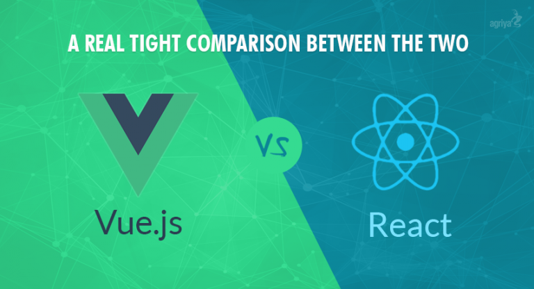

## VueJS vs ReactJS,

Over past few years, the web development arena has witnessed various new developments. New types of frameworks are constantly on the rise. Frameworks are constantly being developed and improved to gain a competitive advantage over counterparts.

ReactJS is the most popular front end development framework right now. However VueJS is an up and coming front end development framework that is fast gaining in terms of popularity. It is only a matter of time before VueJS starts giving stiff competition to ReactJS.

To figure out if ReactJS or VueJS is a better platform for you. The following factors need to be considered.

## Learning curve
Vue is probably the best choice if you want an easy to learn front end development framework. Vue is simple, it features a lot of concepts from Angular 1 and React. You can use it without any build system.

React on the other hand uses the least abstractions, however it will take more time to learn the best practices, as there are a lot of ways in which you can do the same thing or go wrong. This makes ReactJS bigger and a little more complex to set up.

## Scalability
For large applications, both Front end development frameworks Vue and React offer robust routing solutions. The React community has been very innovative in terms of state management solutions (e.g. Flux/Redux).

These state management patterns and even Redux itself can be easily integrated into Vue applications. Using Vuex, an Elm-inspired state management solution that integrates deeply into Vue. Vue claims this offers a superior development experience.

## 3rd party library compatibility
Even though ReactJS doesn’t work with DOM, it is pure JavaScript logic and because of its popularity even the DOM based libraries have their alternative in React.

Vue works perfectly for both DOM and JavaScript and is only second because it has less framework specific libraries.

## Development time
Vue comes with prebuilt data binding and MVC model, making it way easier to set up compared to react and angular. Vue is certainly easy to set up and does not require many changes or syntax and that’s what people love about it; it was designed to solve the fatigue.

Writing single-file Vue components feels very natural . Vue provides a really handy command-line tool to help you generate barebones projects with very little setup. You can also write your own CLI templates or use the provided templates that are very flexible.

React is fairly simple to understand but in fact it takes a long time to set up a react project. But then you can start to make an app and it should be relatively easy to add new features.

## Size

Vue is the smallest and contains a lot as well. Actually you might think it doesn’t matter, but say that to a cheap android 3g smartphone and I don’t think you will be so sure about it.

ReactJS is bigger than VueJS, but smaller than AngularJS.

## Community and popularity
Definitely React has been the most popular front end development framework , It has been very popular in full stack communities in 2016. It is also becoming a good choice for native JavaScript mobile and even desktop apps.

Vue’s documentation is a dream. Its Guide and API reference are great. Evan You (the author and project leader) has a way with putting modern development in layman’s terms. Even for seasoned developers, it’s refreshing.

Vue’s companion libraries for state management and routing are all officially supported and kept up-to-date with the core library.

React instead chooses to leave these concerns to the community, creating a more fragmented ecosystem. But since it is more popular React’s ecosystem is considerably richer than Vue’s.

## Jobs
ReactJS is the most popular right now: That counts for a lot, most popular means it has the most resources online, better job opportunities and more likely to have long term success. React is very popular and it’s been around longer. It’s likely more businesses have used React. Keep that in mind if you’re in the market for a new job right now.

Vue is less popular and is not supported by a big company, therefore businesses choose between Angular and React. Vue still feels like the new kid on the block . However, many developers have started adopting Vue, after considering Angular and React very heavily. Some big names that have adopted Vue are GitLab, Laravel, PageKit, etc.

## Company’s perspective
React comes with a patent clause that for some businesses would be quite a big issue. However, there are also a few alternatives that work in the same way as react and even use the save syntax, like inferno and RAX.

Vue isn’t a child of a big company, it’s a very successful side project started by one person and therefore companies tend to ignore it more often, however they shouldn’t in my opinion.

## Beyond the web
React is ideal for almost any platform. Whether it’s web or native development, React has you covered and is maturing in both directions. The benefit is being a flexible developer in any context when it comes to UI development. It’s even made its way into virtual reality.

Vue 2.0 is moving towards native too. Evan and his team are working with Alibaba to create Weex, which will allow native rendering comparable to React Native. Vue 2.0 is primarily focused on web dev now, but was written to support other platforms moving forward. According to Evan’s latest Vue blog post, 2017’s going to be a big year for Weex.
