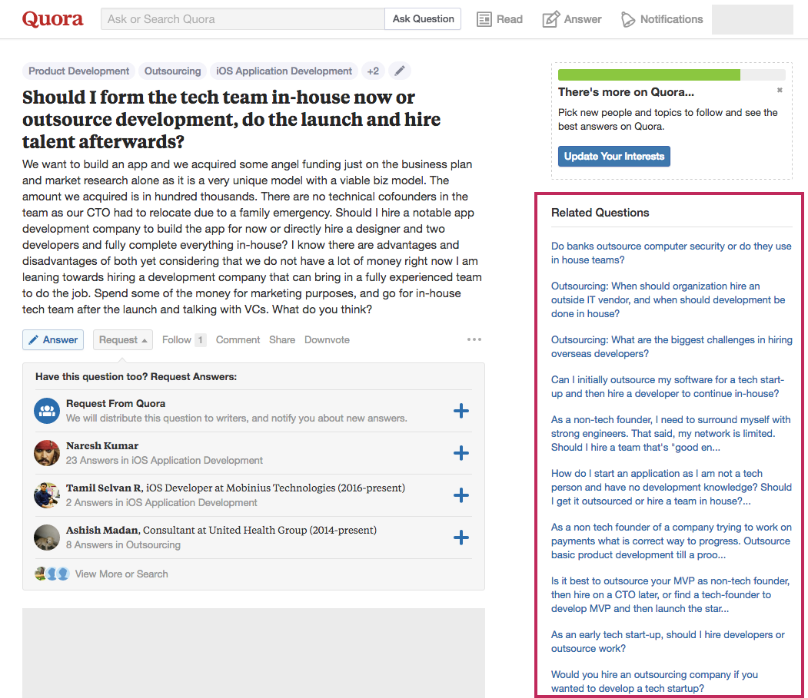

> Should I form the tech team in-house now or outsource development, do the launch and hire talent afterwards?

This is one of the most common questions being asked by non technical founders. Even technical founders who are over burdened with things to do, are considering outsourcing as a viable option. A quick look at the related questions in the popular QnA platform Quora, will tell you how prevalent this dilemma is.

 
As things gets serious and you raise a seed round to validate your idea, you want to quickly find the right product market fit. You have limited runway in terms of time, money and your own skillset. Unless you already have a strong technical co-founder or team member(s), finding key technical members can get very frustrating.

Assessing a developer’s skillset, specially if the found does not have a tech background, can be very difficult. Hiring an agency can, and should always be kept as a viable option in case you don’t find good talent to work with, fast. Even if you have someone to help you technically, extending your team with some solid overseas developers can give you the much needed boost.

Getting to the question of in-house development vs outsourcing your product development, let’s look at the constraints at hand:

## Budget

During the initial phases of your startup, budget will be a huge, if not the biggest, constraint. You have X amount of money, and you need to plan for development cost, marketing cost, sales expenditure, extra overheads and what not. You’re in the hyper-saver mode – living on ramen, cutting costs wherever possible.
You allot Y dollars for your product development and you absolutely can’t go over it.

## Time

When you start planning the launch of your product, one of the first things to do is to set timelines. Either the market decides your timelines for you – “need to get to market before our competition does”. Or you decide them for yourself – “we need to start testing out the first prototype 4 months from now”.
What time you allot for your project becomes a constraint, and needs to be maintained.

## Skillset

The kind of project you’re working on demands a specific skillset. If you’re building a highly evolved financial chatbot, you’ll need developers who are proficient in Machine Learning, Artificial Intelligence and Natural Language Processing. You’ll need a some good backend developers to build scalable systems while the front end folks work on the interface.

Requirements of your project dictates the skillset needed, and that becomes a constraint while looking for people to help you with.

In a nutshell, you need a team of developers who have the required skillset, can work within the stipulated budget and can deliver the product within the required time frame. Unless you have a strong network of developers at you disposal – pulling this off will be a herculean task!

Agencies to outsource your development to, on the other hand, are much easier to find. Thanks to the rapid development and globalization, there are software development agencies located all across the globe. Finding one that fits your need is relatively easier.

## Finding a development agency within your budget
Agencies located in south-east Asian countries like India and certain east-European countries are much more cost effective than their counterparts in the United States. Outsourcing your product development to an agency located in India could reduce your development cost by as much as 50%, without compromising on the quality.

## Do agencies deliver on time
Professional agencies quote the project with an estimated delivery time. How we normally estimate the time-to-completion of a project is that we break it down into smaller shippable modules. Each module then is estimated by the developers, and because the developers have almost always worked on something similar, they’re estimates are pretty accurate. Professional software development agencies are liable to deliver the projects on time.

Do agencies have skilled developers?
Couple of years back I asked a developer friend, “Why would good developers join an agency and not a product based company”. “Two reasons”, he said, “Expertise and boredom”.

Let me clarify – working with an agency gives developers a chance to work on multiple projects. It just keeps things more interesting and because they work iteratively on multiple projects – they level up much faster than their peers. Developers who work in agencies have “seen it all”, as some say.

In conclusion, if you’re having a hard time finding developers to hire for your product, looking towards [outsourced product development](/outsourced-product-development/) agencies to get your MVP done is actually a very viable idea. If you want to learn more about finding the right agency for your product, [this article will help](/software-outsourcing-find-right-tech-team-product/).