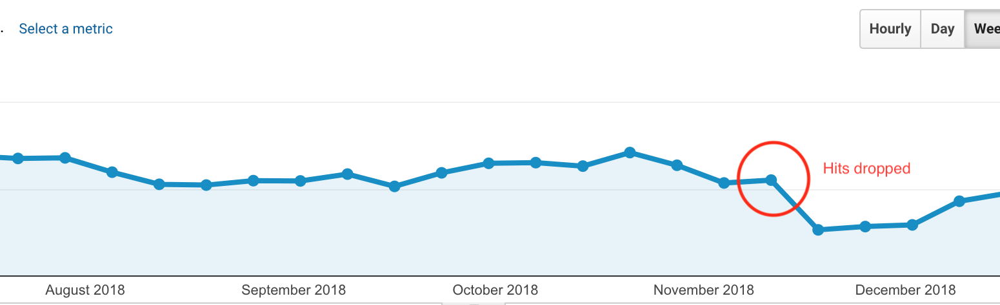
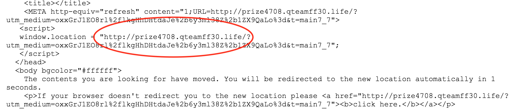
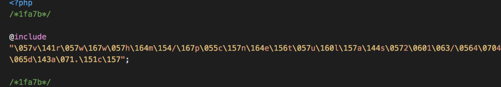
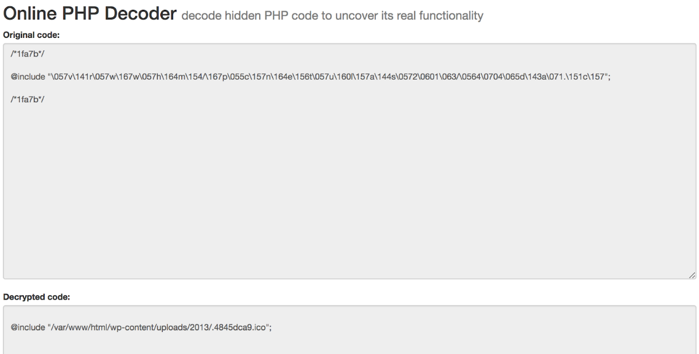

Recently our company site, codebrahma.com dropped 30% of hits suddenly in a short interval of time.

Shows that the site hits dropped around 30-40%
After sometime some of the users of our site reported that the site is redirecting them to some random malware sites. It was a hard time to replicate those malware redirects since it was occurring very randomly. We later found out that our WordPress code was injected with malware and we will share in detail how we solved it.

 __How we replicated the issue__:

We tried to replicate the issue and understand how this was happening with the help of chrome dev tools. Finally we found out that when the user country was set anything apart from India (our origin country) or when the user is using a mobile (based on user agent) the probability of the malware redirects was higher. Since this was happening very randomly we tried to use proxy to understand when it happens.

Also we found out that only the organic hits are affected greatly. The direct hits were still comparable with the older data. So there must be some injected code which looks at all these details and randomize this. We enabled the remote debugging of mobile phone’s Chrome browser by which we were able to inspect the network requests in chrome browser. We were able to replicate the HTML code which has the random redirection script in it.

HTML code with redirect snippet from the malware

__How we solved it ?__

__Step 1: Removal of visible injected files__

We found that so many so many encrypted PHP files injected on our system. We found that the files were injected at various places of the system including /var, /html, /wordpress. We tried to narrow down when the issue started to happen (in our case it was Nov 17th). We saw what files were added to the machine after 17th and removed these files. We restarted our Apache server and it had no effect. We could still find that the malware redirect was present.

__Step 2: Moving to a new machine__

Since Step 1 did not help, we tried to move our entire wordpress site to a new digital ocean droplet (with an assumption that our machine was compromised). We moved all the data in db and installed wordpress on new machine. The files copied from old machine to new machine were apache config, WordPress config, WordPress database dump, WordPress uploads folder which has all the images. But still the issue was not resolved. So our search narrows down to these files which were transferred.

__Step 3: Inspecting all the files__

We found in google on certain solutions that injection can be a encrypted PHP code. We started inspecting all the files copied from old machine to new machine. While inspecting the WordPress config, we found a strange line of script in WordPress config.

We decrypted the above script with the help of https://malwaredecoder.com and found that it is injecting a script from ‘/var/www/html/wp-content/uploads/2013/.4845dca9.ico’

Decoding the file
The contents of the file looked like this

Contents of the injected file
We removed this file and updated WordPress config and restarted apache. Then the issue stopped occurring.

__Root cause:__

The above issue had occurred because the old machine in which our site was deployed was vulnerable to hack. It has SSH password authentication enabled. The SSH password was not so much strong.
The machine was allowing SSH connection from anywhere in the world.
Unnecessary ports were open on the machine (MySQL and other services).

__Solution__

We disabled the SSH password authentication for the new machine and enabled only key(PEM file) for authentication
Configured Digital Ocean settings to have firewall in a way that it will only allow inbound SSH connections from whitelisted IPs.
Closed unnecessary ports.

__What if you encounter such an issue ?__

1. Don’t panic
2. Try to identify the start date when this issue started using google analytics.
3. Look at all the wordpress files / config files and other files which were changed after that.
4. Try to find the script which is similar to the infected one mentioned as above.