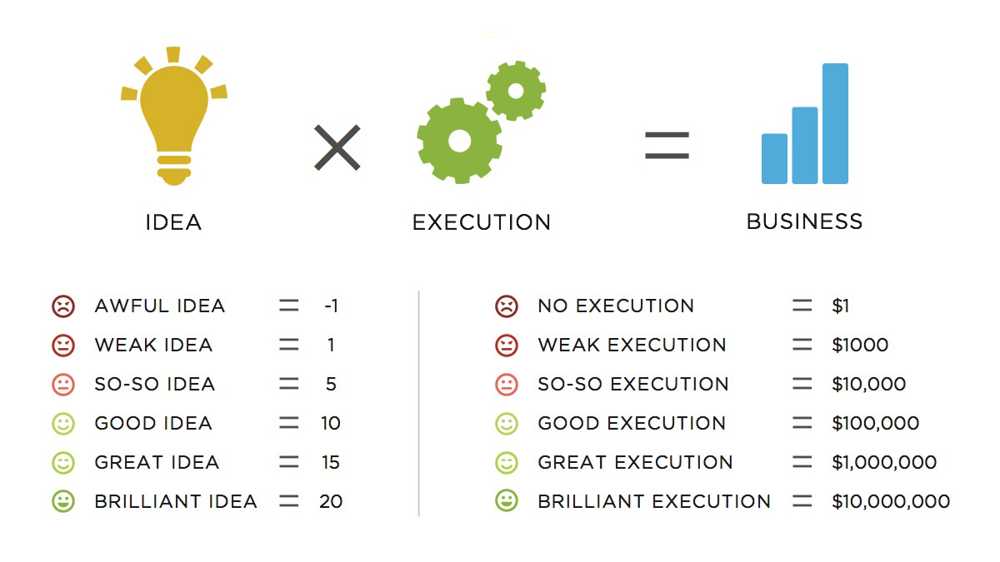

> ‘Creating a successful product is seldom a matter of chance.’

Finding a problem that is big enough to be turned into a viable business requires more than just a personal pain point. Thinking backwards, it makes sense. A couple of guys realising that finding cabs is huge pain led to one of the most coveted internet business of all times. So much so that it gave birth to a whole industry segment (Uber for X).

Then there are products that came into being because of a specific user habit. Photo sharing applications do not solve a pain point, yet Snapchat has become big enough to go public.

With there so many factors in play, and none of them guarantee that your software product will be a resounding success – there are certain steps you can follow to increase your chances of success.

## Find The Problem
A successful product largely solves a pain point felt by a big number of people. Finding taxis and cabs, when you need them, was a problem shared by people all across the world. Ofcourse, different geographies have different constraints – some are more price sensitive, while some have infrastructure problems.

Chancing upon a problem shared by a large number of people is good first step. Can technology be employed to solve it? If the answer is yes, then you’ve hit something solid.

## Assess the Market
Ecommerce is one of the biggest markets to be in. But think 10 years back, ordering off the internet was very niche. Most of the people did not even know that they could replace the headache of shopping with the luxury of clicking a few buttons and getting stuff delivered to their homes.

You need to ensure that the problem your are trying to solve has a big enough market. This is slightly different from the previous point. If your product ‘disrupts’ a market – be prepared for a slow user adoption. On the contrary, if you’re launching a subscription based pet supply e-commerce store – finding users for your product will not be exceptionally hard.

If the market that you’re targeting does not exist, it will take a lot of time, effort and resources to educate your customers and get them to try it out. Assess your target audience, the market size and serviceable market size before jumping the ship.

## Lean Execution
Ideas, more often than not, don’t hold any value unless driven by smart execution. Derek Sivers, founder of an music selling website said: Ideas are just multipliers of execution. Translated into simpler terms, this means that execution holds a higher value in the idea vs execution debate.

Here’s a chart (credit: Crew) that puts it in perspective:

We cannot emphasise the importance of good execution enough. There are times when ideas that you’d probably call weak have gone on to form million dollar businesses. And ofcourse, we are all familiar with brilliant ideas biting the dust because ‘something went wrong along the way’. Executing your idea the right way will be the single most important factor in ensuring your product’s success.

We, at Codebrahma, help founders and entrepreneurs build [software products, mobile and web applications their users will love](/building-products-users-love)! If you need help with your application, drop us a line [here](/contact)!