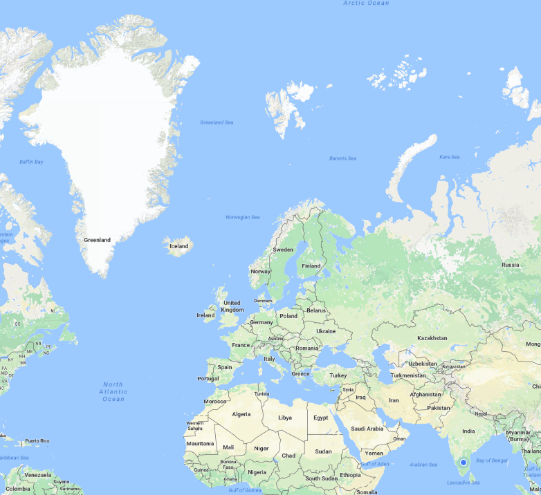
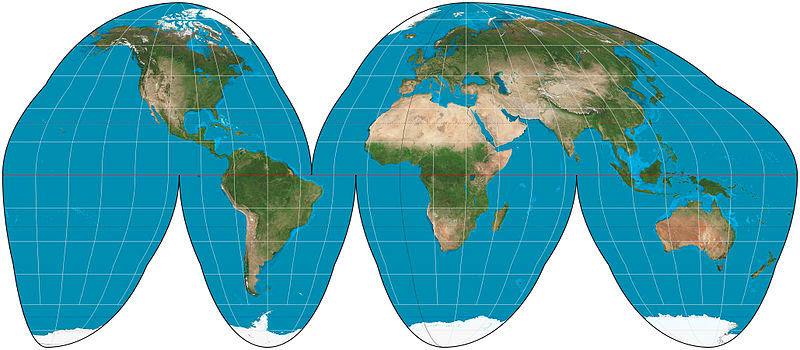
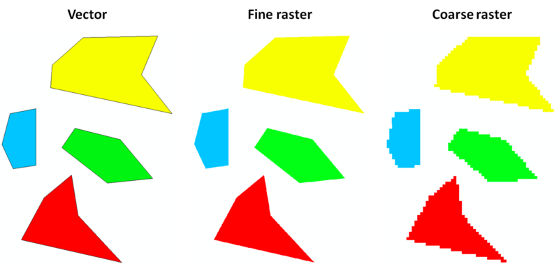
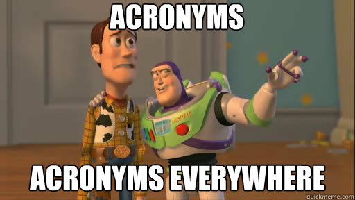
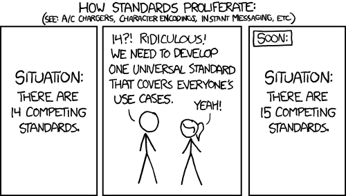
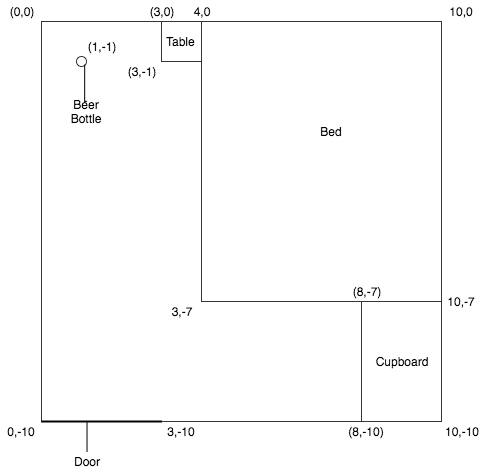

_A quick starter guide for anyone looking to enter into GIS (geographic information system)_

I personally have always been attracted to GIS systems. They seemed like one of those magical applications, feeding on a bunch of boring data and churning out awesome visualizations. But I’ve been hesitant to try it out, all the jargon – mercator projections, GDAL, QGIS, making it all the more harder. Until recently, I got a chance to work on a project that was based on GIS systems, involving in-store analytics for brick and mortar shops. It was a great learning experience – trying out different projections and visualizations, just playing around with data.

This article is my attempt to help all those looking to get into GIS, and I’d love your feedback in the comments below.

A simple Google search on GIS will give you this: “A geographic information system (GIS) is a computer system for capturing, storing, checking, and displaying data related to positions on Earth’s surface. GIS can show many different kinds of data on one map. This enables people to more easily see, analyze, and understand patterns and relationships.”

Kinda neat, right? So let’s get on with the basics:

## Projections

The first thing you need to know about, the one which all the tutorials I read seemed to miss was Projections. Simply put, Projections are a way to represent the surface of a 3D Globe on a 2D map. Why is it such a big deal? Well, let see an example:


Mercator Projection

Look at this image. Most notably, the huge white area at the top-left called Greenland and the country with the blue dot on the bottom right, India.

Which one of the two seems bigger?

_Hint:_
Area of Greenland : 2.166 million km²
Area of India : 3.287 million km²

The problem is, if I assume that the surface of the earth is like a wrapper and try to spread it on a piece of paper, it looks like this :


Source: https://en.wikipedia.org/wiki/File:Goode_homolosine_projection_SW.jpg

So, some wise people came up with a way to remove those empty spaces. The most common of those is known as the [Mercator Projection](https://en.wikipedia.org/wiki/Mercator_projection). It’s just a different way to fill in those empty spaces. There are a bunch of different projections which we use but most of this article will be about Mercator. The downside or Mercator, a country almost 1.5 times bigger than another country in actuality, appears way smaller.

## Vector vs Raster

Most of you would already be familiar with the concept of a raster and vector images. But, we’ll give it a quick go through.

When you try to zoom in on a picture you clicked on your phone, it starts getting blurry after a certain point. That’s because images are normally rasters. Essentially a raster image is a pixel map, with each pixel coloured in a single colour. So when you zoom in, the pixel size increases and the images start getting blurry. You see that image for what it really is: a bunch of coloured dots.



Vector data on the other hand is not pixels. It has definitions. Definitions of how a shape is made. Say you want a point, you define a point, you want a line you define a line, you want a polygon, you define a polygon.

No matter how much you zoom in – a vector image will never get blurry.

Vector data has been used in games for a long time, now we’ve gotten better at processing it quickly.


Source: www.showbizgeeks.com

## GeoJSON, TopoJSON, WKB, WKT



You know how a bunch of friends get together and there’s one guy who calls football, soccer (or vice versa) or how some people just refuse to use the metric system? Well, this is essentially the same scenario. These are just various forms of representing and storing spatial data.


https://xkcd.com/927/

If you’re really interested you can read this article to get to know ALL THE FORMATS. For the purpose of this article, we’ll stick with GeoJSON and Shapefiles only.

## Enough terms, get them pretty maps!

Very soon, just need the right buildup! 🙂

In essence, all vector GIS data is represented as either

1. Points
2. Lines
3. Polygons
4. Groups/Collections of such points
   There are more. You can learn a lot more about [GeoJSON here.](http://www.macwright.org/2015/03/23/geojson-second-bite.html)

So before we get to the them awesome maps, we need to be able to define them. Say you want to show the inside of your room. How can you show it? Let’s consider a top-down view of your house. Now take your house and put it on an x-y plane(Cartesian). Place the top-left corner of your house at (0,0). I’ll assume your room is a square.


**Going step by step:**
Now since the room is the universe in this case, you don’t need to define it. So let’s start with the beer bottle. That bottle is at a point, the point where you left it last night (lazy much?). That point is (1,-1). The bottle is a feature in your representation of the room. So in GeoJSON that bottle can be described as

```json
{
  “type”: “Feature”,
  “geometry”: {“type”: “Point”, “coordinates”: [1,-1]},
  “properties”: {“name”: “Beer Bottle”}
}
```

Now let’s move on to the door. Since the door is a line we represent it as such.

```json
{
  “type”: “Feature”,
  “geometry”: {
    “type”: “LineString”,
    “coordinates”: [
      [0, -10],
      [3, -10]
    ]
  },
  “properties”: {
    “name”: “Door”
  }
}
```

Now the bed

```json
{
  “type”: “Feature”,
  “geometry”: {
    “type”: “Polygon”,
    “coordinates”: [
      [4, 0],
      [3, -7],
      [10, -7],
      [10, 0],
      [4, 0]
    ]
  },
  “properties”: {
    “name”: “Bed”
  }
}
```

Now, after the crazy party last night – you wake up in the morning only to find a big hole in your bed. Now you want to be as faithful to the diagram as possible but you don’t want to specify what that place is for. Also that hole is still part of the bed. Well fear not, for holes are an integral part of a polygon.

```json
{
  “type”: “Feature”,
  “geometry”: {
    “type”: “Polygon”,
    “coordinates”: [
      [
        [4, 0],
        [3, -7],
        [10, -7],
        [10, 0],
        [4, 0]
      ],
      //Hole definition
      [
        [5, -1],
        [5, -2],
        [6, -2],
        [6, -1],
        [5, -1]
      ]
    ]
  },
  “properties”: {
    “name”: “Bed”
  }
}
```

> The second array is basically defining where the damage was done. I’m sure with these basic building blocks you can now create a definition of the entire map.

[Here’s the gist ](https://gist.github.com/Pritoj/1dbf56c73bd6086b35370b3eaa40d30a)for a quick reference.

For those of you who did see the gist, picture looked a bit different? That map doesn’t look anything like what you thought it would!

Well, here’s the reason. Remember that projection stuff we were talking about? Github thought this was just another lat long type file and displayed it as is.

## Parting thoughts

I hope this was an engaging and entertaining post for you guys. I don’t think this would make your life with GIS any easier, but I believe you’d be better equipped to understand what this system is and possibly delve deeper into it. Comments are always welcome!

Helpful links:

1. If you’re looking for more details on GIS, t[he first google](http://docs.qgis.org/2.6/en/docs/gentle_gis_introduction/) result is spot on!
2. [The sub-reddit](https://www.reddit.com/r/gis/) for GIS is really helpful when it comes to questions.
3. [QGIS](https://medium.com/r/?url=http%3A%2F%2Fwww.qgis.org%2Fen%2Fsite%2F) is also amazing if you want to play around with geographic data.
