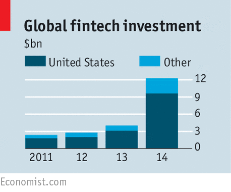

P2P lending or Peer to Peer lending is the practice of borrowing money through online platforms that match borrowers with lenders. It’s a popular alternative to the more traditional practice of borrowing money from banks and non-banking financial institutions (NBFIs). One of the biggest advantages of using an [online P2P lending platform](/financial-software-development-company/)is that the loans are usually cheaper as the platforms operate with lower overheads and software powered automation. The P2P lenders charge money for the platform and doing credit checks for borrowers.

## How Does P2P Lending Work
With P2P lending, it’s not the company operating the marketplace that lends money, but people interested in ‘investing’ their money do. The platform acts as an intermediary between the borrowers and lenders.

Technically, the P2P lending platform has two users:

__Borrowers__
__Lenders__

The lenders register on the platform, and complete a verification step to become a verified lenders. They, then decide the amount they want to invest and transfer that amount to the platform. The money is divided up into units – termed generally as ‘Notes’. The value of the unit varies with the platform. So, if a platform decides the unit note to be valued at $10 and an investor decides to invest $10,000 she’ll end up with 1000 notes to invest in borrowers.

Borrowers, after registering on the P2P lending platform, go through a verification process and a credit check. A credit check is performed to identify the risk involved with investing in the said borrower. The credit check outcome determines the rate of interest for the borrower.

One loan is typically funded by multiple investors. An investor willing to invest 1000 notes can choose to fund 10 different loans with 100 notes each or can mix and match the amount with loans. This diversification of portfolio works in the investor’s favor by reducing the risk. It’s a manifestation of the classic proverb – “don’t put all your eggs in one basket”.

## Creditworthiness In P2P lending platforms
One of the most important tasks for the P2P lending marketplace is to be able to determine, as accurately as possible, the creditworthiness of borrowers. The creditworthiness of an applicant in the United States is determined by the credit score, the FICO score being the most popular credit scoring model. Furthermore, there are three different credit rating agencies in the US – Equifax, Experian and TransUnion.

P2P lending platforms tie up with a 3rd party credit agency to pull in the a borrower’s credit score. Then depending on the business model, they might consider only the credit agency’s score or may compute their own scores using additional data. A lot of P2P lending agencies include the social data as well as other publicly available data in their credit report. Churing the numbers through their own algorithms, they decide whether a borrower is fit for giving loan to and at what interest.

The rate of interest given to a borrower varies with their credit score, amount applied for and the period of loan. Similarly, a lender is offered a higher rate of interest for their loan, if they choose to invest with borrowers having lower credit score. High risk equals higher reward.

## Market and Way Forward
The P2P lending market is relatively new. One of the first P2P platforms – Zopa, was founded in the UK in the year 2005. Prosper and Lending Club were founded in the United States in the year 2006 and 2007 respectively.

The global financial crisis of 2008 and 2009 played a major role in shaping the wave of financial disruption through technology, referred to as Fintech. Major losses suffered by banks resulted in reduced loan disbursements with heavier scrutinies and tighter processes. The exposed fragility of the traditional banks went on to induce a general dissatisfaction amongst the public. All this opened gateways for smaller companies with superior technology to move in and promote the idea of alternate financing. P2P lending is a big part of alternate financing.

According to a PwC report, the P2P lending platforms in the United States issued loans worth $ 5.5 Billion approximately. The global P2P market was estimated at $26.16 Billion in the year 2015. Transparency Market Research predicts the market to grow by CAGR of 48.2% year on year, reaching a whopping $897.85 Billion by the year 2024. Research and Markets expects the P2P market to grow at a CAGR of 53.06% between the years 2016 and 2020. Morgan Stanely predicts the market to be valued at $490 Billion by 2020.

While the numbers predicted by different agencies vary – the key takeaway is that the P2P lending market is poised to grow at a breakneck speed. It already is one of the fastest growing sectors within the Fintech market.

Technology disruption of the financial market is one of the most exciting and interesting trends to follow. Innovation drives change that’s worthy of impacting millions of people. P2P lending is one such market, and we can’t be more excited to see how how it shapes up.

We wokred with some of the biggest names in the Fintech industry, and helped them set up the technology that impacts millions. Harmoney – the leading P2P lending marketplace in New Zealand in one of our case studies.

 

If you’re looking to enter the P2P market and are looking for [financial software consultants](/financial-software-development-company/), we’d love to talk to you!

