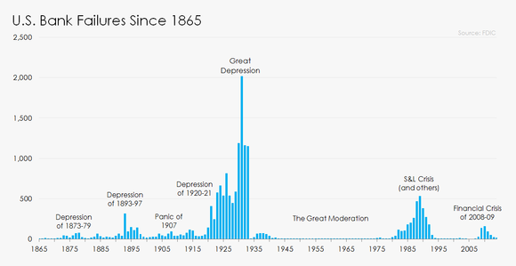
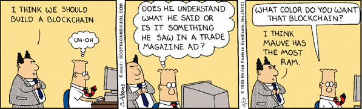
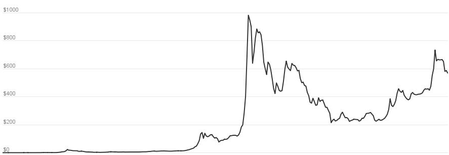
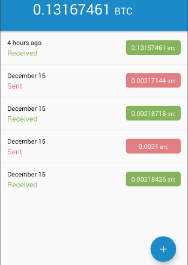
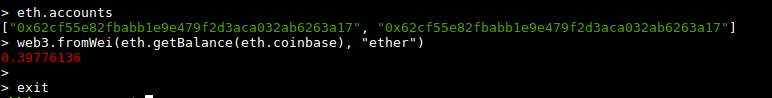

Unless you’ve been living under a rock, you’d have heard about cryptocurrencies or Bitcoin atleast. There’s a lot of buzz around it, but disproportionately less clarity regarding what it actually is. In this article we’ll introduce ourselves to the fundamental principles of cryptocurrencies, clear the mist of confusion which surrounds them, and debunking some myths along the way too.

It’s human nature to compare everything new with something familiar. In case of cryptocurrencies, it’s the fiat money. Money is so fundamental to our daily lives that we always manage to see through them, and seldom do we try to understand the reason we need it and the unique purpose the serve.

> Look at those paper and plastic sheets, do you feel they’re worth it?

Now I’m not an economist, but I know few common principles which make currencies what they are.

# Principles governing currencies
## Demand and supply
Almost every financial and economic activity is affected by this principle. The more the ratio of demand and supply of a commodity, more is it’s value.

## Market sentiments
Market sentiments greatly effect the value of the currencies, stocks and commodities. If the investors of a company think the company shares are going to be worth less, they are worth less.

## Trust
Trust is essential for virtually all economic activity. Banknotes often have a __promissory clause__ which reads like this:


without any gold or other precious resources to actually back that claim. (Earlier they used to back currency value to something like gold. Though it’s discontinued now, but the idea is same).

# Why cryptocurrencies?
So we already have things in place to keep the system running, why do we need these cryptocurrencies? What problems do they solve, if any? Well the features of fiat money are also it’s limitations.

1. The banks represent __a single point of control__ which can deem a currency illegitimate, refuting our claims to our wealth.
2. Apart from being a single point of control, they also represent __a single point of failure__. Banks have failed in the past, and can certainly fail in the future due to various reasons, which puts our wealth at risk.

3. We have to trust the system with our wealth without any satisfactory assurance against a fraud, intentional or otherwise.

Cryptocurrenies are an attempt towards liberating the monetary system, something so essential to our lives, from these issues, in a way that one can be in absolute control of one’s wealth without trusting the system.

Any discussion about cryptocurrencies is incomplete without __Bitcoin__. Bitcoin is to cryptocurrencies what PowerPoint is to presentation programs, Ubuntu is to Linux and Xerox is to photocopying. We will try to understand cryptocurrencies with a case study of Bitcoin, which is not very much different from other cryptocurrencies.

# Bitcoin
Bitcoin is one of the first and certainly the most popular cryptocurrency, created by __Satoshi Nakamoto__(a pseudonym) in 2009. Many of the challenges which Bitcoin faced were first of their kind and success of Bitcoin paved the way for other cryptocurrencies.

Let’s see some of these challenges:

## Eliminating central authority
Bitcoin protocol is based on a Peer-to-peer (P2P) network to eliminate the need of any central authority, just like how BitTorrent protocol, based on a P2P network, eliminated the need of any central authority for file sharing.

## Eliminating trust
When we transfer money through banks, we trust them to do so. But without any central authority, or nodes which one could trust, it was necessary to create a trust-less system. Bitcoin used __blockchains__ to achieve this. Blockchains are a type of distributed database which lives on ever node and are used as immutable public ledger for the transactions. Blockchains are made of blocks which further consist of bitcoin transactions.  Blockchains are similar to a linked list of blocks where every block refer to it’s parent block and this fact makes old transactions very secure and incorruptible as we’ll see later.

Blockchains, themselves are greatly hyped and are considered the biggest achievement of Bitcoin, as the idea can be used in various other industries to create trust-less systems.



## Value of bitcoins
If there’s no central authority, who decides the value of the currency?

Well, as we discussed earlier, the golden rule of __demand and supply__ comes to play here too. Satoshi made the protocol in such a way that the maximum number of bitcoins that can ever be generated (minted) is fixed at __21 million__.



__Market sentiments__ also play a vital role. Recently bitcoin prices plunged when Bitfinex, a Hong Kong based cryptocurrecncy exchange was hacked and $65 million worth bitcoins were stolen.

## Verification of transactions
Banks have interest in processing only valid transactions and keeping fraudulent transactions out of the system. This role is played by __miners__ collectively.

> Miners are the nodes which generate blocks for blockchains by verifying the unverified transactions and including them in their block.

The verification is done by adding __Proof of work__ (POW) to the block data. Block data generally contains the transactions which form the block including the coinbase transaction and the hash of previous block.

> Proof of work is a piece of data which is difficult to produce but easy to verify.

It’s generally the hash of block data with n number of leading zeroes. Miners append a value called __nonce__ to the block data to change it’s hash value and keep changing the nonce until the desired hash is found.

So if the block data is ```Hello, world!```, and the number of zeroes required is 4, it takes 4251 tries (nonce is incremented from 0) to find the desired hash:
```
 0000c3af42fc31103f1fdc0151fa747ff87349a4714df7cc52ea464e12dcd4e9.
```
Now anyone can verify that this is a valid hash of ```Hello, world!4251```, but if someone tries to change a transaction in the block, the hash will be invalidated, and a new POW has to be generated, which is impractical.

We saw, finding POW can be a complex and a resource hungry process. So why do miners do that? Miners are incentivized for every block they generate. At the end of the block, the miner adds a special transaction called __coinbase transaction__ which writes off a certain amount of bitcoins to the miner’s address from thin air, and that’s how new bitcoins are minted. Miners also get some money from the transactions, called __transaction fee__. The block, which is first to arrive, gets placed in blockchain, and other miners have to scrap their work, and start again after syncing with the blockchain.

## Double spending
Let’s say Alice bought something from Bob, and paid him in bitcoins. What if:

Alice broadcasts the transaction, but alters the transaction in her own copy of blockchain to pay herself instead of Bob.
Upon the verification of the transaction by the network, Bob ships the item.
Now Alice broadcasts her own version of the blockchain.
> Which version of blockchain should the nodes trust?

If Alice manages to convince the nodes that her version (without Bob’s transaction) is valid, she gets to __buy the item without paying anything__.

Various elements of Bitcoin protocol come at play to stop this from happening.

Bitcoin nodes __trust the longest blockchain__ and build their blocks on it. If Alice wants to invalidate the current longest blockchain, she has to re-generate the blocks after her fraudulent transaction at such a speed that her blockchain becomes the longest one. As long as most nodes in the network are honest (they should be, they’re getting paid for it!), Alice can’t corrupt the blockhain, and this is why we introduced blockhains as immutable public ledgers earlier in the article. The number of blocks a transaction is buried under, is called the __confirmations__ of that particular transaction. Most exchanges deem a  transaction verified after 6 confirmations.

> More the confirmations of a transaction, more difficult it is to alter it.

## Anonymity
Many people hail Bitcoin as an anonymous mode of payment. But the reality is quite the opposite. Every transaction made on Bitcoin is visible to everyone. Having said that, bitcoin transactions don’t necessarily link to the real identity of the user, but to a pseudonym, much like writing a book with a pen name. Thus, Bitcoin is __pseudonymous__.

## Fun facts about Bitcoin
The first block of the blockchain is called the Genesis Block. Every bitcoin in circulation is either derived from a coinbase transaction or the Genesis block. See how it looked like [here](https://blockexplorer.com/block/000000000019d6689c085ae165831e934ff763ae46a2a6c172b3f1b60a8ce26f).

Rewards from coinbase transactions are halved after every 210,000 transactions. In fact, the latest __halving event__ occurred recently on 9th July 2016, reducing the reward amount from BTC 25 to BTC 12.5. Check when’s the next halving event [here](http://www.coindesk.com/51-attacks-real-threat-bitcoin/).

__51% attack__ is a largely feared attack in Bitcoin, where an attacker controls 51% of the computational resources of the network, allowing it to alter the “immutable” blockchain. It ain’t plain theory, Read about Bitcoin’s brush with it [here](http://www.coindesk.com/51-attacks-real-threat-bitcoin/).
## Altcoins
Cryptocurrencies other than Bitcoin are know as __altcoins__, or alternative to Bitcoin. Most of the altcoins are similar in principle to Bitcoin with some minor differences. [Litecoin](https://litecoin.org/), [Dogecoin](http://dogecoin.com/), [Namecoin](https://www.namecoin.org/) and Nxt are some prominent altcoins.

The altcoins vary in terms of under lying principles. For example, [Primecoin](http://primecoin.io/) is a cryptocurrency which makes use of the vast amount of computational resources to find long chains of prime numbers which can contribute in advancement of cryptography as a science.

[Ethereum](https://en.wikipedia.org/wiki/Ethereum) is a disruptive [blockchain-based platform](/financial-software-development-company), the highlight of which is __smart contracts__. Smart contracts are contracts enforced by computer code, instead of institutions set up by humans. This way, we can port whole economies and governments to digital ecosystem, let alone currencies. The possibilities are endless and out of the scope of this article.

Cryptocurrencies also vary in terms of user friendliness. More popular ones, like Bitcoin are very user friendly, while others are not so.


My bitcoin wallet app

You can see stark difference in my bitcoin wallet app shown above, and my Ethereum wallet shown below.


My Ethereum wallet

## Conclusion
Cryptocurrencies are really trending and have a lot of buzz. The future of cryptocurrencies is very promising. Many people have made a fortune out of cryptocurrencies, however they should not be looked merely as an investment. The ideas which these cryptocurrencies represent and the future possibilities they hold are of far greater value than their monetary value.

If you’re thrilled and want to involve in bitcoins or cryptocurrencies in general, you may like the following links:

Original [bitcoin paper](https://bitcoin.org/bitcoin.pdf) by Satoshi Nakamoto.

[Shapeshift](https://shapeshift.io/) is a site to convert one cryptocurrency to another.

[Poloniex](https://poloniex.com/) is an exchange / trading site for cryptocurrencies.

[Coinbase](https://www.coinbase.com/) is the PayPal of cryptocurrencies.

If you liked the article and feel generous, or just want to hone your newly acquired bitcoin skills, feel free to send me some bitcoins at the following address.

17ULzN8PCaCtE16WKtBhMYc28DQxxt4ja


