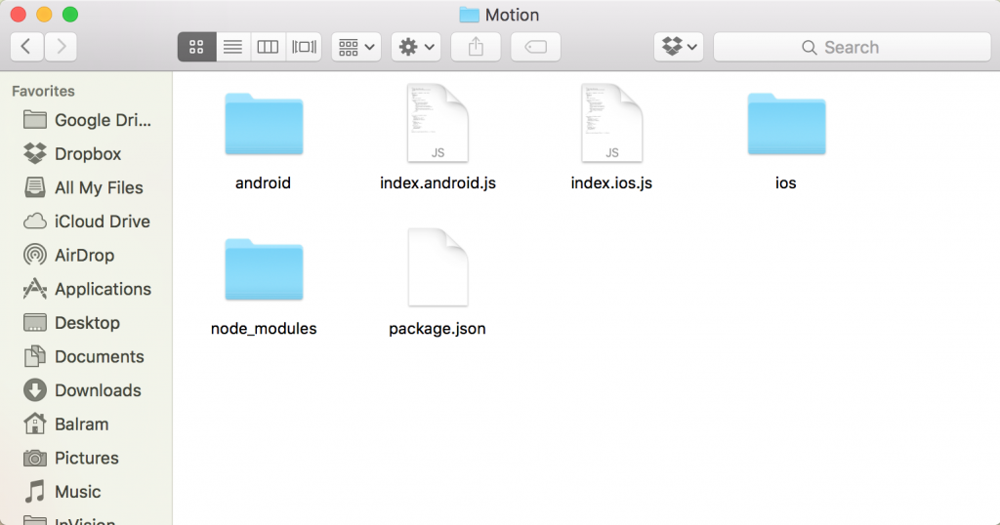
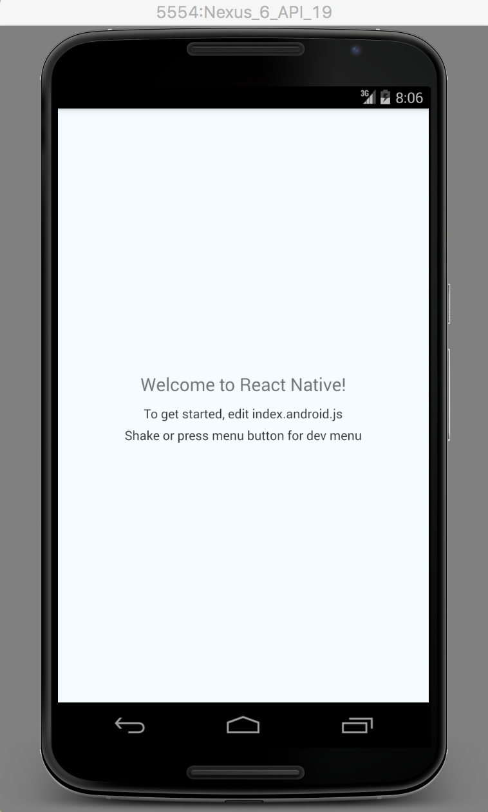
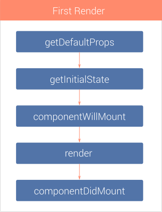
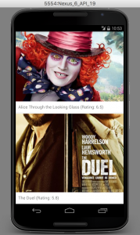

Building mobile applications using JavaScript is in trend these days. Frameworks like [Ionic](http://ionicframework.com/), [PhoneGap](http://phonegap.com/) and [Sencha Touch](http://www.sencha.com/products/touch/) provide the ability to develop apps using basic knowledge of HTML, CSS and JavaScript. With these frameworks, you have the ability to make calls to native APIs, but the bulk of your app will be HTML and JavaScript inside a WebView. [React](https://facebook.github.io/react/), Facebook's JavaScript library has proved tremendously successful around the web, including large companies like [Netflix](http://techblog.netflix.com/2015/01/netflix-likes-react.html) and [Airbnb](https://www.airbnb.com/meetups/x4ede5jr2-css-frameworks-and-the-evolution-of-airbnb-s-frontend).

[React Native](https://codebrahma.com/react-native-development-company/) is a JavaScript framework for writing real, natively rendering iOS and Android applications. Instead of running React in the browser and rendering to divs and spans, React Native run it in an embedded instance of JavaScriptCore inside app and render to higher-level platform-specific components.

 


 

In this tutorial, we'll build an android movie app **Motion** using public api provided by [themoviedb](https://www.themoviedb.org) with React Native. You can find list of movies currently playing in theaters.

 

### 1. Creating A Blank React Native Project

Make sure you have [Node](https://nodejs.org/en/) installed in your system. You can follow [this](https://docs.npmjs.com/getting-started/installing-node) guide to install Node. Now, from the terminal run `npm install -g react-native-cli`. This will install React Native globally on your system. You can also follow the [official guide](https://facebook.github.io/react-native/docs/getting-started.html#content) to get started.

Navigate to the folder in your system where you would like to set up the project. Once there, from the terminal run `react-native init Motion`. This should fetch and install the required modules and create a new folder called **Motion**.


   
 

React Native provides ability to write both Android and iOS applications together with a majority of JavaScript code shared between them. Inside the newly created folder **Motion** you will find two .js files: index.android.js and index.ios.js. If you're building an iOS app you'll work with index.ios.js; with index.android.js for an Android app; and both for, you know, both platforms.

We're building an android app so we can remove the index.ios.js and ios folder. We'll be working with **index.android.js** file. This is the file that is first executed when the app launches.

Connect your usb-debugging enabled android device to your system and from the terminal run `react-native run-android`. It will start the blank app in your device.


 

### 2. Getting the data from themoviedb API

You need to get an api key from [themoviedb](https://www.themoviedb.org/documentation/api) first to access the api. Once we acquire the API key we're good to go. This is how your Motion class looks like initially:
    
```jsx
class Motion extends Component {
  render() {
    return (
      <View style={styles.container}>
        <Text style={styles.welcome}>
          Welcome to React Native!
        </Text>
        <Text style={styles.instructions}>
          To get started, edit index.android.js
        </Text>
        <Text style={styles.instructions}>
          Shake or press menu button for dev menu
        </Text>
      </View>
    );
  }
}
```
 

We need to add a constructor inside the Motion class. Inside the constructor we will initialize our state variables. At this point we need one state variable – moviesData. **moviesData** array is going to store all the JSON data fetched from the API.
    
```jsx    
constructor(props) {
    super(props);

    var ds = new ListView.DataSource({rowHasChanged: (r1, r2) => r1 !== r2});
    this.state = {
      moviesData: ds.cloneWithRows([]),
    };
  }
```
 

Next, we will define a **fetchMoviesData** method, which will fetch the movies JSON from API. Add the following lines of code below the constructor code:
    
    
```jsx    
fetchMoviesData() {
    var url = 'http://api.themoviedb.org/3/movie/now_playing?api_key=YOUR_API_KEY';
    fetch(url)
      .then( response => response.json() )
      .then( jsonData => {
        this.setState({
          moviesData: this.state.moviesData.cloneWithRows(jsonData.results),
        });
      })
    .catch( error => console.log('Error fetching: ' + error) );
  }
```
 

Next, we need to add the **componentDidMount** method. componentDidMount is a lifecycle method which is fired immediately after the first rendering occurs.

 



Let's declare componentDidMount method and call the fetchMoviesData function inside it.
    

```jsx    
componentDidMount() {
    this.fetchMoviesData();
  }
```
 

### 3. Creating the view

We need to import some components which will be used in creating the view.
    
    
```jsx    
import {
  AppRegistry,
  StyleSheet,
  Text,
  View,
  ListView,
  Image
} from 'react-native';
```
 

**ListView** is a core component designed for efficient display of vertically scrolling lists of changing data. **Image** component is used for displaying different types of images, including network images, static resources, temporary local images, and images from local disk, such as the camera roll.

Now, get rid of everything from inside Motion class's **render** method and add these lines of code:
    
```jsx    
render() {
  return (
    <ListView
      dataSource={this.state.moviesData}
      renderRow={this.renderRow}
      style={styles.container}
    />
  );
}
```

ListView's **renderRow** prop expects a template which needs to be rendered for each row. Add the following **renderRow** function inside the Motion class:
    
```jsx    
renderRow(rowData){
  return (
    <View style={styles.thumb}>
      <Image
        source={{uri:'https://image.tmdb.org/t/p/w500_and_h281_bestv2/'+rowData.poster_path}}
        resizeMode='cover'
        style={styles.img} />
        <Text style={styles.txt}>{rowData.title} (Rating: {Math.round( rowData.vote_average * 10 ) / 10})</Text>
    </View>
  );
}
```

We need to do one more thing before we can see the results. You can find the line that says `var styles = StyleSheet.create({` at the bottom. These styles are responsible for displaying the initial default screen. We can update these to show our movie listing in thumbnail list:
    
    
```jsx    
const styles = StyleSheet.create({
  container: {
    backgroundColor: '#f2f2f2',
  },
  thumb: {
    backgroundColor: '#ffffff',
    marginBottom: 5,
    elevation: 1
  },
  img: {
    height: 300
  },
  txt: {
    margin: 10,
    fontSize: 16,
    textAlign: 'left'
  },
});
```
 

Your app with latest movie listing is complete. You can open the terminal run `react-native run-android` to see your app. You can find the code for this app [here](https://github.com/balramkhichar/MotionApp). Enjoy!

 



 

PS: This is the simple demo of the app. You can use pagination of the themoviedb API and build fully functional App. You can also implement the movie detail page using the React Native [Navigator](http://facebook.github.io/react-native/docs/navigator.html).