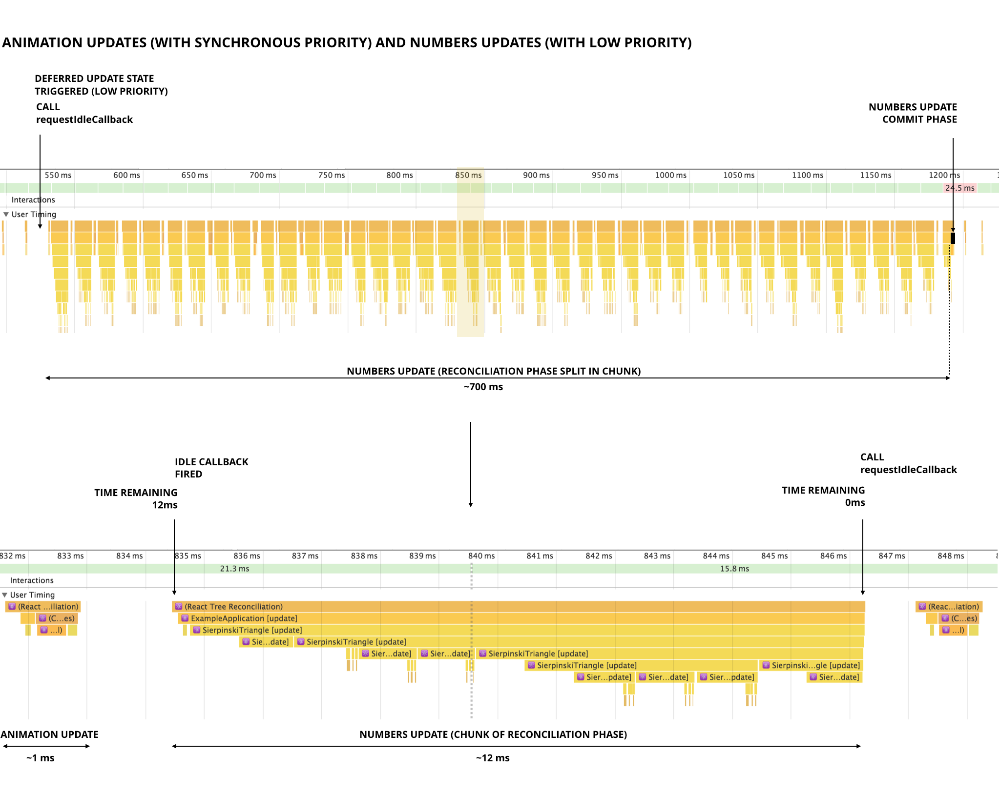
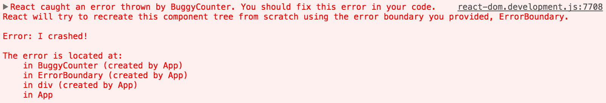
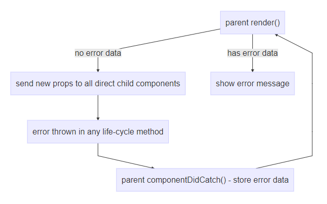
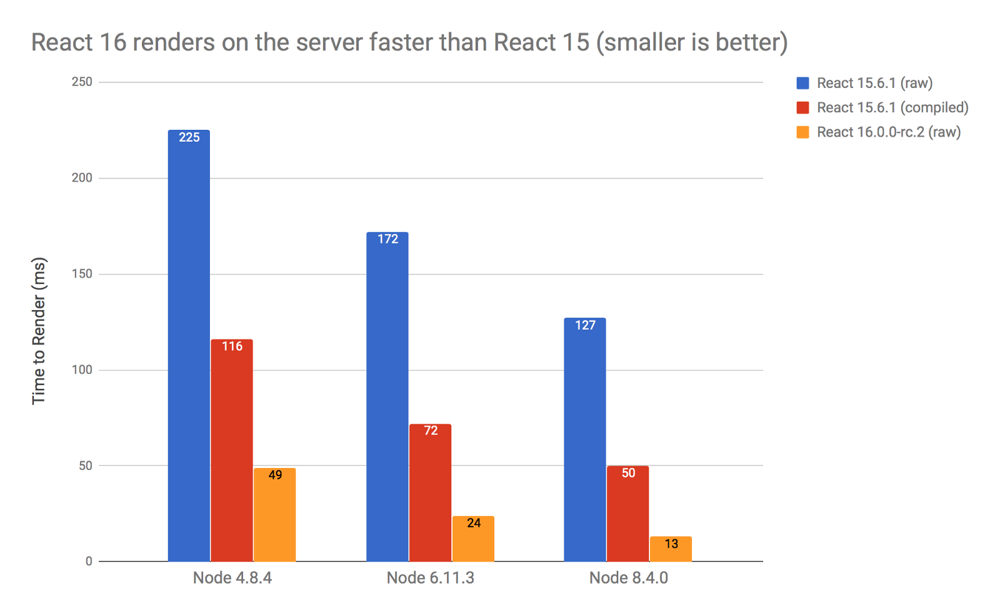

The latest ReactJS development update alters the core React algorithm to offer a ground-up rewrite on how React manages reconciliation.However React will maintain the same public API and that will allow for immediate upgrades for most projects.  This will help improving React JS development process to be more effective than ever and it benefits the companies which adopt React JS. we are also sure this will be true for many of you as well.

## Core Algorithm Rewrite
In this latest ReactJS development update a new core architecture, named “Fiber” is introduced. Additionally, it has removed old internal abstractions that were hindering internal changes. Many new features in the ReactJS development update have been introduced due to “Fiber”, these include :

&nbsp;&nbsp;&nbsp;&nbsp;Error boundaries

&nbsp;&nbsp;&nbsp;&nbsp;Fragments

&nbsp;&nbsp;&nbsp;&nbsp;Portals

&nbsp;&nbsp;&nbsp;&nbsp;Async rendering

Remember that the the API’s are still the same only the internal reconciliation algorithm has been rewritten. Therefore migrating to React 16 is seamless.

## Backwards Compatible

Fortunately React has shown a strong commitment to backwards compatibility. If you can run your code in React 15 without any deprecation warnings, it will work in React 16.

## Error Handling

Prior to this update, any error in any part of the UI would crash the whole application. To address this problem, a new concept has been introduced in React 16 called Error Boundary.

These error boundaries will not only provide clearer error messaging, it will also prevent the entire application from crashing. Error boundaries catch errors and display a fallback UI without the entire component tree crashing. These boundaries catch errors in lifecycle methods, during rendering , and in  constructors of the whole tree below them.

The lifecycle event componentDidCatch() can be used to catch errors.

## Easily readable error logs

 

New architecture for error boundaries 

reactjs-development-3
## More Efficient HTML(For server side rendering)
React 16 also drastically cuts the quantity of SSR overhead in generated HTML. Additionally in React 16 all of the IDs have been have been removed from markup so the HTML is much simpler. Not only is this way more cleaner to read, it also reduces the size of the html document considerably.

## React 16 is Faster
React 16 shows dramatic speed ups in server-side rendering across multiple versions of node. In React 16 the core team rewrote the server renderer from from the ground up, so it doesn’t do any vDOM work at all. This is why it can be significantly faster.
It has been reported from early adopters that they are witnessing a 1.3x speedup.

## Portals
Portals in React 16 will allow us to renders children in any DOM node regardless of it’s location in the DOM.

 
## React 16 Can Deal With Arrays, Strings, and Numbers
In React 16 the client-side renderer allows components to also return a string, a number, or an array of elements from a render method. This feature is also supported by React 16’s server-side rendering.