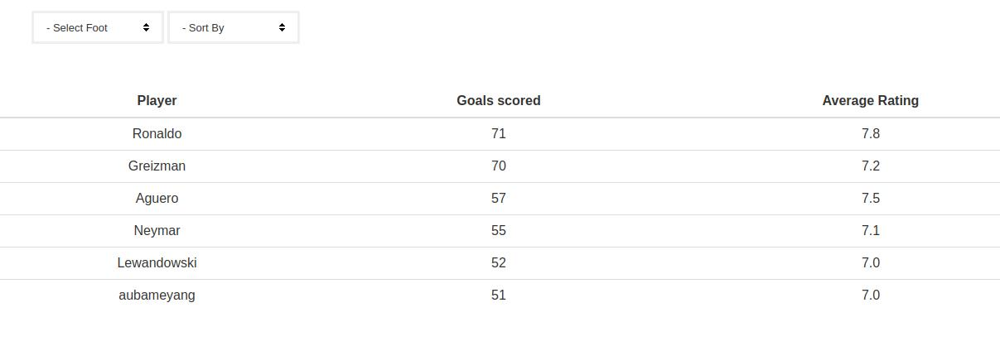

__React and Redux__ compliment each other well. React Components subscribe to Redux store due to which the child components re renders when the state (Redux state) is changed every time. So any component which is subscribed to Redux re renders when there is a state change (unless and until we mention not to do so). This is a prime reason for which there is a need for optimizing React Redux applications in order to avoid unnecessary re renders. [Reselect](https://github.com/reactjs/reselect) is a library which can be effectively used in a React Redux application for the same. In this __Reselect tutorial__ we will explore how Reselect will help in optimizing React Redux application.

## How Redux Subscription works


Before jumping straight away into Reselect, there are certain other ways in optimizing React Redux applications.
<ol>
  <li>
  Using <b>React’s PureComponent</b>, React shallow compares previous props and current props and avoid re rendering if there is no change.
  </li>
  <li>
  Using <b>shouldComponentUpdate</b> lifecycle we can selectively avoid re rendering of a React Component.
  </li>
  <li>
  Using <b>functional components</b> when there is no use of internal state. This avoids component lifecycle methods, which improves the speed of a React application.
  </li>
</ol>

This can help in avoiding re rendering __unless and until there is a prop change which is consumed by the component.__

## Reselect Concept
According to the library’s homepage

__Selectors can compute derived data, allowing Redux to store the minimal possible state.__
Which can be considered as keep the store as minimal as possible. Compute any derived data through the selectors.

__Selectors are efficient. A selector is not recomputed unless one of its arguments change.__
A memoized selector that recalculates only when that part of the start tree changes which are input arguments to the selector. The value of selector doesn’t change when there is no change in other (unrelated) parts of the state tree.

## What are selectors ?
In our context, __selectors are nothing but functions which can compute or retrive data from the store__. We usually fetch the state data using mapStateToProps function like this.
```jsx
const mapStateToProps = (state) => {
  return {
    activeData: getActiveData(state.someData, state.isActive)
  }
}
```
Where ```getActiveData``` will be a function which returns all the records from ```someData``` having the status as ```isActive``` .

The drawback with this function is, whenever any part of the state state updates, this function will recalculate this data. In this case the calculation might be a very simple filter function. But what if this calculation takes 2-3 seconds every single time when the redux store gets updated. That too neither of the state’s data and isActive doesn’t change. This is where __Reselect__ comes to rescue. What Reselect does is unless the input parameters to the function doesn’t change, re calculation doesn’t happen.

## How to write a ‘reselect’ selector ?
When we use Reselect it caches the input arguments to the memoized function. So only when the arguments of the function changes from the previous call, the selector recalculates.

For a above mapStateToProps function a normal selector would be written as
```jsx
const getActiveData = (someData, isActive) {
  // returns by filtering out all someData for which isActive set to true
}
```
The same with reselect will be
```jsx
const getActiveData = createSelector([someData, isActive], (data, active) => {
  // callback is called only when someData or isActive changes
}
```
Reselect provides a createSelector API for creating memoized selectors. createSelector takes an array of input-selectors and a transform function as its arguments. If the values of the input selectors are the same as the previous call to the selector, it will return the previously computed value.

A memoized selector can itself be an input-selector to another memoized selector. This is a very useful technique since we can chain selectors so that if any part of the chain re calculates only selectors below will it re calculate.

## Let’s look how Reselect can be utilized to optimize a React Application’s performance with an example
Assume that there is a list of football player’s statistics displayed in the UI like this.



It displays the number of goals scored and the average rating awarded to the players in the last 100 matches .
The UI has features like

__1.Selecting Goals scored by particular foot__. This changes the display by changing the goals scored by that specific foot. If none selected it should display goals scored by both the left and right foot.

__2.Sorting by either Goals scored or average rating__. If selected it should sort by either number of goals scored or average rating). On default goals scored will be sorting criteria).

Considering an API response like this, which is actually stored in Redux once fetched.
For Each player the last 100 match data will be having a structure like
```jsx
// Each player data will be an object
{
  name: ‘Ronaldo’,
  goalData: [
    {
      lefFootGoals: 1,
      rightFootGoals: 1,
      Rating: 8, 
    } // ,.. Remaining matches data will follow
  ]
}
```
To calculate and convert the data to the format which is required for UI we will structure selectors as follows


In the above structure we are chaining ```footSelector``` -> ```calculatePlayerData``` -> ```sortSelector```. This means
1.When the API data changes all three selectors re calculates.
2.When the output of footSelector is changed it re calculates the player data since the goal count will change forcing sortSelector to recalculate.
3.When we change the sorting criteria it just forces sortSelector to recalculate.

And when there is no change in any of these data the output to the UI remains the same (from cached result).
We will assume the redux store is maintained in immutable JS. (Refer [How to use immutable JS in a React Redux](https://codebrahma.com/how-to-use-immutable-js-in-a-react-redux-application/) application ).

So in code the above selectors will be

### Foot Selector
```jsx
// Footselector will return if the selectedFoot in the store is either "left" or "right" or "both"
const footSelector = createSelector([state] => state.get('selectedFoot'));
```
### calculatePlayerDataSelector

```jsx
// footSelector is input to another selector - chaining
export const calculatePlayerData = createSelector([apiData, footSelector], (data, foot) => {
  if (!data.isEmpty()) {
    return data
      .toSeq()
      .map(( eachPlayerData) => {
        const playerDataToTableFormat = eachPlayerData
          .get('goalData')
          .reduce((playerDataAccumulator, eachMatchData) => {

            const leftFootGoals = eachMatchData.get('leftFootGoals');
            const rightFootGoals = eachMatchData.get('rightFootGoals');
            const rating = eachMatchData.get('rating');

            let goalsScored = playerDataAccumulator.get('goals');
            let totalRating = playerDataAccumulator.get('totalRating');
            
            // Calculate goals scored by player based on the foot 
            if (foot === 'left') {
               goalsScored += leftFootGoals;
            }
            else if (foot === 'right') {
              goalsScored += rightFootGoals;
            } else {
              goalsScored += (leftFootGoals + rightFootGoals);
            }
            return playerDataAccumulator
              .set('goals', goalsScored)
              .set('totalRating', totalRating + rating);

          }, Map({
            totalRating: 0,
            goals: 0,
          }))
        console.log(playerDataToTableFormat);
        return Map({
          name: eachPlayerData.get('name'),
          data: playerDataToTableFormat,
        })
      })
      .toJS()
  }
});
```

Similarly we can write a ```sortSelector``` which will take ```calculatePlayerData``` as input and return the data sorted based on the selected criteria.

## How this is different from calculation in the view ?
The calculation logic remains the same as we generally do it in the view (component). What changes here is we calculate it once for the same input and keep it cached unless the input changes. Also if we are making a sequence of selectors as shown in the example, it re calculates from the selector whose input is actually changed (For example when footSelector’s parameters are changed it re renders)

## Tips and Tricks
__Expensive calculations:__ 
In case of very expensive calculation the view might actually display with the older data, taking time to display the new data. From UI perspective we might feel that it was laggy.
In these cases we can write another selector which handles whether the data recalculation part is actually completed or not. Depending upon the calculation status we can render a Preloader.

__Reselect with multiple instances.__ 
Sharing of selectors across components might yield wrong results if you are using the selector function straight away.This is because each instance on the component requires its own private selector. To handle this case we can write a function which will actually return a new instance of the selector function whenever called, so that each component will get its own private copy of the selector function.

__So I have redux store, internal state, selectors and view. Where to store my data?__

Keep the redux store as minimal as possible. A bloated state might actually make your app slow. Try to keep view as a direct representation of the data passed through props. You guessed it correctly, use functional components as much as possible with calculations performed inside selectors (Separation of concerns).