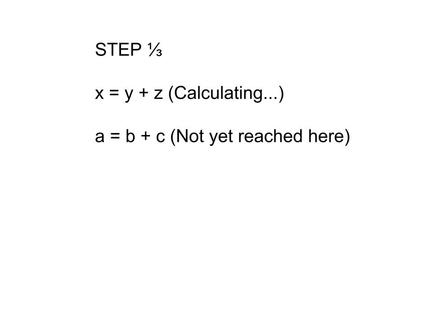
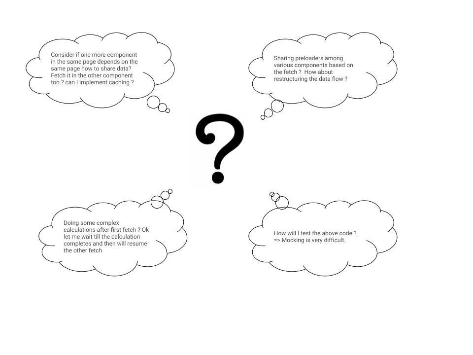
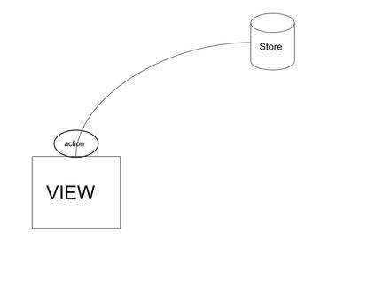

## Introduction
Javascript is a single thread programming language. That is when you have code something like this



The second line doesn’t get executed till the first one gets completed. Mostly this won’t be a problem since millions of calculations are performed by the client or server in a second. We can notice the effects only when we are performing a costly calculation (A task that takes noticeable time to complete, a network request which takes some time to return back).

__Why did I show only API call (network request) here ? What about other async operations ?__
API call is a very simple and best example of describing how to deal asynchronous operation. There are other operations like ```setTimeout()``` , performance heavy calculations, image loading and any event driven operations.

While structuring our application we need to consider how asynchronous execution impacts structuring. For example consider ```fetch()``` as function which performs a API call (network request) from the browser. (Forget if it is an AJAX request. Just think of the behaviour as either asynchronous or synchronous in nature). The time elapsed while the request is processed on the server doesn’t happen on the main thread. So your JS code will keep getting executed and once the request returns a response it will update the thread.

Consider this code
```
userId = fetch(userEndPoint); // Fetch userId from the userEndpoint
userDetails = fetch(userEndpoint, userId) // Fetch for this particular userId.
```
In this case since ```fetch()``` is asynchronous we won’t be having userId when we try to fetch userDetails. So we need to structure it in way which ensures second line executes only when the first returns a response.

Most of the modern implementation of network requests are asynchronous in nature. But this doesn’t help always since we depend on the previous API response data for the subsequent API calls. Lets look at how particularly we can structure this in React JS + Redux Applications.

## Async operations in React – Redux applications.
React JS is a front end library which is used for making user interfaces. Redux is a state container which can manage the whole state of the application. With React JS in combination with Redux we can make efficient applications that can scale well. There are several ways to structure async operations in such a React JS application. For each method lets discuss about the Pros and Cons in terms of

- Code Clarity
- Scalability
- Ease of error handling

For each method we will perform these two API calls.

 #### 1. Fetching city from userDetails (First API response). 
Lets assume the endpoint is ‘/details’. It will have city in the response. Response will be an object.

```js
userDetails : {
  ...
  city: 'city', 
  ...
};
```
 #### 2. Based on the user city we will fetch all restaurants in the city 
Lets say the endpoint is ```/restuarants/:city```. Response will be an array
```js
['restaurant1', 'restaurant2', ...]
```
Remember that we can do the second request only when we finish doing the first (Since it is dependent on the first request). Lets discuss various ways to do this.

- Directly using promise or async await with set state.
- Using redux thunk.
- Using Redux saga.
- Using Redux Observables.

Particularly I have chosen the above methods because they are the most popularly used for a large scale project. There are still other methods which can be more specific to particular tasks which don’t have all the features which are required for a complex app(redux-async, redux-promise, redux-async-queue to name a few).

## Promises:
Javascript ```Promise``` is an object that may provide a single value sometime in the future either a resolved or the reason why it was not resolved.

In our case we will use [axios](https://github.com/mzabriskie/axios) library to fetch, which returns a promise when we make a network request. That promise may resolve and return the response or throw an error. So once the React Component mounts we can straight away fetch like this.
```jsx
componentDidMount() {
  axios.get('/details') // Get user details
    .then(response => {
    const userCity = response.city;
    axios.get(`/restaurants/${userCity}`)
      .then(restaurantResponse => {
       this.setState({
         listOfRestaurants: restaurantResponse, // Sets the state
       })
    })
  })
}
```
By this when the state changes (due to fetching…) Component will automatically re render and load the list of restaurants.

```Async await ```is a new implementation with which we can make async operations. For example the same thing can be achieved by
```jsx
async componentDidMount() {
  const restaurantResponse = await axios.get('/details') // Get user details
    .then(response => {
    const userCity = response.city;
    axios.get(`/restaurants/${userCity}`)
      .then(restaurantResponse => restaurantResponse
    });

    this.setState({
      restaurantResponse,
    });
}
```
Both of these are the simplest of all methods. Since the entire logic is inside component, we can easily fetch all the data once the component loads.

## Drawbacks in the method:
The problem will be when we will be doing complex interactions based on the data. For example consider the following cases



We don’t want the thread in which JS is being executed to be blocked for network request
All the above cases will make the code very complex and difficult to maintain and test.
Also scalability will be a big issue since if we plan to change the flow of the app then we need to remove all the fetches from the component.
Imagine doing the same if the component is at the top of the parent child tree. Then we need to change all the data dependent presentational components.
Also to note, the entire business logic is inside the component.
__How we can improve from here ?__


#### 1. State Management
In these cases using a global store will actually solve half of our problems. We will be using Redux as our global store.

#### 2. Moving business logic to correct place
If we think of moving our business logic outside of the component then where exactly can we do that ? In actions ? In reducers ? By middlewares ?. The architecture of redux is such that it is synchronous in nature. The moment you dispatch an action (JS objects) which when reaches the store, the reducer acts upon it.

#### 3. Ensuring to have a separate thread where async code is executed and any change to global state can be retrieved through subscription



From this we can get an idea that if we are moving all the fetching logic before reducer, that is either action or middlewares then it is possible to dispatch the correct action at the correct time.
For example once the fetch started we can ```dispatch({ type: ‘FETCH_STARTED’ }) ```and when the fetch completed we can ```dispatch({ type: ‘FETCH_SUCCESS’ })``` .

 
> [Want to develop React JS application ?](/react-js-development/)


## Using Redux thunk
__‘Redux-thunk’__ is a middleware for redux. It basically allows us to return ```function``` instead of ```objects``` as an action. How this helps exactly is, it provides dispatch and getState as arguments for the function. We use the dispatch effectively by dispatching the necessary actions at the right time. The benefits are

Allow multiple dispatch inside the function.
Business logic related to the fetch will be outside of react components and moved to actions.

In our case we can rewrite the action like
```jsx
export const getRestaurants = () => {
  return (dispatch) => {
  dispatch(fetchStarted()); // fetchStarted() returns an action

  fetch('/details')
    .then((response) => {
      dispatch(fetchUserDetailsSuccess()); // fetchUserDetailsSuccess returns an action
      return response;
     })
    .then(details => details.city)
    .then(city => fetch('/restaurants/city'))
    .then((response) => {
      dispatch(fetchRestaurantsSuccess(response)) // fetchRestaurantsSuccess(response) returns an      action with the data
    })
    .catch(() => dispatch(fetchError())); // fetchError() returns an action with error object
  };
}
```
As you can see we now have a good control of when to ```dispatch``` what type of action. Each function call like fetchStarted(), fetchUserDetailsSuccess(), fetchRestaurantsSuccess() and fetchError() dispatches a plain javascript object of a type and additional details if required. So now it is the job of the reducers to handle each action and update the view. I haven’t discussed about the reducer since it is straightforward from here and the implementation might be varying.

For this to work we need to connect the React component with redux and bind the action with the component using ‘redux’ library. Once this is done we can simply call this.props.getRestaurants() which in turn will handle all the above tasks and update the view based on the reducer.

In terms of its scalability __redux-thunk__ can be used in apps which doesn’t involve complex controls over async actions. Also it works seamlessly with other libraries as discussed in the topics of the next section.

But still it is little difficult to do certain tasks using redux-thunk. For example we need to pause the fetch in between or when there are multiple such calls allow only the latest or if some other API fetches this data and we need to cancel ?

We can still implement those, but it will be little complicated to do exactly. Code clarity for complex tasks will be little poor when compared with other libraries and maintaining it will be difficult.

### Using Redux saga

Using _redux-saga_ middleware we can get additional benefits which solves most of the above mentioned functionalities. Redux-saga was developed based on es6 [generators](https://davidwalsh.name/es6-generators).

Redux-saga provides API which helps in achieving

- Blocking events which blocks the thread in the same line till something in achieved.
- Non blocking events which makes the code async.
- Handling race between multiple async requests.
- Pause / Throttle / Debounce any action.
### How Sagas Work ?

Saga uses a combination of ES6 generators and async await APIs to simplify the async operations. It basically does it works on a separate thread where we can do multiple API calls. We can use their API to make each call synchronous or asynchronous depending on the use case. The API provides functionalities by which we can make the thread to wait in the same line till the request returns a response. Apart from this there are lot of other API provided by this library which makes API requests very easy to handle.

Consider our previous example,
If we initialize the saga and configure it with redux as mentioned in their documentation then we can do something like
```jsx
import { takeEvery, call } from 'redux-saga/effects';
import request from 'axios';
function* fetchRestaurantSaga() {
  // Dispatches this action once started
  yield put({ type: 'FETCH_RESTAURANTS_INITIATED '});
  try {
    // config for fetching details API
    const detailsApiConfig = {
      method: 'get',
      url: '/details'
    };
    // Blocks the code at this line till it is executed
    const userDetails = yield call(request, config);
    // config for fetching details API
    const restaurantsApiConfig = (city) {
      method: 'get',
      url: `/restaurants/${city}`,
    };
    // Fetches all restuarants
    const restaurants = yield call(request, restaurantsApiConfig(userDetails.city));

    // On success dispatch the restaurants
    yield put({
      type: 'FETCH_RESTAURANTS_SUCCESS',
      payload: {
        restaurants
      },
    });
  } catch (e) {
    // On error dispatch the error message
    yield put({
      type: 'FETCH_RESTAURANTS_ERROR',
      payload: {
        errorMessage: e,
      }
    });
  }
}
export default function* fetchRestaurantSagaMonitor() {
  yield takeEvery('FETCH_RESTAURANTS', fetchInitial); // Takes every such request
}
```

So if we dispatch a simple action with type ‘FETCH_RESTAURANTS’, the saga middleware will listen and respond. Actually none of the Actions get consumed by the middleware. It just listens and does some additional tasks and dispatches new action if required. By using this architecture we can dispatch multiple requests each describing

- When the first request started
- When the first request finished
- When the second request started
- … So on

Also you can see the beauty of ```fetchRestaurantsSaga()``` . We have currently used call API for implementing blocking calls. Sagas provide other API like fork which implements non blocking calls. We can combine both blocking and nonblocking calls to maintain a structure which fits our application.

In terms of scalability, using sagas is beneficial.

- We can structure and group sagas based on any particular tasks. We can trigger one saga from another by simply dispatching an action.

- since it is a middleware, actions that we write will be plain JS objects unlike thunk.

- since we move the business logic inside sagas (which is a middleware), if we know what will be the functionality of saga then understanding the React part of it will be much easy.

- Errors can be easily monitored and dispatched to the store by try catch pattern.

## Using redux-observables

As mentioned in their doc “An epic is the core primitive of redux-observable”.
1. An Epic is a function which takes a stream of actions and returns a stream of actions. That is Epic runs alongside normal Redux dispatch channel, after the reducers have already received them.

2. Actions always run through your reducers before epics even recieve them. Epic just recieves and outputs another stream of actions. This is almost similar to redux-saga that none of the Actions get consumed by the middleware. It just listens and does some additional tasks.

For our task we can simply write
```jsx
const fetchUserDetails = action$ => (
  action$.ofType('FETCH_RESTAURANTS')
    .switchMap(() =>
      ajax.getJSON('/details')
        .map(response => response.userDetails.city)
        .switchMap(() =>
          ajax.getJSON(`/restaurants/city/`)
            .map(response => ({ type: 'FETCH_RESTAURANTS_SUCCESS', payload: response.restaurants })) // Dispatching after success
)
         .catch(error => Observable.of({ type: 'FETCH_USER_DETAILS_FAILURE', error }))
      )
    )
)
```
At first this might look little confusing. But the more you understand RxJS the easier is to create an Epic.

As in the case of sagas we can dispatch multiple actions each one describing at what part of the API request chain the thread currently is in.

In terms of scalability we can split Epics or compose Epics based on particular tasks. So this library can help in building scalable application. Code clarity is good if we understand the Observable pattern of writing code.

 
> More Blogs on React Js Development

### My Preferences

__How do you determine which library to use ?__
It depends on how complex our API requests are.

__How do you choose between redux-saga and redux-observable?__
It comes down to the learning generators or RxJS. Both are different concepts but equally good enough. I would suggest to try both to see which one fits you perfectly.

__Where do you keep your business logic dealing with APIs.?__
Preferably before reducer but not in the component. Best way would be in middleware (using sagas or observables)