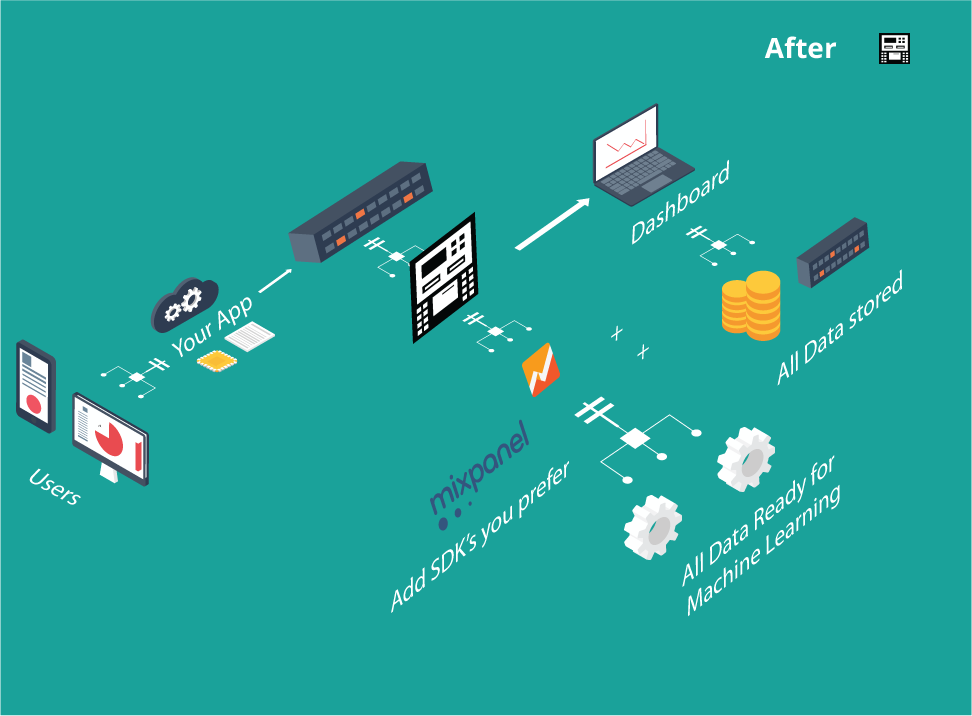

As a premium engineering product company we have delivered not just projects, but success stories for entrepreneurs. For every project we take, there is a back story. Story of why it happened and story of the struggle to make it happen.

Only a founder knows the real struggle – the journey of nurturing a small idea into reality, going against all odds.

We’ll be interviewing entrepreneurs who’ve seen it all, pick their brains and share their stories with you so you might be able

In the first edition, we begin with [Dipankar Sarkar](https://twitter.com/dipankarsarkar), the founder of [Octo.ai](https://octo.ai/), an open source analytics platform that is taking everyone by storm. They have a staggering 370 plus upvotes on Product Hunt, and were trending there for a couple of days! Based on artificial intelligence and machine learning, Octo.ai has raised $200,000 recently from investors and plans to take a shot at mainstream analytics tools.

Let’s get to know more about Dipankar and his entrepreneurial journey.

__Congratulations on raising funds for Octo. That’s big news! Before we get into specifics – can you tell us a bit about yourself?__

This is always a tough one to answer, with the context in mind here it goes.

I would describe myself as a builder and thinker. I have an engineering degree from IIT Delhi in computer science, during my student days I figured that building for the Internet was my passion.

The awesome founders & seniors at Slideshare were nice enough to give me a platform. With great mentors and high quality work that got my career started, I am proud to be an early member of a well known internet product.

This is what got the startup bug into me, and I have continued following my passion for startups ever since. Did quite a few by myself, but Octo.ai has been one of the most interesting journeys among them.

__How did the idea for your business come about? What ignited the spark to get into machine learning?__

The credit for the initial idea for Octo goes to my wife.

In mid-2014, I saw her completing a transaction with a clothes seller in Gujarat on WhatsApp. That lead me to believe that bots inside WhatsApp would really enable commerce and act as an online to offline bridge. That is how AAHIT was built out.

As we went to angels for raising capital, it became clear that being inside WhatsApp without official APIs was a big risk for them. Based on that feedback we went on to build a mobile application based consumer bot.

In that development process, we realized that there was a bigger opportunity in marketing automation and AI and that’s how Octomatic was born.

Of course, the engineering – be it NLP (natural language processing) or ML (machine learning) – was built for the various products developed. This was an extension of my interest in heuristics and algorithms.

__With AAHIT – An intelligent Whatsapp bot, you had gained good initial traction with 20,000+ users. What happened there?__

We had built something interesting and had traction. To take things forward and expand our reach, we raised some funds. We soon realized that the amount of money it’ll take to challenge the bigger players was way too much.

Haptik and Helpchat had way too many resources at their disposal. Technology was not the primary question with the kind of capital competitors had raised.

__How important is it to find the right partner/co-founder?__

It is possibly the most important choice to make. The character of the company is defined by those early choices for the team.

__Incase finding a partner proves difficult, would you suggest looking towards a tech services company for help?__

If it is a core tech company, then you need someone who understands it in the founding team.

If tech is an enabler, outsourcing that capability is actually recommended. Though, someone again must have some basic tech experience for a positive outcome.

__How did the idea of Octo.ai come around?__

Octo.ai is a product of how we think data science for consumers will evolve. We initially started building chatbots, then moved to enterprise SaaS with octomatic and now, an enterprise Open Source company.

We are proposing that for software to perform any sort of intelligence, it needs to collect data. The valuable data for Octo.ai is user interactions. The more data it collects, the smarter it becomes. Context is derived from data, which in turn is the basis of decisions made by the software.

__There exist a lot of analytics tools. And it looks like you’ll be, more or less, competing with big players like Google Analytics and Mixpanel. Right?__

Yes and No.

Yes. Our Open Source framework eliminates third party analytics including Google Analytics and Mixpanel, you should be storing your data on your own servers and running business intelligence (outsourced or internally) on top of it (instead of trusting third party tools with your data). We are competing with segment.io, but they are a closed source system.

No. What we are offering to enterprise clients is segment of one marketing automation, it learns user behavior and targets them intelligently to pull them back into the system. Effectively, increasing retention and potential conversions within the system. This is right at the intersection of high-end analytics and marketing automation. There are no players in this vertical.

__Could you give us a business case that’ll set you apart from analytics competition?__

The business case is storing your user’s context and mining it for increasing retention and conversions. We will super charge the marketing team that attempts to understand analytics and create marketing automation campaigns.

Our belief is that once marketing sets goals, the intelligence must personalize for each user at any scale. Campaigns are, after all built with the goal of capturing and converting latent users manually.

__What other tech can Octo be used/integrated with?__

When we built Octo.ai we looked at it as the operating system for the big data. Healthtech and IoT are a natural fit.

Octo.ai has been designed from ground up to collect data – perform analysis and has a feedback loop to learn as more and more data enters the system.
One of the biggest use cases I see is a future where health product aggregators, fitness bands and health care services become one big offering. A system designed in a way that tracks and stores data from different services, performs calculations and gives actionable metrics to the users.

This future is very near – we’ll slowly see different sub verticals coming together to offer a more holistic solution to users and at the core of it all, will be data.

Possibilities – they sure are endless.

__How do you define success and what would you say are the essential skills needed to be a successful entrepreneur?__

At a personal level, I view success as being able to keep doing the things that I like. My joy is derived out of building and people using my work.

The only skill is the willingness to learn and listen, rest follows.

__I think every founder has a fair share of ups and downs, and lessons learned from them. If you could go back in time again and have a fresh start – what would you do differently?__

I would not do anything differently.

The present moment is a result of all that has gone right and wrong, no regrets.

__Advice to young entrepreneurs out there?__

Get used to the chaos and friction, keep up the fight!

As one of my classmates would always say, “Kyonki Fighter Hamesha Jeet-ta Hai”
(Because one who fights always wins)
