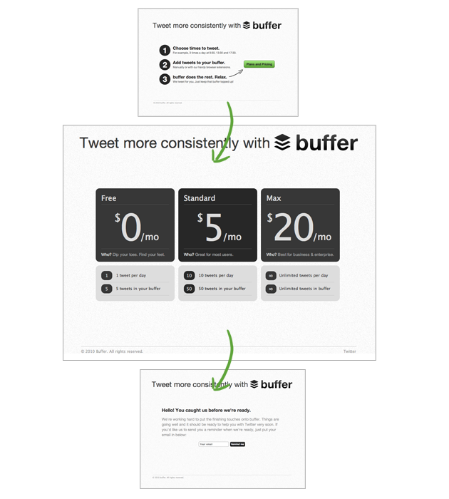
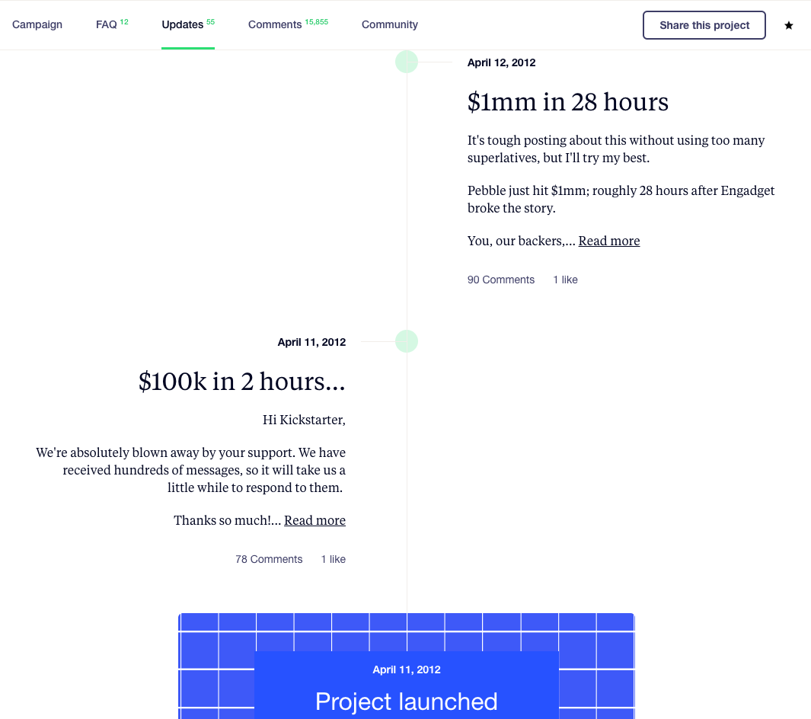

> ## “Make something people want.”
> – Paul Graham

Making a product that people want is the holy grail of the startup world. A lot of ideas that sound amazing in your head, may or may not actually be something that people actually want. So how do you ‘know’ even before you build, whether that idea will resonate with your target audience. A popular methodology called Lean Startup, championed the idea of building a Minimum Viable Product to test the waters. A Minimum Viable Product or MVP for short is, “that product which has just those features (and no more) that allows you to ship a product that resonates with early adopters; some of whom will pay you money or give you feedback.”

In other words, the lean startup methodology says that it is better to test waters with building a basic product that has just enough features to verify with you audience that your product is actually solving a problem. The problem is figuring out what constitutes for a Minimum Viable Product. And the second problem is, if you don’t have a technology background, how do you go about building the MVP.

Here we give you three alternates to actually building an MVP, that’ll just as well help you validate your startup idea.

## 1. Landing Pages
Landing pages can ideally be a great way to validate your idea. The caveat is, that you need to ensure that the people going through the landing page think of it as a real ‘purchase’. Putting together a landing page that outright tells people that your product is under development will not do much to validate.

Joel Gascoigne used a similar technique to validate his idea. He wanted to build a tool that makes Twitter scheduling a breeze. His idea had weight, as the tool is now the social media giant Buffer.

Joel created this three page MVP after he got some positive feedback on his initial, two page MVP (that didn’t include the actual pricing). Including an actual pricing page made things more real. People who were only really looking to try or buy this product would go through the whole cycle and fill in their email id.

If you’re creating a landing page MVP, be sure to ‘ask’ for money. Show your items as ‘Sold Out’ or ‘Under Preparation’ and build a list of users who are willing to pay. If you can collect enough IDs and deliver within a short period of time, you’re in business.

## 2. Crowdsourcing Your Fund
Crowdsourcing allows you to effectively communicate your idea and see if people are really interested in what you’re building. Sites like Kickstarter are a great way to make your product available for pre-purchase orders and raise money to build them. It’s great way to validate your idea, where people actually pay and show their support.

Jason Fried, founder of Basecamp explains – “You can’t ask people who haven’t paid how much they’re willing to pay. Their answers don’t matter because there’s no cost to saying ‘yes’ ‘$20’ ‘no’ ‘$100’. They all cost the same—nothing. The only answers that matter are dollars spent. People answer when they pay for something. That’s the only answer that really matters.”

The issue with going the crowdsourcing way is that you’re stuck with your initial pitch for a longer period of time. Once people start pitching in for your idea, you can’t really change what you’re looking to build. This sometime works against the principles of rapid prototyping and quick pivots that software demands, but works great for longer term projects such as those for hardware.

Smart watch company Pebble, is one of the most successful crowdfunding stories till date. Three of the four biggest amounts raised on Kickstarted are for their products.

 

The pebble project creating waves on Kickstarter
 

## 3. Build A Manual MVP
Paul Graham, in one his popular essays, mentions – “Some startups could be entirely manual at first. If you can find someone with a problem that needs solving and you can solve it manually, go ahead and do that for as long as you can, and then gradually automate the bottlenecks.”

Incidentally, ZeroCater – a YC startup, that provides catering options to companies started off as a simple spreadsheet that the founder Arram Sabeti maintained. AngelList started off as the founders manually collecting list of startups and matching them with potential investors. Even Netflix started off as a company that rented and sold DVDs over the internet. Examples of the ‘Manual’ MVP approach are endless and can be a great way to validate your idea!

 
 

We hope this gives you ideas to implement for your own startups. While validating your startup idea is a big part of your journey, determination will be the single most important factor in determining your success!

P.S. If you’re looking to [outsource your product development](/outsourced-software-product-development/), drop us a line!
