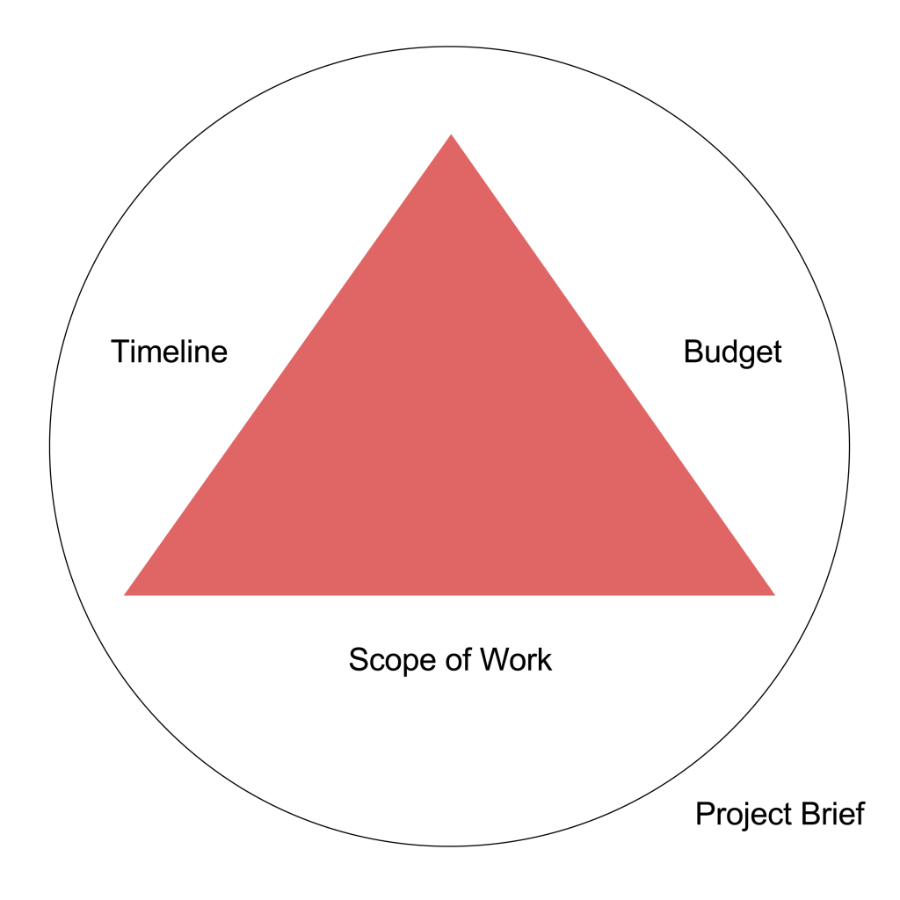

You have an idea that you want to develop and you’re convinced that hiring an outsourced team is the best way to move forward. You spent hours researching about the best agencies to work with and shortlist a bunch of them. Now you need to finalize the one that will turn your idea into a reality. The next thing you need to do is create a solid project brief and share it with all the shortlisted agencies, to kick off discussions.

In short, a project brief is a document summary of your idea. It contains the ‘hows’ of your project, and could also include the ‘whys’. The best way to imaging a project brief, is a document that is read by a complete stranger and she understanding, in entirety, what is it that you’re looking to build. There are certain other things that you need to add, for example, things like timelines and budget constraints to complete it. Software agencies will use your project brief as a basis of scoping out the work and estimating timelines, manpower/skills required, costs associated with the project amongst other things. Hence, writing a comprehensive project brief can save you a lot of time and make the process generally smoother.

## Components of a Project Brief

Start a project brief with a basic introduction of the idea along with the end goals. You can also include the type of audience your application will target, marketing strategies you have in mind and whatever you feel would help the agencies deliver.

A good project brief must include the following components:

__Scope of work__

The scope of work contains what you’re looking to build. Depending on how deeply you’ve thought through the project, your scope of work could be defined with the exact functionality and user flow. For example, if you already have an application developed and are looking to add a few features on top of it – your scope of work would be extremely well defined.

Or you could have a more loosely defined features if you’re still exploring and are looking for inputs from the software agency. For example, you’re looking to build a mobile application that promotes loyalty amongst restaurant patrons.

__Budget__

While it’s difficult for clients to ascertain a certain number to the project, it always helps an agency when an upper cap if defined. Defining a budget within the project brief also helps agencies create a customized solution, that’ll get the work done and fit within your budget.

__Timelines__

This section communicates how fast you’re looking to hit the market and the kind of urgency the agency will have to work with. Setting a soft deadline, ‘we’re looking to launch the first version of the product within six months’, creates a positive pressure and can help agencies figure how to best allocate resources.

The scope of a project, timelines and budget are highly interdependent. The more defined the scope of the project is, the easier it is to estimate timelines and budget. If you’re looking to expedite development, costs might go up. Complex projects generally need to keep the timelines and budget flexible, otherwise the quality might be compromised.

Depending on which stage your project is and the level of flexibility you’re open to, the project brief might vary from a single paragraph to a detailed multi-page document.

## Exploratory Project Briefs
If your project is still in the ideation phase, and you’re exploring the technologies, features, growth tactics etc – you’ll most probably be working with what we call an ‘Exploratory Brief’. These briefs are rather loosely defined without most of (or any) specifics.

__An example:__

__Summary__: We’re looking to build a mobile application that’ll help foster loyalty amongst diners. Think of it as a loyalty card, but brand independent and on mobile.

__Application Flow__

__Users (diners) should be able to:__

Click pictures when they are at a partner restaurant.

Share it on social media platforms.

Earn points on each share.

Redeem points in partner restaurants.

__Partner restaurants should be able to__:

View and respond to users who have shared images

Provide discounts on offers based on points collected

__Devices__:

Devices will be decided as per the markets targeted.

This project brief barely touches upon what the app should be able to do. There’s no mention of the specifics, the platforms it will be developed for, technologies to be used etc.

It’s essential to attach a budget to exploratory projects. As the scope is loosely defined, the agencies could go on and add a lot of features, fancy technologies, high end systems that would really shoot up the prices. Keeping a budget defined helps them define and work within that budget.

## Estimation Project Briefs
These project briefs have a clearly defined scope of work. They are used to get an idea of the cost and timelines from different agencies.

__Example:__

Summary: We’re looking to build a mobile application that’ll help foster loyalty amongst diners. Think of it as a loyalty card, but brand independent and on mobile.

__User Definition:__

- There are two types of users on the application:

- End Users (Diners)

- Partner Users (Restaurants)

__Application Flow (End Users)__

- End users will be able to:

__Sign Up__

- Primary sign up method for users will be using their mobile numbers.

- They will also be able to sign up using Facebook Login

- They will also be able to sign up using Twitter Login

- In case of social login, users will be prompted to add their mobile numbers.

__Creating Profile__
- Users will be create their profiles.

- A public profile will include profile picture, location, favourite restaurants.

- Incase of social signup, details to be pulled in from social profiles.

- Add / edit mobile number, private. Not visible publicly.
__Devices:__

End user application will be an iOS application, built natively.

Partner application will be a web and iOS application (native) with features described in the ‘Application Flow’.
 
Every single aspect of the project is carefully thought out and included. The agency’s job is now to merely estimate timelines and cost of the project. The scope of project is fixed whereas the timelines and budget are kept open.

A project brief is considered successful if it can clearly communicate the requirements of the project to everyone involved in it, and can help you choose the right development partners.

If you’re looking for development help, [we’d be happy to have a word with you!](/contact)
