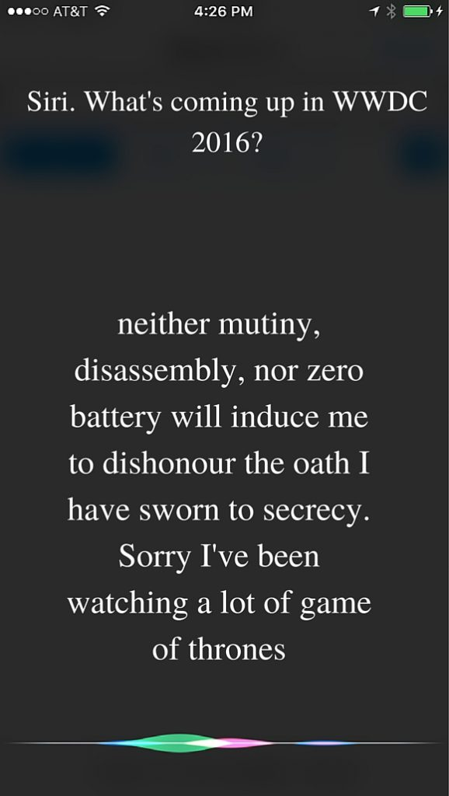
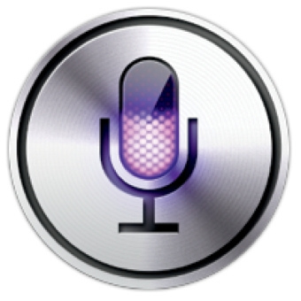
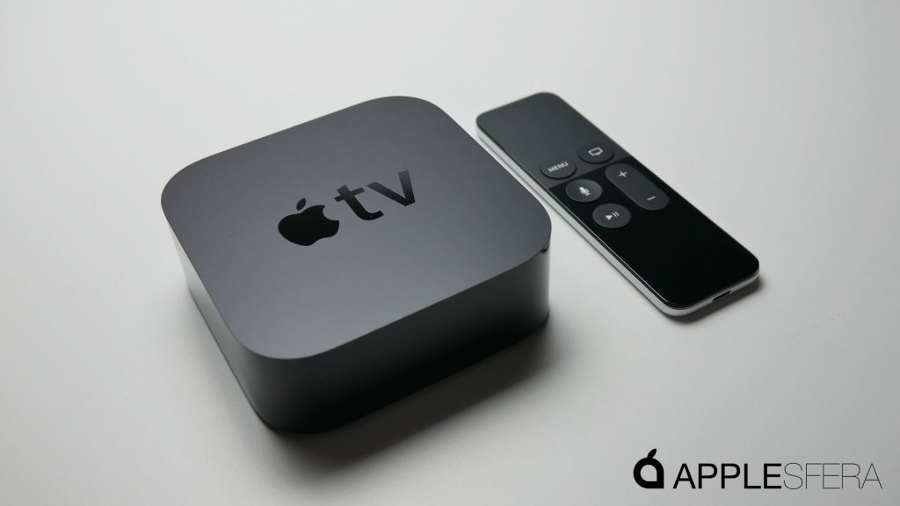
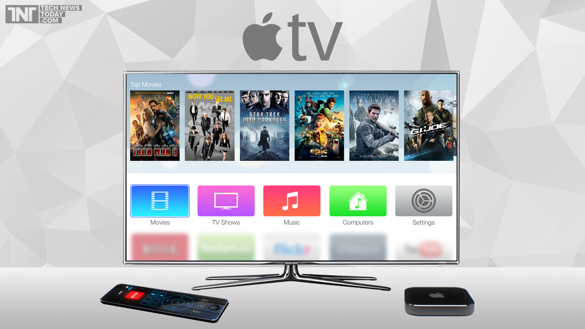
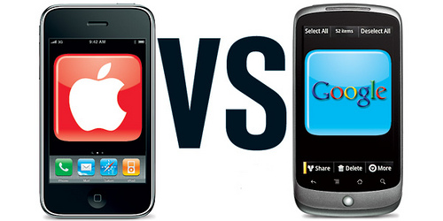

Apple's World Wide Developer Conference, the holy grail of all developers is back. Here is the quick overview of everything that happened at WWDC 2016.

Right from the day the dates for the Apple conference was announced as June 13th to 17th, the expectations for the new launches was quite high. With all the excitement, thousands of Apple fans turned to their best friend  Siri for titbits on what's coming. Here's what Siri had to say:

##

Getting a ticket to attend the apple conference was never an easy task. The $1599 ticket in itself is a daunting affair for many. This year apple had also introduced the "lottery" whereby you would have to test your luck to earn the privilege of paying $1599 to attend the conference.

The key note speech delivered by Tim cook, CEO of apple is the high light of the event. He gives out all the new launches for the year. The highly anticipated speech of wwdc 2016 started of on the first day of the event and Tim cook definitely did not disappoint the crowd. Here are the most important parts of the speech

## The Keynote- Reason why all of us are here :

The apple CEO, Tim cook delivered the keynote speech in the conference this year. Some of the much anticipated upgrades were introduced during the speech.

### OS X GETS A NEW NAME :

The OS X that has been powering the macintosh since 2002 is now re-named macOS and the latest iteration is called the Sierra. The beta version of the same will be available by july and the final version will be out by fall. The most interesting feature of this new OS is the continuity across devices. The universal clipboard feature demonstrated by Craig Federighi potrays the power of continuity. This feature allows users to cut and copy across various devices. Now you can cut your favourite beyonce/shakira images on your mac and paste it straight into your iphone. You can now also save your MAC desktop to icloud and access it from different computers using icloud drive.

### Apple's virtual Girl friend comes to infest your desktop as well :

Competing with Cortana on the desktop of windows 10,the macOS Sierra will also bring Siri on to your desktop. Siri will be accessible from the dock and the top right corner near the spotlight. So we can now get all the witty one liners and the highly intelligent assistance of siri (no sarcasm intended) at the click of a button on your mac.

### Apple Pay online:

### 

The Apple fans in US, UK, Canada, Australia, and Singapore have called for a celebration. They have the unique privilege of making online payments through safari. Apple pay has gone online and the authentication happens through your touch id on your iphone or watch thus eliminating the need for credit cards.

### Clock ticks faster. Finally!

###

The watch OS 3 was introduced with a lot of upgrades but the most important update is, the OS that allows the apps to get 70% faster. These unbelievable increase in efficiency is brought about by refreshing the background and storing the apps in memory. The side button gives the users access to the dock, making it a little more like an iphone with a new control center.

Apple has also come up with a host of new features, such as a "scribble"- a keyboard to respond to messages, an sos feature that contacts 911 if the side button is held down,  a collection of fitness apps including activity specific watch faces and a meditation app called "breathe".

### iOS updated

The iOS has undergone a tremendous change. Craig federighi, VP of software engineering called this release, "the biggest iOS release ever for our users". The music and maps have been completely re-designed. The all new "Raise and awake" feature allows the lock screen to come alive when you lift the phone. This feature also reveals newly modified notifications with which you can interact using the 3d touch.

### Music Redefined

### 

Apple seems to have decided to get its hands dirty in the fight with spotify. The one year old apple music has been redesigned to accommodate many new features. A separate section of downloaded music and the new "discovery mix" that tailors the play list to listeners taste. The song lyrics can also be accessed now.

### Apple and the Idiot box

The relatively new TV OS of apple has also undergone its share of upgrades. It now hosts over 13o0 video chanells and 6000 apps. Apple is bringing a new remote app that possess all the functionalities of the tv remote.

### iMessages becomes 'my messages' again!

In reply to strong competition from messaging apps such as whatsapp and snapchat, the iMessages app  is being completely revamped. The new messaging app will include option for hand-written notes, animated effects such as strobe lights, balloons, and confetti. One more interesting feature is the 'invisible ink'. This features allows the messages to be hidden/blurred until swiped over. In the world of private messages, this is a smart addition to have in the messaging app. Developers are also getting a bonus as they can now develop apps like stickers for the iMessages application.

### Photos Vs Google photos

Apple is taking on one powerful component with an upgrade in each segment. The photos upgrade is aimed at taking on the google photos. Apple allows the organizing of data automatically through facial recognition. The application is aptly named memories. The memories bundles together photos according to events and locations.

### Voicemail transcription comes to iOS

The new iOS allows automatic transcription of voicemails, converting them into text. Apple is also all set to battle spam callers. New APIs are being put in place to warn users about spam calls before they pickup.

### Siri opens up to developers

After a long and languished wait the developer community finally get a taste of nectre as apple has decided to open up siri. Now developers can integrate siri functionality into their website. So in the near future you will be able to book ola, make a reservation and watch your favorite video online with just a command to siri.

### Predictive typing

"Can i please have my old black and white phone back"

This seems to be the single wish of most of the frequent texters today. Predective texting was an amazing idea that was to make our lives simple but it has only managed to do the opposite so far. The ineffeciiency of predictive texting has made it a considerable nuisance as of today.

Apple claims to have solved this issue. Quicktype will now bring the "siri intelligence" to the keyboard. Now that siri has opened up,multiple features would be added to your keyboard. The power of this functionality would unfold before us in time. Let us wait to watch the fun.

### Collecting your data without collecting your data

Apple is the leading advocate of privacy in the digital world. But its policy of privacy is creating a lag for its customer understanding capabilities. In the age of big data and machine learning apple would fall behind its competitors if it is not able to collect the relevant amount of user data. Apple's ingenious solution to this is "differential privacy"

According to apple

"Differential privacy is the statistical science of trying to understand as much as possible about a group while learning as little as possible about an individual in it."

As a part of differential privacy policy the AI analysis of your texts will remain on your phone and will not be transferred to the cloud.

## The culmination

The apple WWDC 2016 is a collection of small upgrades that combine together to make the use of apple eco-system more easy, efficient and safe. The upgrades on macOS and the apple watch are quite significant changes. The newly opened up Siri provides a great opportunity for enthusiastic developers across the globe. The impact on the upgrades on the individual devices independent of the apple eco-system is a question that is yet to be answered. But on the whole, yet another very impressive presentation by the apple team.

Do you feel there are some more important points to be added? What do you think would be the impact of all the updates? Go ahead and add your thoughts to the comments section and let us discuss
