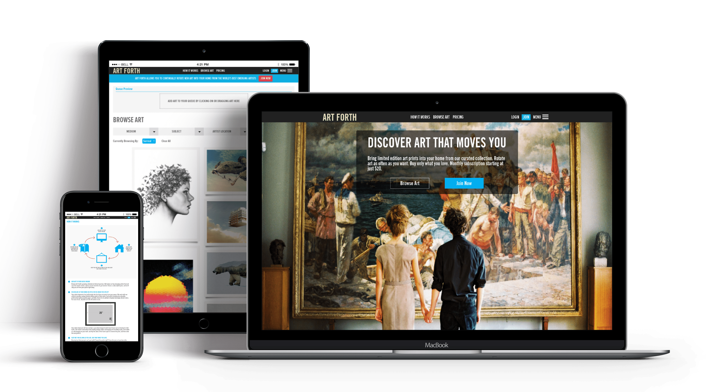

## About
Artforth is a portal where you can rent art. Subscription based renting of art, so that you can try out everything in stock, before you settle on buying the original.

## Problem
The client wanted to create a portal to connect up-and-coming artists with art connoisseurs. People looking to buy art should be able to queue a list of art pieces, receive prints to try at home and return the pieces for the next ones to be shipped.

## Solution
We created a beautiful (it’s art, after all) e-commerce type portal where users are able to queue art pieces that they like. Then on a basis of monthly subscription, the users will receive a certain number of art prints that they can ‘try’ out before the next cycle of art is shipped. We built a classy admin panel to upload various kind of art and manage the orders on the site. The interface was mainly drag and drop, for the user to create their queue. Using Stripe, we created the subscription based payment model.

## Technologies
- Ruby on rails
- jQuery
- Backbone.js

## Testimonial

  

    <iframe
      src="https://player.vimeo.com/video/80916108"
      frameBorder="0"
      allow="autoplay; fullscreen"
      style="max-width: 100%;"
      allowFullScreen
    />
  

