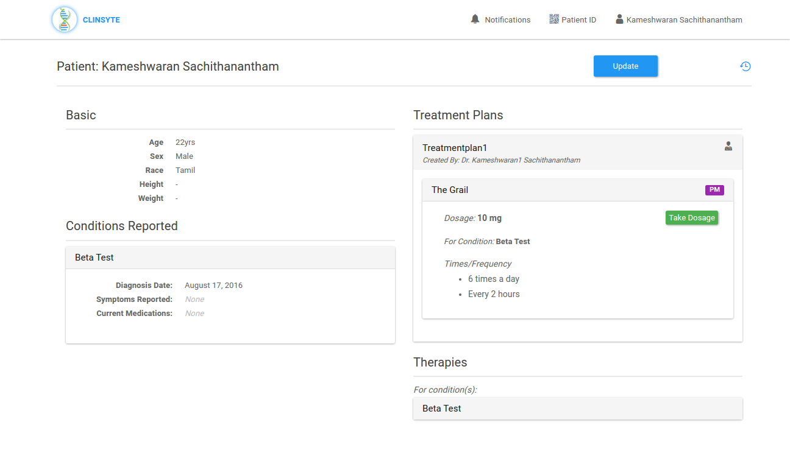

Clinsyte is a platform which connects patients and doctors. Patients can search for doctors, send request to them and vice versa.

## Features

Patients can schedule an appointment with doctors. The entire patient data is tracked through the patient chart module in the application.

This application also has surveys which are created by either admin or physician, will be sent to the patients after they take medicine to get their feedback on the therapies. The feedback is considered for data analytics and shows the visual representation of the effect of therapies to the doctors.

### Appointment Booking

Patients can directly book appointments with their doctor via the app. A robust yet simple calendar based booking system, with an intuitive flow so anybody can book their appointment easily.

### Post Medication Survey

Doctors can run surveys after recommending medications to their patients to gather data about the medications interactions. This is a very valuable feature and can help doctors understand medication and its implications much better.

## Technologies used:

- Ruby on Rails
- React.js

### Testimonial:

> “We are very pleased with the final product delivery and impressed with the team's dedication and focus ... even during the down ramp, which is very crucial in ensuring smooth transition. Once again, we praise the talent and drive of the team mentioned above and promptness in the response whenever issues were encountered.
>
> Finally, as we reflect on our experience working with the team at Codebrahma, without hesitation, I can say they did a commendable job and we'll look forward to working with this team again.”
>
> — Nitesh Patel, Co-Founder, Clinsyte
>