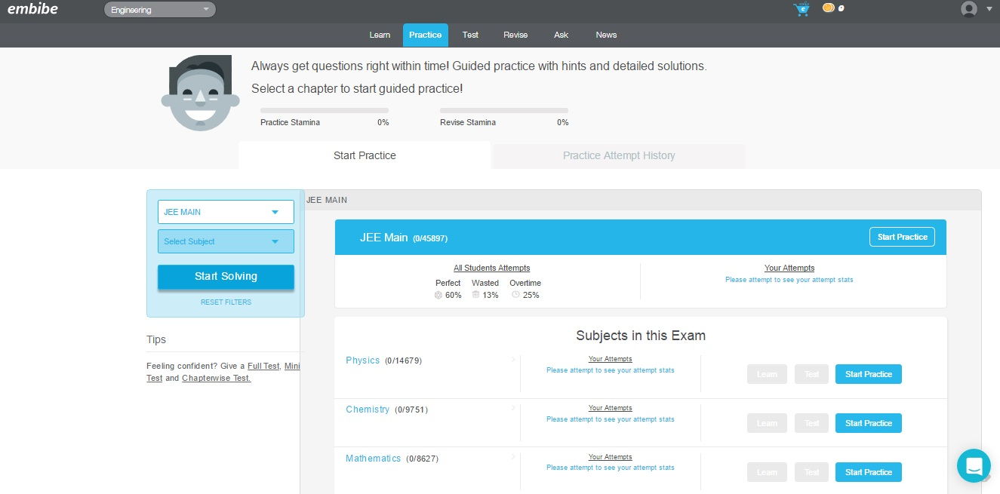
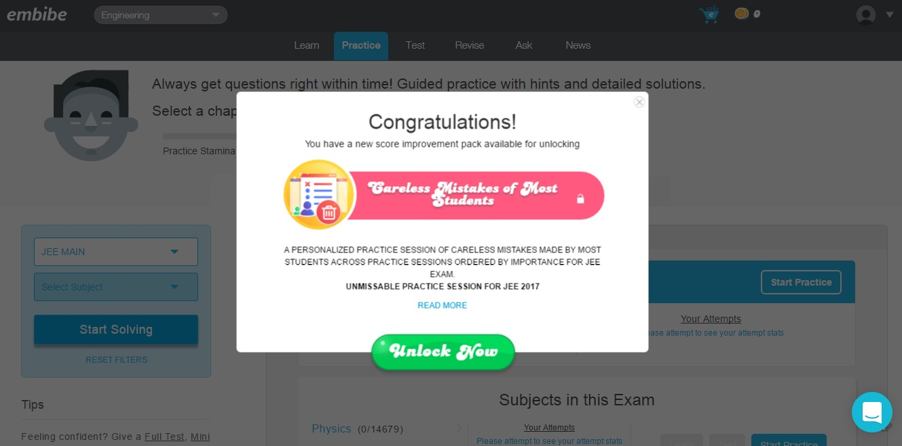
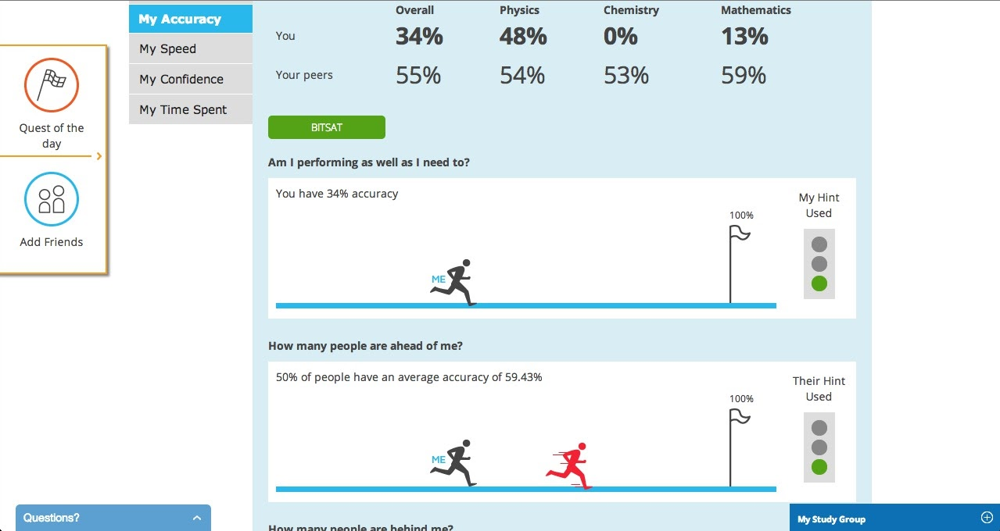

Embibe is one of the first companies to help students prepare for IIT-JEE online. They can invite their friends and compete with each other on test and get detailed analytics on how they performed.

## Challenges:
* Building a scalable realtime chat engine amongst friends, similar to facebook  was a real challenge.
* Architecting and developing a customizable gamification engine that kept the students motivated to go on with their preparation and attack their weakness.
* We also wanted to develop a test taking interface that was really simple to use and minimal. We wanted the interface to be inviting so that the students took more and more tests.
* Doing Analytics on test data and bringing a social context to it was really challenging.

## Solution:
* We architected a realtime chat engine based on the pub sub protocol using Faye, an evented server in ruby. We built a modular gamification module that plugs into the application user events and the test score and provides rewards to the user.
* The rails social network was designed with single test taking interface with no refresh whatsoever. This made is tremendously quick for the students to attempt multiple questions. We built an analytics engine, completely isolated from the system do the number cruching and we built some cool visualization to see the results.

## Benefits:
* _Real time chat engine:_ Students were able to chat with their peers and plan their preparation with ease.
* _In depth Analytics:_ Students knew exactly where they stood amongst their friends and peers across the platform.
* _Increasing stickiness:_ Students spent more time on the site, attempting more questions. This splurge in time spent was primarily due to Gamification.

## Gamified Platform

The platform was created in a way to make learning fun. Gamification of learning is absolutely essential, specially when it comes to online learning. It is one of the most important factors contributing to completion as well as retention rates.

## Competitive Analysis

As the saying goes, you cant improve what you dont measure. Since Embibe is essentially a platform to help students improve their test taking ability and understanding for competitive exams – building a robust analytics platform was a necessity.