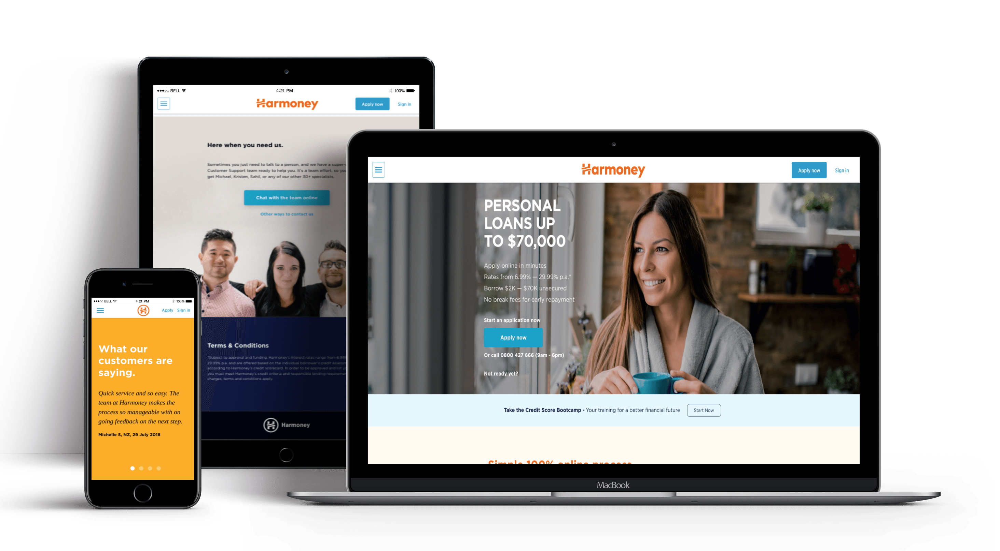
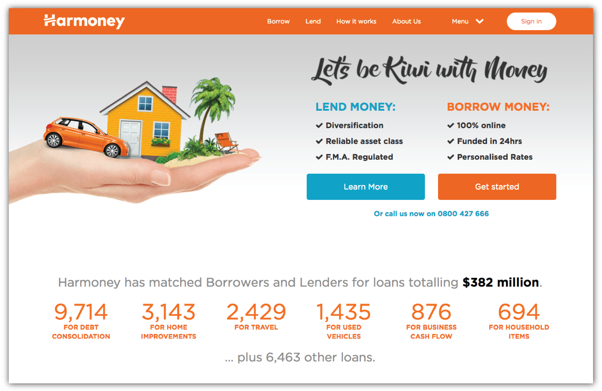
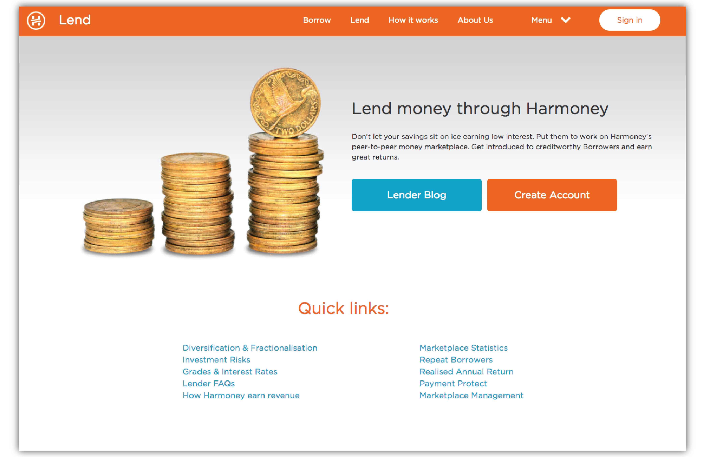
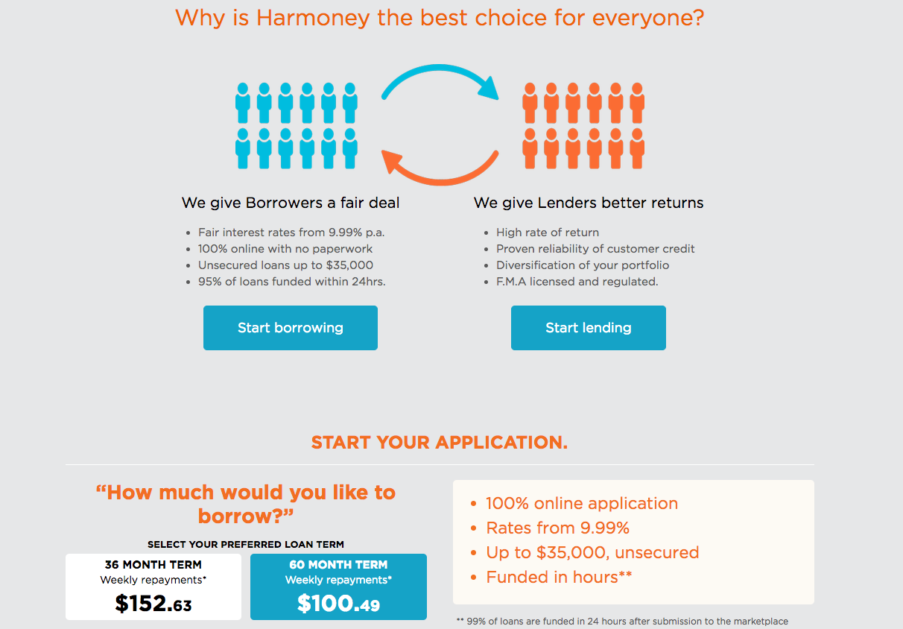
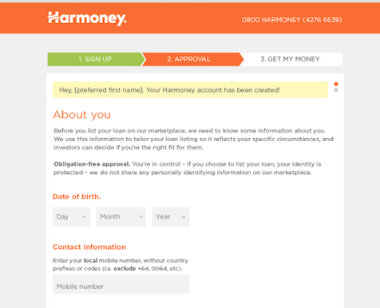
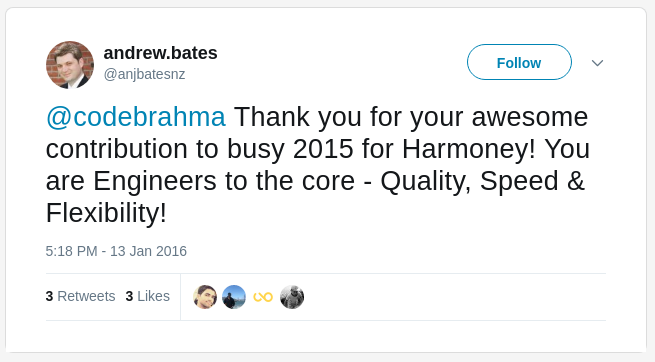

Harmoney is New Zealand’s first licensed Peer to Peer Lending platform. Providing personal loans at low interest rates and high return investment opportunities.

## Problem

Harmoney approached us in December 2013 with an idea to build a fully automated peer to peer to money lending marketplace. They wanted all their data to be in sync real time with their backend customer support infrastructure that sits on salesforce. Their customer care team would need this data in real time as their clients would call them during the application process. Loan Application forms are generally long and tedious, but harmoney wanted us to design a form that had a low drop off rate.

* Building a smooth experience for the user during various long steps of the application process.
* Communicating the data in real time with the Customer Care infrastructure.
* Obtaining all the information required to process a loan without the user dropping off.

## Solution

We built a Rails application that would constantly listen to the Database and queue each updation into message queue. Then we implemented a worker mechanism with scheduling and decay algorithms to precisely replicate the updates on Salesforce. After multiple iterations of the User Interface and various rounds of A/B testing, we achieved a huge decrease in the loan application drop-off rates – one of their biggest challenges. Rails and AngularJS based, Harmoney was off to a smooth start with the user experience loved by all the users.

* Implemented Messaging Queues and Async Pub Sub protocols for smooth experience.
* Implemented a Bidirectional RealTime Sync between Salesforce and our RDBMS.
* Designed a guided loan application process.

### Peer-To-Peer Matching
Matching people who want to invest, with people who want to borrow. It’s an efficient model that allows funds to flow directly between investors and borrowers without the need for a traditional Financial intermediary, giving everyone a better deal.

### Simplified User Onboarding
Mulitple iterations on the user onboarding process coupled with extensive and in-depth A/B testing resulted in one of the lowest drop off rates seen in the Fintech industry. Easier onboarding process equals happier users, meaning a lot more business!

## Technologies:
* Ruby on Rails
* Angular
* RefineryCMS
* Salesforce
* Cloud Lending

CloudLending is a leading Fintech cloud provider, which in turn led to selection of salesforce since CL is available in salesforce only. Refinery is choose to dynamically change the homepage or other static pages. Angular and Ruby on Rails is choosen as they are fast in development and are latest technologies.

## Testimonial:

