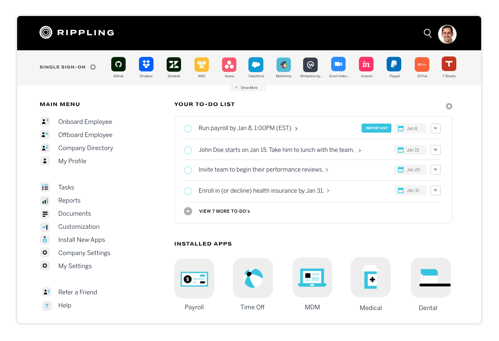
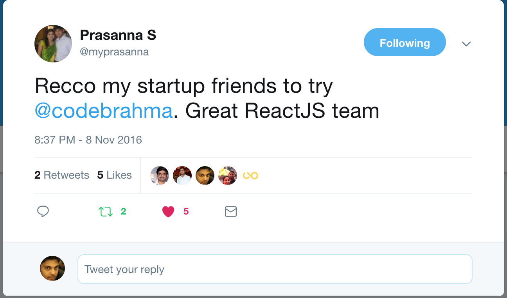
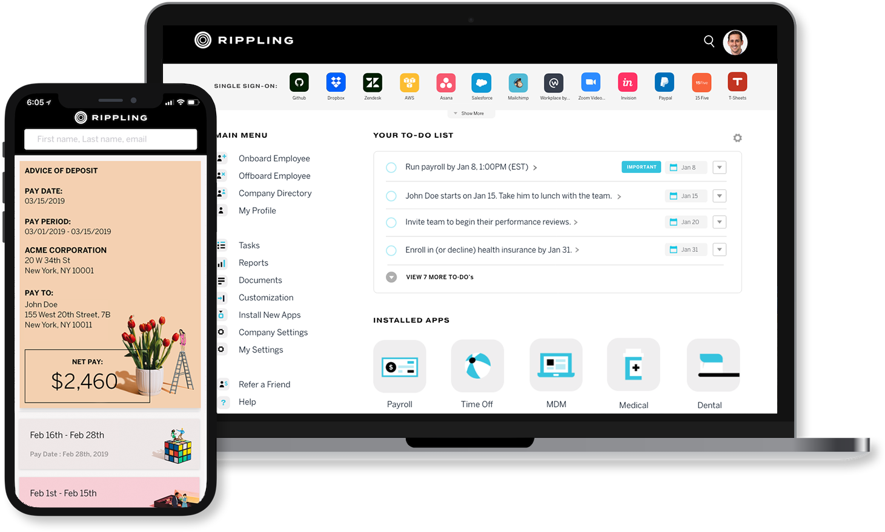

In 2016 Rippling CTO Prasanna Sankaranarayanan approached Codebrahma with a huge product roadmap. They wanted to build a suite of HR, Payroll, IT management, Marketplace features in their SaaS offering.

They had a strong team of engineers, who were ACM ICPC finalists. The CTO himself was ranked India's no.1 programmer.

## Case Study

Helping a high potential startup accelerate product build to reach a 250 million $ valuation.

[Rippling](https://techcrunch.com/2019/04/03/rippling-45-million/),
(which recently raised 45 million on a 275 million valuation) is also founded by Parker Conrad
(who previously founded the billion dollar company zenefits.com).
His CTO Prasanna Sankaranarayanan
(who is [ranked the number one programmer by TopCoder](https://community.topcoder.com/tc?module=Static&d1=features&d2=120507))
reached out to Codebrahma during their early days to build their web and mobile frontend.
Rippling had a killer backend team under Prasanna, who had hired a lot of his fellow TopCoder
ranked contestants and colleagues from Google. The killer tech team was very very good when it came to writing
complex backend logic (think payroll for the entire US). They found it very cumbersome to write pixel perfect ReactJS
applications, which worked smoothly on the browser. This is when they reached out to Codebrahma

Codebrahma reviewed the designs and the API specs of rippling, and proposed a frontend architecture
modeled around ReactJS, Redux webpack build. We also built the react native mobile app for rippling.
[Rippling](http://rippling.com) was so happy with the work that, they focussed on hiring for backend alone,
and they delegated the entire frontend to Codebrahma. This massively helped them in building product very fast,
and winning market share in the HR, and IT management space.
Here is a testimonial from the CTO of [Rippling](http://rippling.com)

We have also spent a lot of time with [rippling.com](http://rippling.com)
and these were the sentences, we heard from them time to time

"We have a large roadmap of features to build..
And having a team like Codebrahma help us handle
our frontend has enabled us to focus on what we know best, our backend.
And thats what matters most to our customers!"

