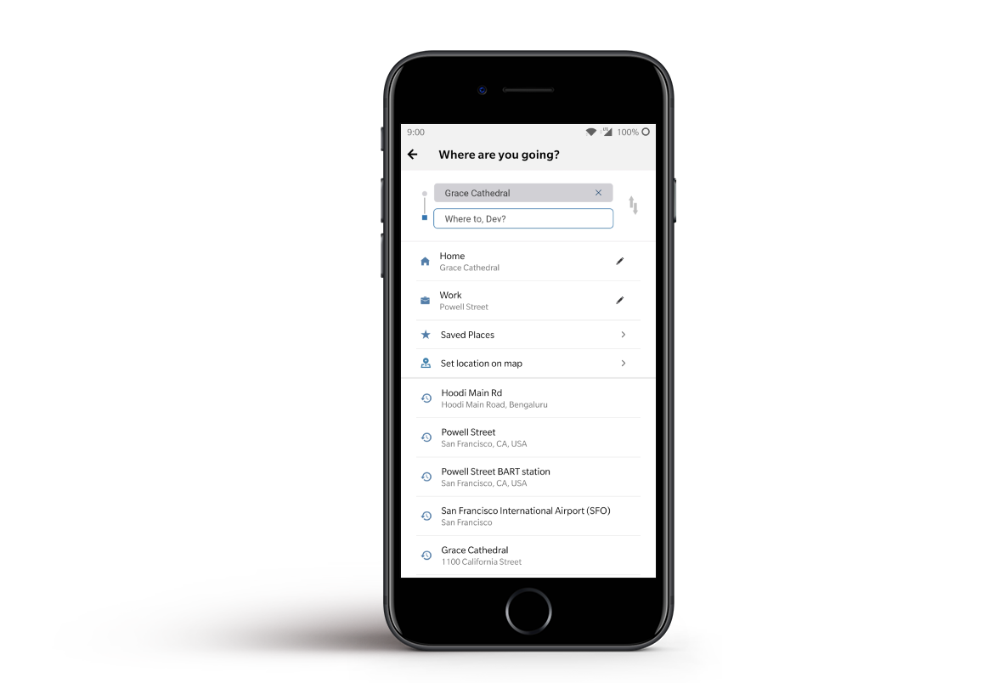

In 2018, Mystro Founder Herb approached Codebrahma for a new product roadmap. They wanted to build an application that helps intracity commuting for people in the best and efficient way.

We built the complete stack which includes back end(written in Node.js) and front end(written in React Native) for both iOS and Android.

## Challenges:

The major challenge in implementing the idea like Bestride is, the data provided by the APIs of services like Uber, Lyft and other ride-hailing apps. Each service provides the ride data in different format. The app has to handle all the types of data structures without compromising the performance. In addition to that, the app should stand out from the giant competitors already in the market. 

Taking a careful decision on what computation needs to be on the server and what needs to be done on the client app is very critical for this project. The team has done a tremendous job in architecting the app so that there is a minimal change required to do whenever any of the API providers change their data structure.

The mobile application is optimised to the level where even on continuous use of services like geolocation and a significant count of API requests made parallel at any time, the app seems to be responsive, robust and reliable.

## Tech Stack: 
 * Node Js for server
 * React Native for mobile app (Android and iOS)