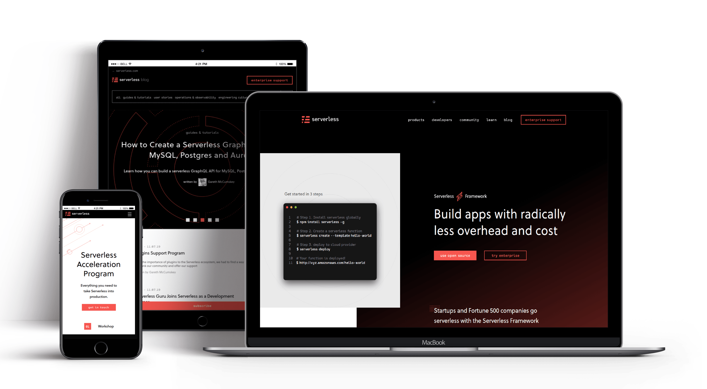

In 2018 Serverless VP Nick Gottlieb approached Codebrahma with idea of re-architecting [serverless.com](http://serverless.com) website. They wanted to re-architect and re-design the website, docs and blogs in 2.5 months.

### Challenges
Rewriting a website like [serverless.com](http://serverless.com) which has large number of audiences and great SEO, was a big challenge. The site has to be responsive across all the devices and it has to serve the users of all the platforms ranging from Windows IE to Apple Safari.

### Solution
Serverless website was previously written in React.js with [Phenomic](https://github.com/phenomic/phenomic). Codebrahma helped them building a fully responsive website with Gatsby.js.

Codebrahma built a fully-fledged [design system for serverless](https://design-system-serverless.netlify.com/) with a great list of reusable components. And used the same in building the website.

### Technologies:
- React.js
- Gatsby.js
- Styled Components
- Styled System
