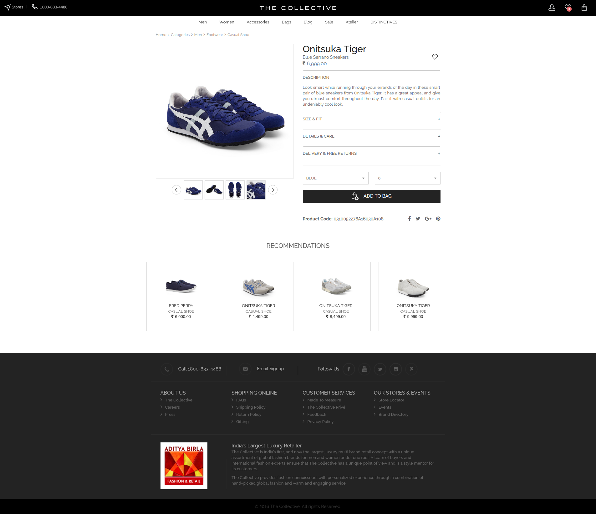

The Collective is a luxury e Commerce application which primarily focus on providing complete shopping experience for the customers. It was built on top of Spree Commerce, the most trusted e Commerce framework in Rails by which entire application can be built in a number of days.

## Problem
Madura Fashion & Lifestyle, a division of Aditya Birla Nuvo Ltd, is one of India’s fastest growing branded apparel companies and a premium lifestyle player in the retail sector. They were looking to create an omnichannel ecommerce platform to take their business online.

## Solution
Our team of designers and developers got together to create an omni channel ecommerce platform for the Collective. The application is based on Spree Commerce, an open source e-commerce platform that is powered by Ruby on Rails. The project had multiple parts to it – the user facing e-commerce site and admin panel to manage orders and inventory. We implemented the Database on PostgreSQL to make the data flow faster and real time. Front end design was created using Bootstrap and JQuery.

### Rich User Interface
We created a very simple-to-use yet rich product interface with multiple filters, sorting options, multiple images and magnification. Creating a breeze of a user experience was the top priority.

### Streamlined Checkout
The checkout process was streamlined with the user being able to place the order with minimum number of clicks and an option to edit the cart always at hand. Adding coupons and promo offers helped the client in converting more users into customers.

## Technologies:

- Ruby on Rails
- Spree Commerce
