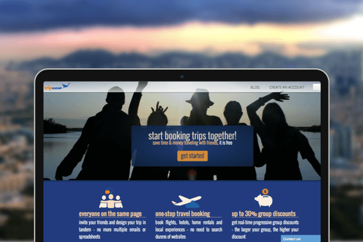
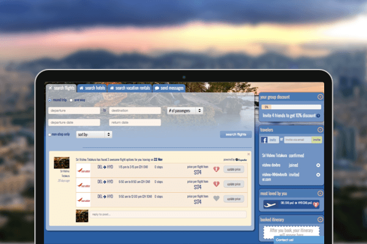
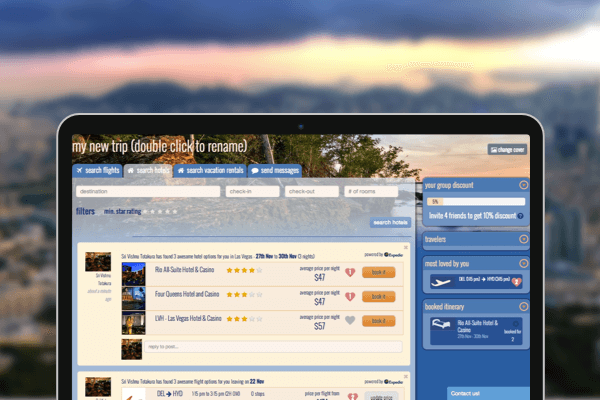

## Group Trip Planning Portal
Codebrahma helped Tripeese create a full fledged group flight + hotel booking system.

## Challenges Faced:
Tripeese approached us with an idea to build a real-time group travel planning portal. This would help a group of friends pick experiences vote on them, discuss about them and book flights and hotels.

The founders wanted the entire experience to be in real-time (obviously non-realtime discussion suck, and hey we love doing real-time applications) — We should link to our blog on realtime.

The founders also wanted a flawless flight + hotel booking system which enables a group of people to vote on options and book them

* Accommodating search results from various providers simultaneously
* A real time multi-user experience for group travel planning

## Solution:
Designed a service-oriented architecture that will expose tiny apps like flight booking, hotel booking, discussion system. These tiny apps are consumed by a Async Faye Server and the results are shown on the trip booking page. This provides a real time experience and facilitates a smooth discussion , voting, booking trip planning engine.

SOA enables us to break a complex app into simpler smaller components. These smaller apps communicate via an API and are consumed by the main application using an evented server like Faye. This approach was used to built this multi-layered application.

## Benefits:
* RealTime platform for collaboratively planning trips
* Choose and book the right flights and hotel that everyone like

## Features

### Interactive Planning

_Empowering groups of friends to book experiences together_

### Realtime Trip Planning

_Travellers can form groups and invite their friends to a trip they create._

### Social Features

_Combining the social features familiar on Facebook with the ability to pick and purchase experiences in real-time, allowing groups to interact over actual search results._

## Technologies:
 - Ruby on Rails
 - AngularJS
 - RabbitMQ

## Testimonial:
_“First thing that impressed me about working with Codebrahma is Agility with which things got done. The developers of Codebrahma are really talented, whether it is web, mobile, real time application you can rely on Codebrahma. Working with Codebrahma has been one of the best decisions we have made as a company. ” - Shirish Nilekar, CTO & Co Founder_

  

    <iframe
      src="https://player.vimeo.com/video/70546637"
      frameBorder="0"
      allow="autoplay; fullscreen"
      style="max-width: 100%;"
      allowFullScreen
    />
  

