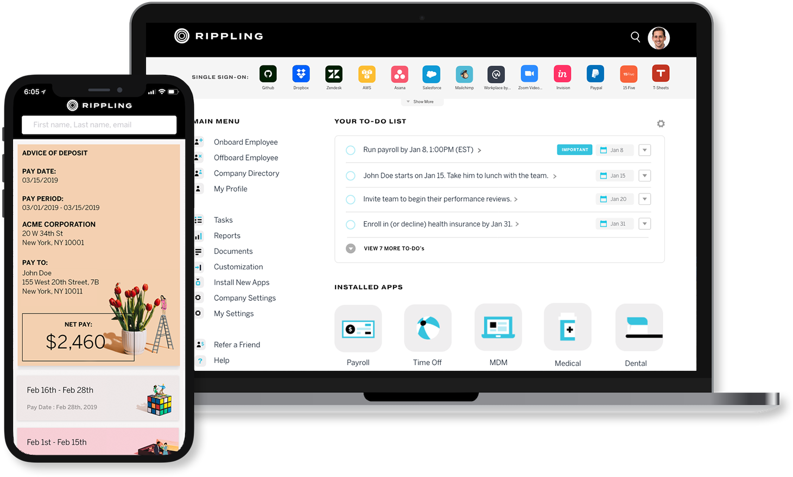

# React JS Development Company

We take your _design_ and _api_ specs and give you **a mobile and 
web** frontend using react & react native

We primarily based out of San Francisco. 
We have remote teams in India, Nigeria, Ukraine.

> [Contact Us](/contact)

## Featured ReactJS project

### Rippling: HR Automation Powerhouse developed On ReactJS
[Rippling](/rippling) is a software tool to automate a bunch of things that companies need to do while hiring and offboarding employees. Right from contract management to hardware supplies, to running the payroll and leave management – Rippling does everything.

---
[Here is our ReactJS Development process](/codebrahma-react-application)

We have used the best libraries to develop React JS applications. Some of them are as follows.

 
### Code Standard
1. ES7 and ES6 Ready code
2. Airbnb-eslint
3. Flow js

### State Management
1. Redux
2. Mobx

### Bundler
1. Webpack
2. Gulp
 
### Async Libraries
1. redux-saga
2. redux-observables
3. redux-thunk

### Testing Libraries
1. Enzyme
2. Mocha
3. Chai
4. Jasmine

### Form Libraries
1. Redux-forms
2. Formsy-React

We have the right tools to develop and develop production ready React JS applications with minimum possible bundle sizes.

> For more info , take a look at our [blogs](/category/react)

---

## RELIABLE REACT JS DEVELOPMENT SERVICES

### Fast, modular and Bug free React JS development service
We develop your application with atleast 30% faster than other development companies.

### Javascript Lovers
We specialise in servicing modern JavaScript based web & mobile applications. We are experts in developing applications in React.js, AngularJS, Node.js

### Expert React JS Developers
We have a set of skilful React JS developers who are updated with current React Eco System

### Best React JS development Service history
We have 10 + React projects delivered to clients in quick time

