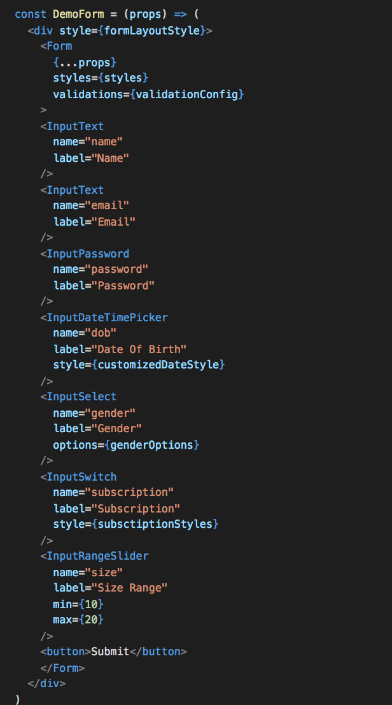
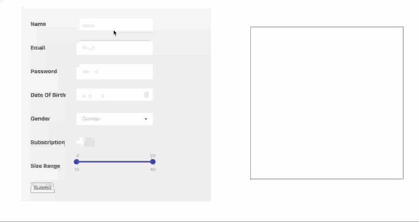

We use a set of UI components which are engineered for 70% of any requirement

gives you

## What are the benefits by using these react components ?

### Out of the BOX UI
- More than 50+ UI components
- Handpick the best UI component
- Get Out of Box UI / UX
- Minimal rewrite if required
- Well Tested functionalities

### Automated form submission and styling
- Automated Form submissions
- Core functionalities are wrapped
- Style your form at one place
- Minimal rewrite if required
- Utilizing the best libraries available

### AUTOMATED FORM VALIDATION AND ERROR HANDLING
- Validate using a simple word
- Handle Errors in a common place
- Mention Error Display once
- Minimal rewrite if required
- Validate literally any field

### See in action

<iframe width="560" height="315" src="https://www.youtube.com/embed/5mgwUFav7wo" frameborder="0" 
allow="accelerometer; autoplay; encrypted-media; gyroscope; picture-in-picture" allowfullscreen></iframe>
 
 
 
<iframe width="560" height="315" src="https://www.youtube.com/embed/nlooQAxAhK4" frameborder="0" 
allow="accelerometer; autoplay; encrypted-media; gyroscope; picture-in-picture" allowfullscreen></iframe>
 
 
 
<iframe width="560" height="315" src="https://www.youtube.com/embed/mtc4iY28bMM" frameborder="0" 
allow="accelerometer; autoplay; encrypted-media; gyroscope; picture-in-picture" allowfullscreen></iframe>
 
 
 
<iframe width="560" height="315" src="https://www.youtube.com/embed/5mgwUFav7wo" frameborder="0" 
allow="accelerometer; autoplay; encrypted-media; gyroscope; picture-in-picture" allowfullscreen></iframe>
 
 
 

> [Contact US](/contact)